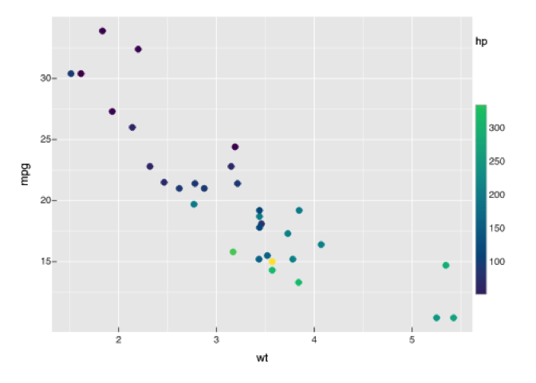
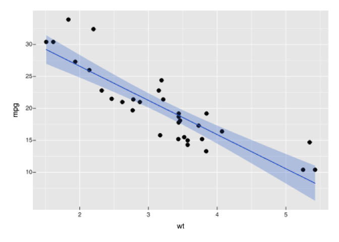
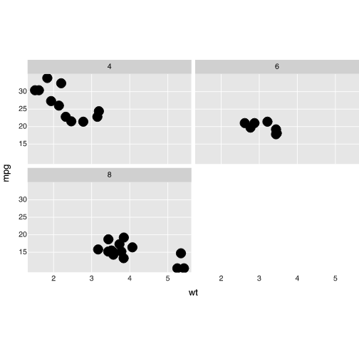
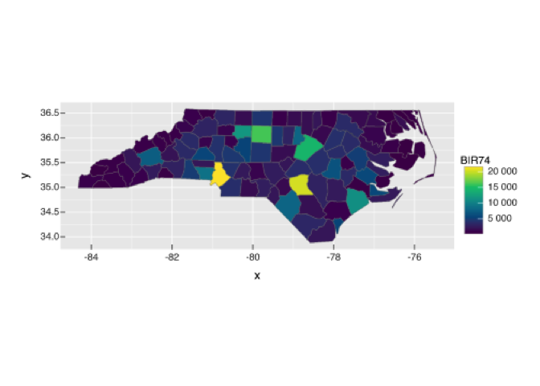
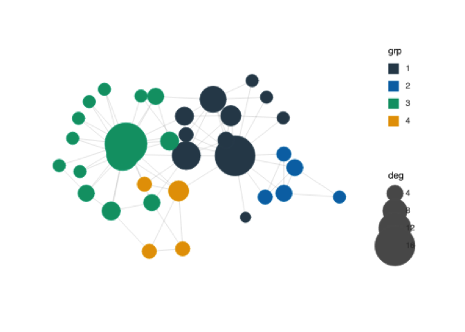

<!-- README.md is generated from README.Rmd. Please edit that file -->

# vellumplot 

<!-- badges: start -->

[](https://github.com/r-vellum/vellumplot/actions/workflows/R-CMD-check.yaml)
<!-- badges: end -->

vellumplot is a declarative, pipe-first grammar of graphics built on the
[vellum](https://github.com/r-vellum/vellum) graphics backend. You
describe a plot as an inspectable, serializable *spec*; nothing is drawn
until the spec is compiled into a vellum scene and rendered.

It is a real compiler — spec → resolve encodings → train scales →
measure layout → compile guides → compile marks → vellum scene — not a
thin wrapper around the drawing primitives.

## Installation

``` r
# install.packages("pak")
pak::pak("r-vellum/vellumplot")
```

vellumplot needs the [vellum](https://github.com/r-vellum/vellum) backend,
which compiles a Rust crate, so you also need a Rust toolchain
(`cargo`/`rustc`); pak pulls vellum in automatically.

## Usage

Building a plot returns a spec; printing it draws into the Plots pane
(and embeds in a knitr/Quarto chunk), like ggplot2. Use `render_plot()`
to write a file.

``` r
library(vellumplot)

# a scatter with a continuous colour legend
vplot(mtcars) |>
  mark_point(x = wt, y = mpg, color = hp) |>
  scale_color_continuous()
```



Layer marks on a single panel; scales train across every layer:

``` r
vplot(mtcars) |>
  mark_point(x = wt, y = mpg) |>
  mark_smooth(x = wt, y = mpg)
```



Facet into a grid of panels (`facet_wrap()` / `facet_grid()`), with
shared or free scales:

``` r
vplot(mtcars) |>
  mark_point(x = wt, y = mpg) |>
  facet_wrap(~cyl)
```



Draw spatial data: `mark_sf()` renders an `sf` geometry column and
`coord_sf()` reprojects and locks the map aspect ratio:

``` r
nc <- sf::st_read(system.file("shape/nc.shp", package = "sf"), quiet = TRUE)
vplot(nc) |>
  mark_sf(fill = BIR74) |>
  coord_sf()
```



Draw a network: `vgraph()` lays out an `igraph` graph (stress
majorization by default), then `mark_edges()` / `mark_nodes()` draw it —
aspect-locked, no axes, edges under nodes:

``` r
g <- igraph::make_graph("Zachary")
g <- igraph::set_vertex_attr(
  g,
  "grp",
  value = as.factor(igraph::cluster_louvain(g)$membership)
)
g <- igraph::set_vertex_attr(g, "deg", value = igraph::degree(g))
vgraph(g, layout = "stress") |>
  mark_edges(alpha = 0.4) |>
  mark_nodes(size = deg, fill = grp) |>
  scale_size(range = c(2, 8))
```



The spec is just data — `summary()` shows its structure without drawing:

``` r
summary(vplot(mtcars) |> mark_point(x = wt, y = mpg, color = hp))
#> <PlotSpec> 32x11 (11 columns), page 6x4 in
#> 
#> ── layers
#> • mark_point(x = wt, y = mpg, color = hp)
```

Write to a file with `render_plot()` (the format follows the extension):

``` r
p <- vplot(mtcars) |> mark_point(x = wt, y = mpg)
render_plot(p, "cars.png")
```

## What’s included

- Marks: `mark_point()`, `mark_line()`, `mark_step()`, `mark_rule()`,
  `mark_bar()` (explicit heights, or row counts per category),
  `mark_area()` / `mark_ribbon()`, intervals (`mark_errorbar()`,
  `mark_linerange()`, `mark_segment()`), `mark_boxplot()`,
  tiles/heatmaps (`mark_tile()`, `mark_raster()`), 2-D binning
  (`mark_bin2d()`, `mark_hex()`), 2-D density contours
  (`mark_contour()`, `mark_contour_filled()`), text (`mark_text()`,
  `mark_label()`), and pie/donut shortcuts (`mark_pie()`, `mark_donut()`).
- Spatial: `mark_sf()` draws an `sf` geometry column as a map layer,
  with `coord_sf()` to reproject and lock the aspect ratio.
- Network: `vgraph()` starts a node-link diagram from an `igraph` graph
  (stress layout by default, via `graphlayouts`), with `mark_edges()`,
  `mark_nodes()`, `mark_node_text()`, and `scale_edge_width()`.
- Encodings (tidy-eval): `x`, `y`, `color`/`fill`, `size`, `shape`,
  `alpha`.
- Position scales (`scale_x_continuous()`, `scale_y_continuous()`;
  linear and `log10`) with auto-trained, expanded domains; discrete band
  scales (`scale_x_discrete()`, `scale_y_discrete()`) for categorical
  axes.
- Colour scales (`scale_color_continuous()` / `scale_fill_continuous()`,
  `scale_color_discrete()` / `scale_fill_discrete()`, `_gradient()`,
  `_binned()`, `_manual()`), `scale_shape()`, and a trained
  `scale_size()`, with stacked legends.
- Trained axes, a panel with gridlines, and layering on one panel.
- Faceting (`facet_wrap()`, `facet_grid()`) with shared or free scales,
  via the `resolve_scale()` lattice.
- Statistical marks: `mark_histogram()`, `mark_density()`,
  `mark_summary()`, `mark_smooth()` (with `after_stat()`).
- Coordinate systems: `coord_cartesian()`, `coord_flip()`,
  `coord_fixed()` / `coord_equal()`, `coord_trans()` (nonlinear display
  remap), `coord_polar()` (pie / coxcomb / radar), and `coord_sf()`.
- Position adjustments: stack / dodge / fill bars, jittered points.
- Per-mark `blend =` modes (CSS `mix-blend-mode`: `"multiply"`,
  `"screen"`, …).
- `mark_datashade()` for million-point density rasters; `auto = TRUE` on
  `mark_point()` / `mark_line()` / `mark_step()` / `mark_segment()` /
  `mark_edges()` falls back to datashading (dense scatter, timeseries, and
  large-graph edges) past a row threshold.
- Annotations: `annotate()`, `labs()`, and `md()` markdown titles.
- Themes (`theme_gray()` default, `theme_minimal()`, `theme_bw()`,
  `theme_classic()`, `theme_void()`, `theme_cyberpunk()`, `theme()` /
  `set_theme()`) and multi-plot composition (`hconcat()`, `vconcat()`,
  `concat()`, `wrap_plots()`, `inset()`, `repeat_()`).
- Layer effects (`glow()`, `outline()`, `shadow()`) and gradient fills
  (`linear_gradient()`, `radial_gradient()`).
- Hand-drawn rendering: `sketch()` gives any geometry mark a wobbly,
  hachure- filled [Rough.js](https://roughjs.com) look (a `sketch =`
  argument on marks, an `element_line()` / `element_rect()` `sketch =`
  slot, or the plot-wide `theme_sketch()` one-liner). Generated natively
  in the engine, so it is exact and works across PNG / SVG / PDF.

## The vellum ecosystem

vellumplot is the grammar layer of a small ecosystem of packages that share
the vellum scene model:

- **[vellum](https://github.com/r-vellum/vellum)** — the parchment:
  the low-level graphics backend (Rust scene graph, PNG/SVG/PDF
  renderer).
- **[vellumplot](https://github.com/r-vellum/vellumplot)** — the pen: this
  package.
- **[vellumwidget](https://github.com/r-vellum/vellumwidget)** — the annotation: turns
  a vellumplot plot (or a raw vellum scene) into a client-side interactive
  HTML widget via `as_widget()`.
- **[vellumverse](https://github.com/r-vellum/vellumverse)** —
  installs and loads the whole ecosystem in one step.
