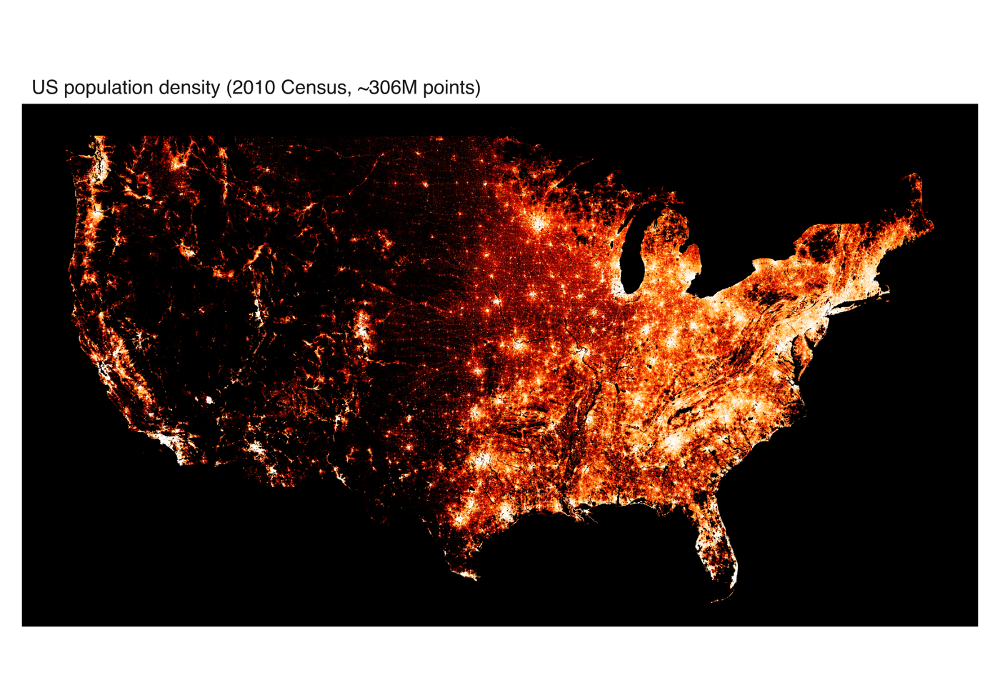
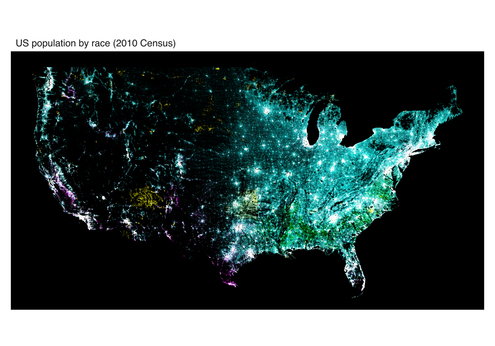

# Datashading a third of a billion points

Scatter plots break down long before you run out of memory. Past a few
tens of thousands of overlapping points, markers stop landing on empty
canvas and start landing on each other. The picture saturates: you can
no longer tell a region with a thousand points from one with a million,
and drawing every marker only gets slower. This is overplotting, and no
amount of transparency fully fixes it.

Datashading takes a different route. Instead of drawing points, it bins
them into a grid sized to the output, counts how many fall in each cell,
and colours each cell by that count. The result is a single raster whose
cost is set by the grid resolution, not the number of points. Ten
thousand points or ten million, the image takes about the same time to
make, and density is shown honestly because it is measured rather than
implied by overlap.

In vellumplot this is
[`mark_datashade()`](https://r-vellum.github.io/vellumplot/reference/mark_datashade.md).
It bins `x` and `y` into a `width`-by-`height` canvas in one pass and
colours each cell by density, drawing one raster that fills the panel.
The binning itself is done by the backend’s
[`vellum::datashade()`](https://r-vellum.github.io/vellum/reference/datashade.html),
whose [datashading
article](https://r-vellum.github.io/vellum/articles/datashading.html)
covers the aggregation engine, the reductions, and the equalisation
options in depth. Because the cell colour encodes density, per-point
aesthetics like colour and size do not apply. The **[statistical
marks](https://r-vellum.github.io/vellumplot/articles/statistical-marks.md)**
article introduces it on a synthetic half-million points; here we push
it as far as it goes.

## The US Census, about 306 million points

The canonical stress test for datashading is the [datashader US Census
example](https://examples.holoviz.org/gallery/census/census.html): one
point per person from the 2010 US Census, roughly 306 million rows, each
tagged with a location and a race. It is far too many points to plot as
markers, and it is a good showcase precisely because the interesting
structure lives across an enormous dynamic range, from empty desert to
dense city cores.

The figures below are produced by
[`inst/examples/19-datashader-census.R`](https://github.com/r-vellum/vellumplot/blob/main/inst/examples/19-datashader-census.R).
That script is a heavy showcase, not a quick example: it downloads a
1.44 GB Parquet dataset once and needs several gigabytes of RAM for the
full run (you can set an `n_max` in the script to smoke-test on a
spatial subset first). The images here are scaled down from the
full-resolution exports.

### Population density

The first map shades every person by local population density on a
single colour ramp, with histogram equalisation (`how = "eq_hist"`) to
spread that huge dynamic range across the ramp so both sparse and dense
regions stay legible. It is the classic “where do people live” map, and
the whole country emerges from a third of a billion anonymous points.



US population density from the 2010 Census, about 306 million points,
shaded by local density on a single ramp with histogram equalisation.

### Coloured by race

The second map colours the same points by race. Map a discrete `color`
aesthetic and
[`mark_datashade()`](https://r-vellum.github.io/vellumplot/reference/mark_datashade.md)
shades **categorically** — datashader’s `count_cat` — in one call:

``` r

vplot(census) |>
  mark_datashade(x = easting, y = northing, color = race)
```

Each race is aggregated into its own count grid in the same single pass,
and every cell is coloured by the count-weighted average of the hues it
holds, with opacity from its total density. Where one group dominates a
cell you get that group’s hue; where groups overlap the hues mix — so
the segregation and mixing patterns of American cities read directly off
the colour, and you get a colour legend for free. The hues come from the
ordinary discrete colour scale, so
[`scale_color_manual()`](https://r-vellum.github.io/vellumplot/reference/scale_color_continuous.md)
(or any `scale_color_*()`) sets them.

(Before this was a single call, the same map was built by hand — one
[`mark_datashade()`](https://r-vellum.github.io/vellumplot/reference/mark_datashade.md)
layer per race, each ramping from black to its hue, composited with
`blend = "screen"` on a black panel. The `blend` route still works and
remains useful for bespoke compositing, but `color = race` is the direct
way.)



US population by race from the 2010 Census: categorical (`count_cat`)
datashading, each cell coloured by the count-weighted mix of the races
present and shaded by density.

## Resolution: aggregation, not dpi

One practical lesson from the census script is worth stating on its own,
because it trips people up. There are two different resolutions in play,
and they are not interchangeable:

- The **aggregation resolution** is the `width` and `height` you pass to
  [`mark_datashade()`](https://r-vellum.github.io/vellumplot/reference/mark_datashade.md).
  This is the size of the grid the points are counted into, and it sets
  how much detail the shaded map actually contains.
- The **page resolution** is `width * dpi` from
  [`vplot()`](https://r-vellum.github.io/vellumplot/reference/vplot.md).
  This only rescales the finished raster.

A high `dpi` over a small aggregation grid just upsamples a small image,
so it looks blurry. For a genuinely high-resolution export you have to
raise the aggregation `width`/`height` *and* give the page enough pixels
that the panel is at least that wide, so the raster is drawn close to
one-to-one rather than stretched. The census figures use a 5000-wide
aggregation grid on a 6000-pixel page for exactly this reason.

## When to reach for it

Datashading is the answer whenever a layer has so many rows that
individual markers are neither informative nor fast: dense scatter
plots, GPS traces, event logs, particle simulations.
[`mark_point()`](https://r-vellum.github.io/vellumplot/reference/mark_point.md)
even has an `auto = TRUE` switch that falls back to a datashaded raster
automatically past a row threshold, so you can keep writing
[`mark_point()`](https://r-vellum.github.io/vellumplot/reference/mark_point.md)
and let vellumplot pick the representation. For the full argument list,
see the
[`mark_datashade()`](https://r-vellum.github.io/vellumplot/reference/mark_datashade.md)
reference, and for the aggregation engine underneath it, vellum’s
[datashading
article](https://r-vellum.github.io/vellum/articles/datashading.html).
