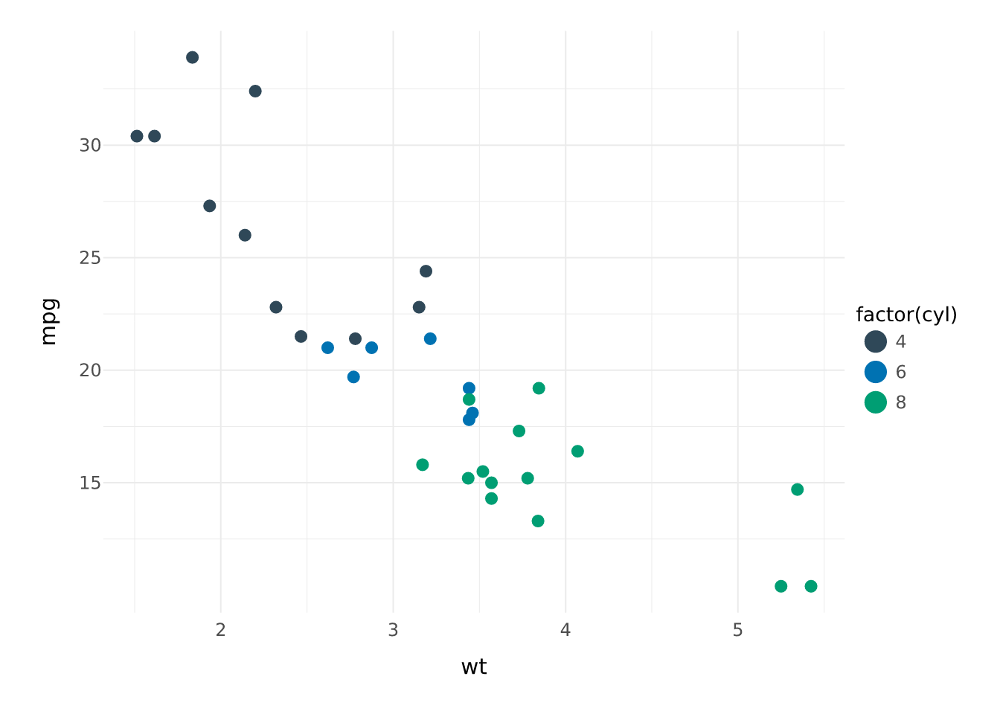
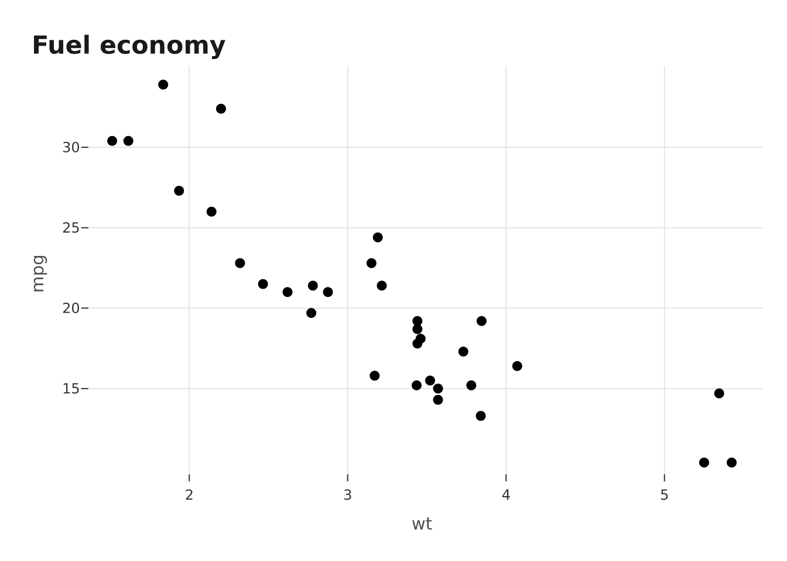
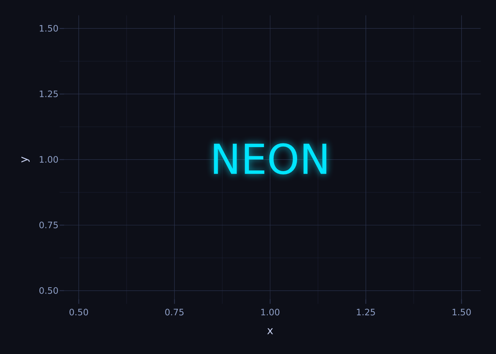
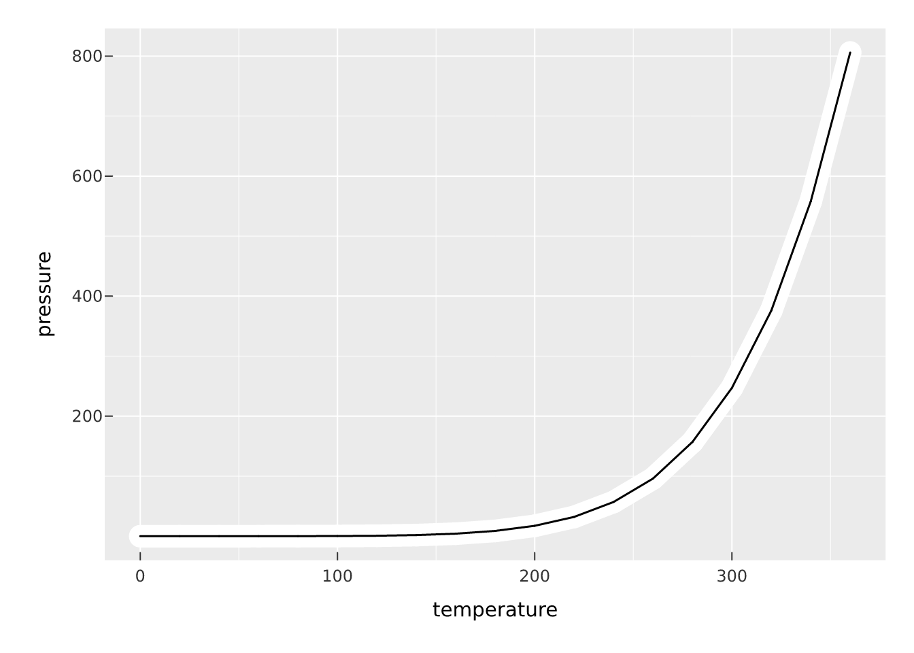
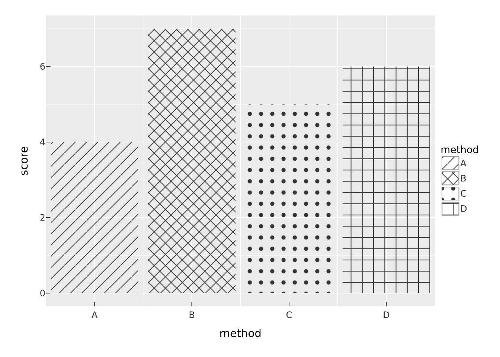
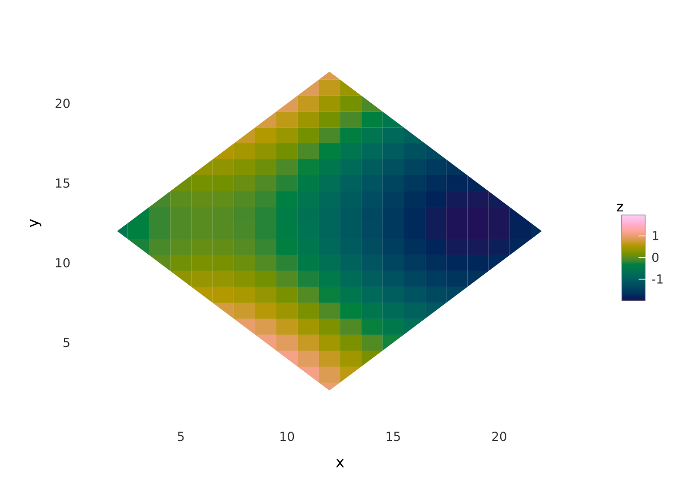
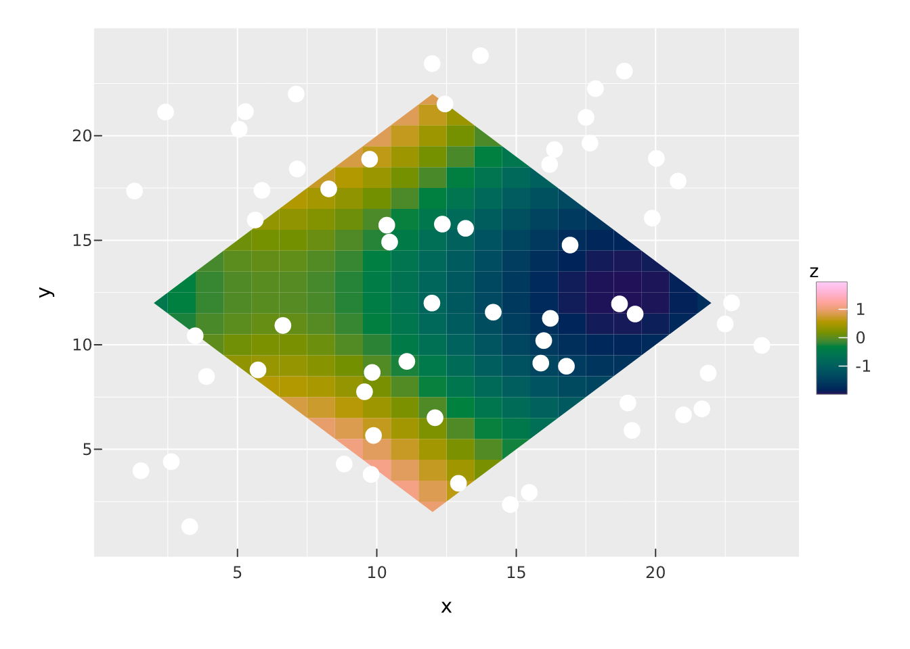
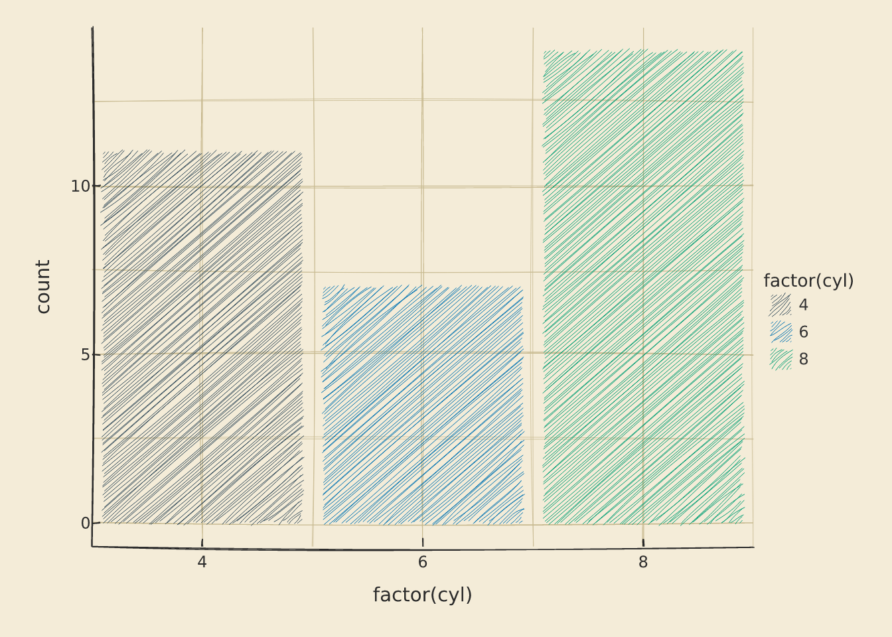
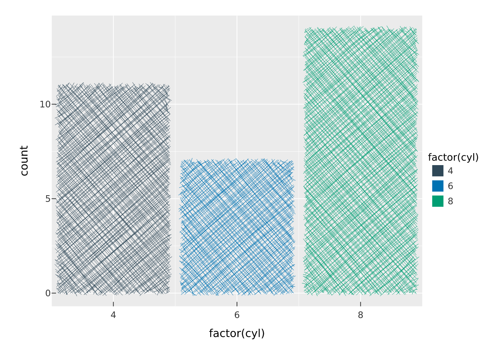

# Effects and themes

Everything so far has been about mapping data. This article is about the
rest: the panel, the gridlines, the fonts, and a set of render effects
that change how marks are painted. vellumplot keeps these separate. A
*theme* controls the non-data furniture of the whole plot; a *layer
effect* changes how one mark is drawn; a *gradient* is a fancy fill
value; and *sketch* mode turns the whole thing hand-drawn.

## Built-in themes

A theme sets the look of everything that is not a mark. vellumplot ships
several.
[`theme_gray()`](https://r-vellum.github.io/vellumplot/reference/theme_gray.md)
is the default (grey panel, white gridlines);
[`theme_minimal()`](https://r-vellum.github.io/vellumplot/reference/theme_gray.md)
drops the panel fill;
[`theme_bw()`](https://r-vellum.github.io/vellumplot/reference/theme_gray.md)
is a white panel with light grey gridlines;
[`theme_classic()`](https://r-vellum.github.io/vellumplot/reference/theme_gray.md)
gives axis lines and no gridlines;
[`theme_void()`](https://r-vellum.github.io/vellumplot/reference/theme_gray.md)
strips everything but the marks, legend, and titles.

``` r

vplot(mtcars) |>
  mark_point(x = wt, y = mpg, color = factor(cyl)) |>
  theme_minimal()
```



## Customising with theme elements

[`theme()`](https://r-vellum.github.io/vellumplot/reference/theme_gray.md)
overrides individual slots, and each slot is described by a typed
*element*:
[`element_text()`](https://r-vellum.github.io/vellumplot/reference/element.md),
[`element_line()`](https://r-vellum.github.io/vellumplot/reference/element.md),
[`element_rect()`](https://r-vellum.github.io/vellumplot/reference/element.md),
or
[`element_blank()`](https://r-vellum.github.io/vellumplot/reference/element.md)
to draw nothing. Slot names follow the familiar dotted scheme
(`panel.grid.minor`, `axis.title`, `plot.title`, and so on), and any
property left `NULL` is inherited from its parent in the theme tree.

``` r

vplot(mtcars) |>
  mark_point(x = wt, y = mpg) |>
  theme_bw() |>
  theme(
    panel.grid.minor = element_blank(),
    plot.title = element_text(size = 16, face = "bold"),
    axis.title = element_text(color = "grey30")
  ) |>
  labs(title = "Fuel economy")
```



## Layer effects

Effects change how a single mark is painted, and they are passed to a
mark’s `effects` argument as a list. They apply to stroked and point
marks.
[`glow()`](https://r-vellum.github.io/vellumplot/reference/glow.md)
softens a widened copy with a real Gaussian blur for a neon halo;
[`shadow()`](https://r-vellum.github.io/vellumplot/reference/shadow.md)
adds a blurred, offset drop shadow;
[`outline()`](https://r-vellum.github.io/vellumplot/reference/outline.md)
puts a sharp contrasting halo behind the mark so it stays legible over a
busy backdrop.
[`motion()`](https://r-vellum.github.io/vellumplot/reference/motion.md)
and
[`echo()`](https://r-vellum.github.io/vellumplot/reference/motion.md)
draw a fading trail of copies marching off along a direction — a
speed-blur
([`motion()`](https://r-vellum.github.io/vellumplot/reference/motion.md),
many close copies) or discrete ghost repeats
([`echo()`](https://r-vellum.github.io/vellumplot/reference/motion.md)).

Because
[`glow()`](https://r-vellum.github.io/vellumplot/reference/glow.md) and
[`shadow()`](https://r-vellum.github.io/vellumplot/reference/shadow.md)
are real blurs, they also work on **text** marks — a neon
[`mark_text()`](https://r-vellum.github.io/vellumplot/reference/mark_text.md)
needs no glyph-stroking:

``` r

vplot(data.frame(x = 1, y = 1, lab = "NEON"), width = 5, height = 2.2) |>
  mark_text(x = x, y = y, label = lab, size = 42, color = "#00e5ff",
    effects = list(glow())) |>
  theme_cyberpunk()
```



``` r

vplot(pressure) |>
  mark_line(
    x = temperature, y = pressure,
    effects = list(shadow(), outline(color = "white", size = 2))
  )
```



``` r

vplot(mtcars) |>
  mark_point(x = wt, y = mpg, size = 4, effects = list(motion(x = 4)))
```


[`glow()`](https://r-vellum.github.io/vellumplot/reference/glow.md)
pairs naturally with
[`theme_cyberpunk()`](https://r-vellum.github.io/vellumplot/reference/theme_gray.md),
a dark neon theme.

``` r

vplot(mtcars) |>
  mark_point(x = wt, y = mpg, color = factor(cyl), effects = list(glow())) |>
  theme_cyberpunk()
```


## Gradient fills

A gradient is an unscaled *value* for the `fill` aesthetic, not a mapped
scale. Pass
[`linear_gradient()`](https://r-vellum.github.io/vellumplot/reference/gradients.md)
or
[`radial_gradient()`](https://r-vellum.github.io/vellumplot/reference/gradients.md)
directly as a fill and the region is painted with it as one paint. Using
a transparent stop gives the “fade out under a line” look.

``` r

vplot(pressure) |>
  mark_area(
    x = temperature, y = pressure,
    fill = linear_gradient(c("#00e5ff", "#00e5ff00"))
  ) |>
  mark_line(x = temperature, y = pressure, color = "#00e5ff") |>
  theme_cyberpunk()
```


Because a gradient is one paint per region, it cannot be mapped to a
data column; for that you want a colour scale (see **[Scales and
guides](https://r-vellum.github.io/vellumplot/articles/scales-and-guides.md)**).

## Pattern (hatch) fills

A *pattern* is the texture counterpart of a gradient: another unscaled
`fill` value, built by the `pattern_*()` family. Distinguishing regions
by texture (not only hue) keeps a plot legible in greyscale print and
under colour-vision deficiency. Pass one directly as a `fill`:

``` r

bars <- data.frame(method = c("A", "B", "C"), score = c(4, 7, 5))
vplot(bars) |>
  mark_bar(x = method, y = score, fill = pattern_crosshatch(color = "grey20"))
```


[`pattern_stripe()`](https://r-vellum.github.io/vellumplot/reference/patterns.md),
[`pattern_crosshatch()`](https://r-vellum.github.io/vellumplot/reference/patterns.md),
[`pattern_grid()`](https://r-vellum.github.io/vellumplot/reference/patterns.md),
[`pattern_dot()`](https://r-vellum.github.io/vellumplot/reference/patterns.md),
and
[`pattern_checker()`](https://r-vellum.github.io/vellumplot/reference/patterns.md)
each take a `color`, a transparent-or-solid `bg`, and a `spacing` (in mm
by default); stripes/crosshatch also take an `angle` restricted to `0`,
`45`, `90`, or `135`. Patterns work on any filled mark — bars, areas,
ribbons, rects, tiles, boxplots, violins, ridgelines, half-eyes, hulls,
and `sf` polygons — and render on every backend including PDF. For a
custom motif, build the tile yourself with
[`vl_pattern()`](https://r-vellum.github.io/vellumplot/reference/vl_pattern.md).

To vary the texture *by a variable* (rather than a single constant
fill), map the `pattern` aesthetic and let
[`scale_pattern()`](https://r-vellum.github.io/vellumplot/reference/scale_pattern.md)
assign a distinct texture to each level — the greyscale- and
colour-vision-safe way to tell a few series apart:

``` r

bars <- data.frame(method = c("A", "B", "C", "D"), score = c(4, 7, 5, 6))
vplot(bars) |>
  mark_bar(x = method, y = score, pattern = method) |>
  scale_pattern(name = NULL)
```



`scale_pattern(values = )` overrides the palette with builder names
(`"stripe"`, `"dot"`, …) or your own `pattern_*()` objects; the legend
keys are drawn as patterned swatches.

## Clipping and masking to a shape

[`clip_to()`](https://r-vellum.github.io/vellumplot/reference/clip.md)
restricts a plot’s marks to a geometry instead of the panel rectangle —
the way to pour a raster or tile heatmap into a region outline. Give it
an `sf` object or a data frame of `x`/`y` polygon vertices.

``` r

grid <- expand.grid(x = 1:24, y = 1:24)
grid$z <- with(grid, sin(x / 4) + cos(y / 4))
diamond <- data.frame(x = c(12, 22, 12, 2), y = c(2, 12, 22, 12))

vplot(grid) |>
  mark_tile(x = x, y = y, fill = z) |>
  clip_to(diamond)
```



`invert = TRUE` keeps the marks *outside* the shape (punching it out as
a hole).
[`set_mask()`](https://r-vellum.github.io/vellumplot/reference/clip.md)
instead applies a soft radial mask — a vignette that fades the panel
towards its edges, with `feather` setting how gentle the fade is:

``` r

vplot(grid) |>
  mark_tile(x = x, y = y, fill = z) |>
  set_mask(feather = 0.5)
```


[`clip_to()`](https://r-vellum.github.io/vellumplot/reference/clip.md)
and
[`set_mask()`](https://r-vellum.github.io/vellumplot/reference/clip.md)
mask the whole panel;
[`clip_layer()`](https://r-vellum.github.io/vellumplot/reference/clip.md)
masks only the most-recently-added layer, so one raster layer can be
clipped to a shape while the axes and other layers stay full-bleed:

``` r

set.seed(1)
pts <- data.frame(x = runif(60, 1, 24), y = runif(60, 1, 24))
vplot(grid) |>
  mark_tile(x = x, y = y, fill = z) |>
  clip_layer(diamond) |>
  mark_point(data = pts, x = x, y = y, size = 1.5, color = "white")
```



All three work under cartesian coordinates (a smooth feathered edge on
an arbitrary polygon is not available yet, so
[`clip_to()`](https://r-vellum.github.io/vellumplot/reference/clip.md) /
[`clip_layer()`](https://r-vellum.github.io/vellumplot/reference/clip.md)
are hard-edged; reach for
[`set_mask()`](https://r-vellum.github.io/vellumplot/reference/clip.md)
when you want a soft fade).

## Hand-drawn sketch mode

[`theme_sketch()`](https://r-vellum.github.io/vellumplot/reference/theme_sketch.md)
turns an entire plot hand-drawn in one line: wobbly gridlines, axis
lines, and marks, on a warm paper background. The look is generated
natively in the engine, so it is exact and works across PNG, SVG, and
PDF.

``` r

vplot(mtcars) |>
  mark_bar(x = factor(cyl), fill = factor(cyl)) |>
  theme_sketch()
```



For finer control,
[`sketch()`](https://r-vellum.github.io/vellumplot/reference/sketch.md)
is the vocabulary: `roughness`, `bowing`, `fill_style` (`"hachure"`,
`"crosshatch"`, `"zigzag"`, and more), and so on. Pass a
[`sketch()`](https://r-vellum.github.io/vellumplot/reference/sketch.md)
value to a single mark’s `sketch =` argument to rough up just that
layer, or to an
[`element_line()`](https://r-vellum.github.io/vellumplot/reference/element.md)
/
[`element_rect()`](https://r-vellum.github.io/vellumplot/reference/element.md)
slot inside
[`theme()`](https://r-vellum.github.io/vellumplot/reference/theme_gray.md).
Set `sketch = NA` on a mark to force it crisp even under a plot-wide
[`theme_sketch()`](https://r-vellum.github.io/vellumplot/reference/theme_sketch.md).

``` r

vplot(mtcars) |>
  mark_bar(
    x = factor(cyl), fill = factor(cyl),
    sketch = sketch(roughness = 2, fill_style = "crosshatch")
  )
```


