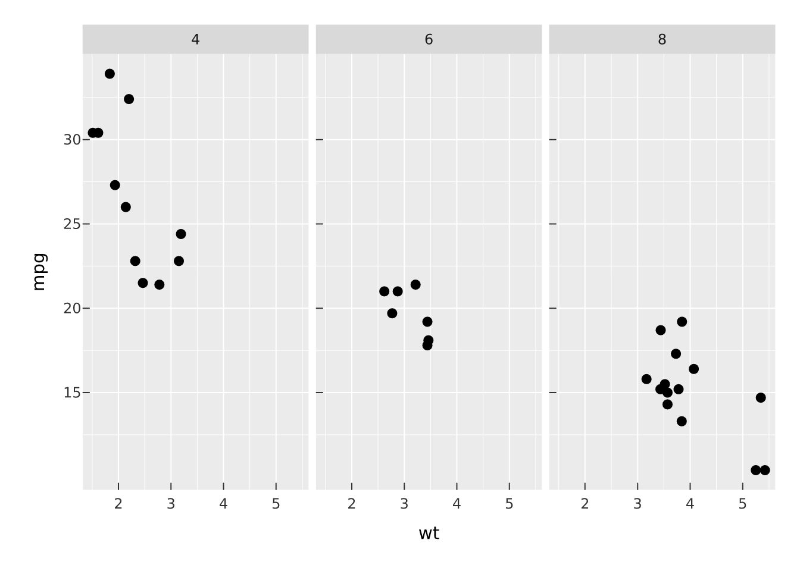
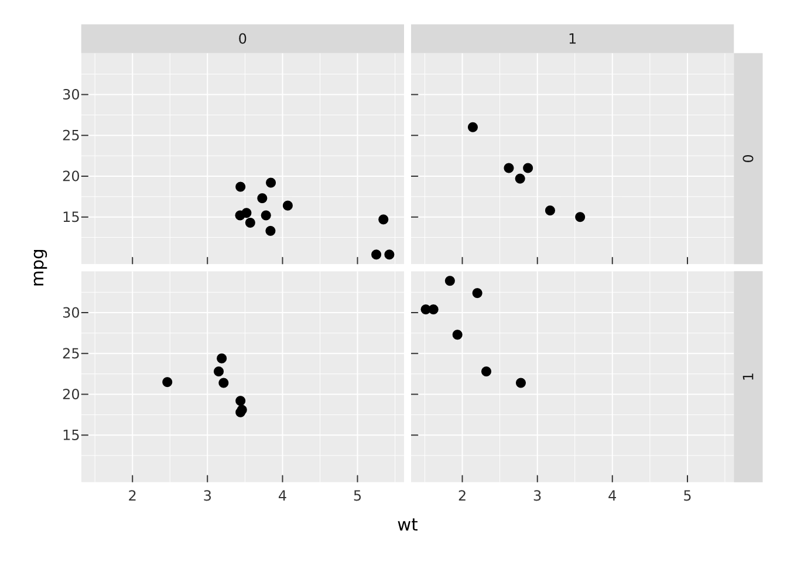
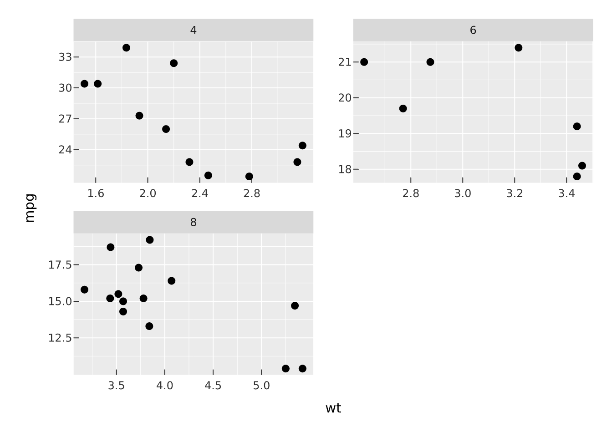
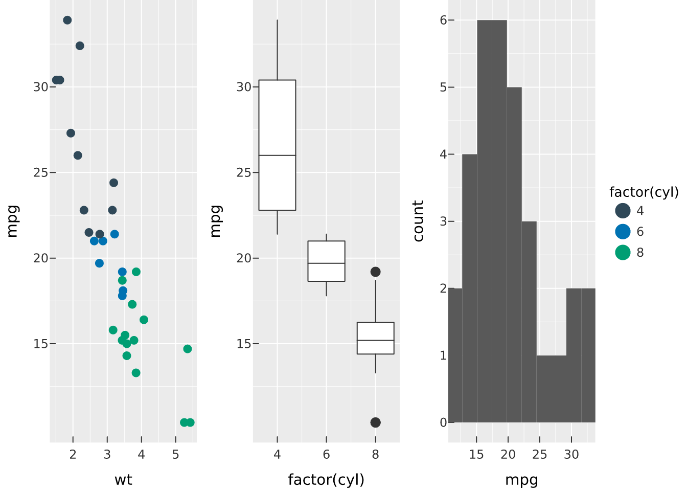
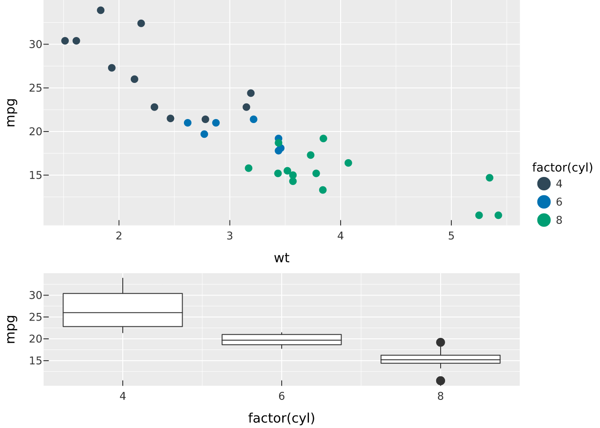
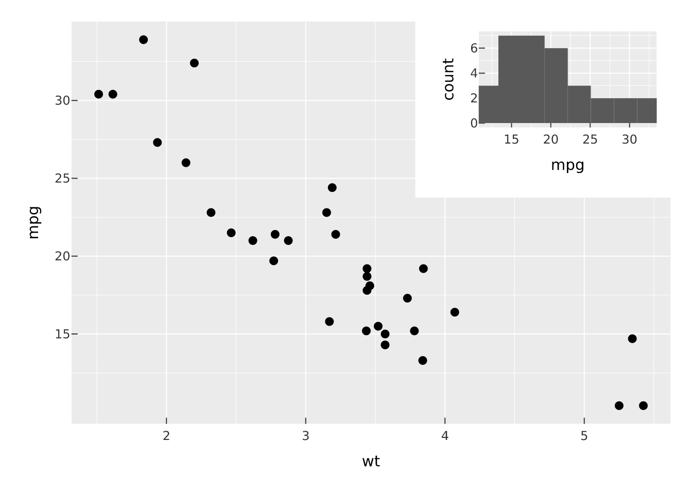
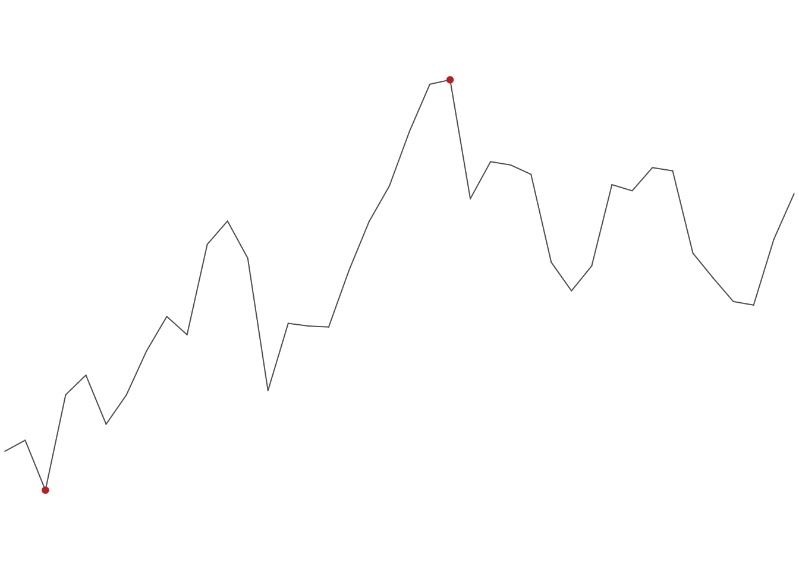
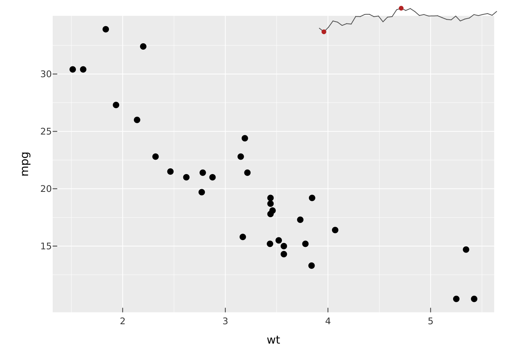
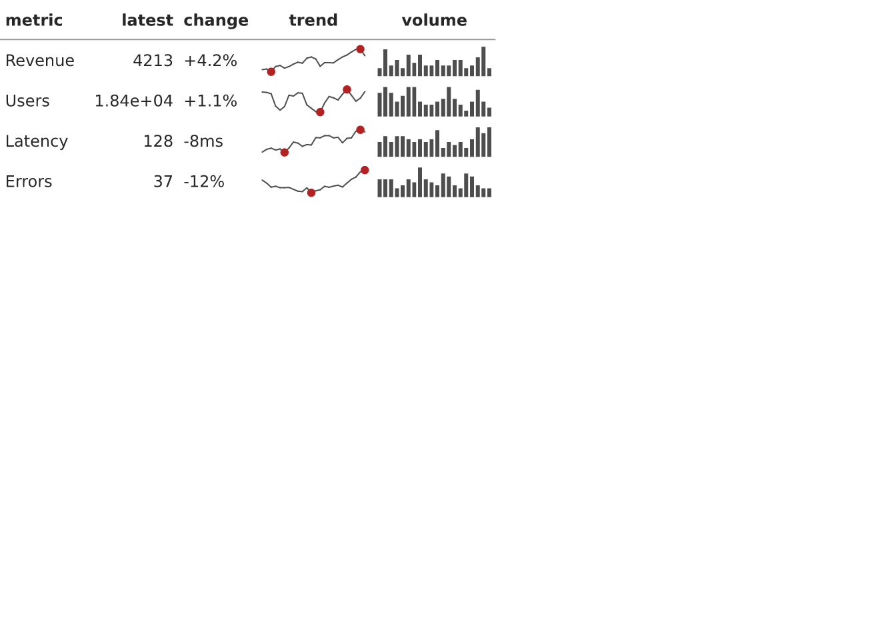
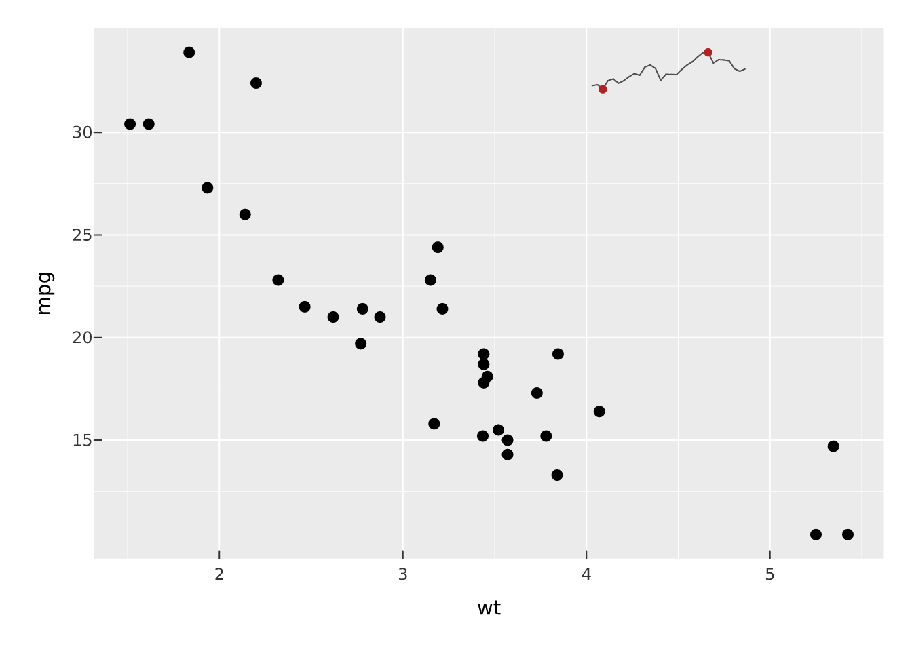

# Facets and composition

There are two different reasons to end up with a grid of panels, and
vellumplot keeps them separate. *Faceting* takes one plot and splits it
by a variable, so every panel shares the same encodings and (by default)
the same scales. *Composition* takes several independent plots, each its
own spec, and arranges them into a single figure. Use faceting for small
multiples of the same view; use composition for a dashboard of different
views.

## Faceting

[`facet_wrap()`](https://r-vellum.github.io/vellumplot/reference/facet_wrap.md)
lays panels out in a ribbon wrapped to `ncol` or `nrow`.

``` r

vplot(mtcars) |>
  mark_point(x = wt, y = mpg) |>
  facet_wrap(~cyl, ncol = 3)
```



[`facet_grid()`](https://r-vellum.github.io/vellumplot/reference/facet_wrap.md)
puts panels on a 2-D grid defined by a `rows ~ cols` formula, which is
the right tool when you are crossing two variables.

``` r

vplot(mtcars) |>
  mark_point(x = wt, y = mpg) |>
  facet_grid(vs ~ am)
```



### Shared or free scales

By default position scales are shared across panels so the axes line up
and panels are comparable. When panels cover very different ranges, free
them per panel with `scales = "free_x"`, `"free_y"`, or `"free"`.

``` r

vplot(mtcars) |>
  mark_point(x = wt, y = mpg) |>
  facet_wrap(~cyl, scales = "free")
```



`scales = "free_y"` is sugar for the underlying
[`resolve_scale()`](https://r-vellum.github.io/vellumplot/reference/resolve_scale.md)
lattice, which lets you set the policy per aesthetic directly. These two
are equivalent:

``` r

vplot(mtcars) |> mark_point(x = wt, y = mpg) |>
  facet_wrap(~cyl, scales = "free_y")

vplot(mtcars) |> mark_point(x = wt, y = mpg) |>
  facet_wrap(~cyl) |> resolve_scale(y = "independent")
```

Colour and size scales (and their legends) stay shared across panels, so
one legend describes the whole figure.

## Composition

To place *different* plots side by side, build each one and combine
them.
[`concat()`](https://r-vellum.github.io/vellumplot/reference/concat.md)
(and its friends
[`hconcat()`](https://r-vellum.github.io/vellumplot/reference/concat.md)
and
[`vconcat()`](https://r-vellum.github.io/vellumplot/reference/concat.md))
arrange plots into a grid; by default they collect the legends into one
shared guide.

``` r

p1 <- vplot(mtcars) |> mark_point(x = wt, y = mpg, color = factor(cyl))
p2 <- vplot(mtcars) |> mark_boxplot(x = factor(cyl), y = mpg)
p3 <- vplot(mtcars) |> mark_histogram(x = mpg, bins = 10)

concat(p1, p2, p3, ncol = 3)
```



Control the shape with `ncol`/`nrow`, the relative sizes with
`widths`/`heights`, and irregular layouts with a `design` string.
[`plot_spacer()`](https://r-vellum.github.io/vellumplot/reference/plot_spacer.md)
drops an empty cell, and
[`wrap_plots()`](https://r-vellum.github.io/vellumplot/reference/concat.md)
takes a list of plots when you have assembled them programmatically.

``` r

concat(p1, p2, ncol = 1, heights = c(2, 1))
```



### Insets

[`inset()`](https://r-vellum.github.io/vellumplot/reference/inset.md)
floats one plot over another, positioned by fractional coordinates of a
reference box. Good for an overview-plus-detail figure.

``` r

main <- vplot(mtcars) |> mark_point(x = wt, y = mpg)
mini <- vplot(mtcars) |> mark_histogram(x = mpg, bins = 8)
inset(main, mini, left = 0.6, bottom = 0.6, right = 0.98, top = 0.98)
```



### Sparklines

[`vsparkline()`](https://r-vellum.github.io/vellumplot/reference/vsparkline.md)
is a compact, axis-free chart of a single series, sized in physical
units (mm by default) so it reads as a *word-sized graphic*. It is a
plain `PlotSpec` — render it, or
[`inset()`](https://r-vellum.github.io/vellumplot/reference/inset.md) it
into a figure. Three shapes: a `"line"` trend (with a dot on its
extremes or last point), a `"bar"` column micro-chart, and a `"winloss"`
chart of equal up/down bars.

``` r

set.seed(1)
vsparkline(cumsum(rnorm(40)), width = 60, height = 16)
```



``` r

vsparkline(rpois(24, 6), type = "bar", color = "steelblue", width = 60, height = 16)
```


Because it is a `PlotSpec`, a sparkline drops into any composition —
e.g. floated onto a plot as a tiny trend indicator:

``` r

spark <- vsparkline(cumsum(rnorm(40)))
inset(main, spark, left = 0.62, bottom = 0.9, right = 0.98, top = 0.99)
```



### Tables with sparklines

[`vtable()`](https://r-vellum.github.io/vellumplot/reference/vtable.md)
lays a data frame out as a grid of cells: ordinary columns render as
text, and a **list-column of numeric vectors** renders as a per-row
sparkline. The whole table is one vector scene, so it prints and exports
like any plot — chart-in-table without leaving the plotting pipeline.

``` r

set.seed(1)
df <- data.frame(
  metric = c("Revenue", "Users", "Latency", "Errors"),
  latest = c(4213, 18402, 128, 37),
  change = c("+4.2%", "+1.1%", "-8ms", "-12%")
)
df$trend <- lapply(1:4, function(i) cumsum(rnorm(24)))
df$volume <- lapply(1:4, function(i) rpois(20, 6))

vtable(df, spark = list(trend = "line", volume = "bar"), row_height = 8)
```



Map a column to a `type` (`"line"`/`"bar"`/`"winloss"`) or to a builder
function for full control,
e.g. `spark = list(trend = \(v) vsparkline(v, color = "steelblue"))`.

### Sparkline (and grob) callouts

`annotate("sparkline", …)` drops a sparkline at a data coordinate — a
little trend callout inside a plot. More generally,
`annotate("grob", grob = …)` places *any* vellum grob (or a `PlotSpec`)
at a coordinate, sized in physical units and anchored by
`halign`/`valign`.

``` r

set.seed(1)
vplot(mtcars) |>
  mark_point(x = wt, y = mpg) |>
  annotate(
    "sparkline",
    x = 4, y = 33, values = cumsum(rnorm(30)),
    width = 32, height = 10, halign = "left"
  )
```



### Sparklines in a `gt` table

Beyond the native
[`vtable()`](https://r-vellum.github.io/vellumplot/reference/vtable.md),
you can add a vellum sparkline column to a [gt](https://gt.rstudio.com)
table — keeping all of gt’s formatting and theming.
[`gt_vsparkline()`](https://r-vellum.github.io/vellumplot/reference/gt_vsparkline.md)
renders a list-column of numeric vectors as inline-SVG sparklines (HTML
output).

``` r

library(gt)
#> 
#> Attaching package: 'gt'
#> The following object is masked from 'package:vellumplot':
#> 
#>     md
set.seed(1)
df <- data.frame(metric = c("Revenue", "Users", "Latency", "Errors"))
df$trend <- lapply(1:4, function(i) cumsum(rnorm(24)))
df$volume <- lapply(1:4, function(i) rpois(20, 6))

gt(df) |>
  gt_vsparkline(trend, type = "line") |>
  gt_vsparkline(volume, type = "bar", color = "#4682b4")
```

| metric | trend | volume |
|----|----|----|
| Revenue | ![](data:image/svg+xml;base64,PHN2ZyB4bWxucz0iaHR0cDovL3d3dy53My5vcmcvMjAwMC9zdmciIHdpZHRoPSIxMDAlIiBoZWlnaHQ9IjEwMCUiIHZpZXdib3g9IjAgMCAxMTMgMzAiIHJvbGU9ImltZyIgYXJpYS1sYWJlbGxlZGJ5PSJ2bDExNTYtZCI+PGRlc2MgaWQ9InZsMTE1Ni1kIj5BIHNwYXJrbGluZSBwbG90LiBJdCBwbG90cyAudiAodmVydGljYWwgYXhpcykgYWdhaW5zdCAuaSAoaG9yaXpvbnRhbCBheGlzKS4gQmFzZWQgb24gMjQgb2JzZXJ2YXRpb25zLjwvZGVzYz48ZGVmcz48L2RlZnM+PGcgZGF0YS12ZWxsdW0tcGFuZWw9InBsb3QiPjxnIGRhdGEtdmVsbHVtLXBhbmVsPSJwYW5lbC1hcmVhIj48ZyBkYXRhLXZlbGx1bS1wYW5lbD0icGFuZWwtMS0xIj48ZyBkYXRhLXZlbGx1bS1wYW49InBhbmVsLTEtMSI+PGcgZGF0YS12ZWxsdW0taWQ9ImxheWVyLTEtc3BhcmtsaW5lLWcxIj48cGF0aCBkPSJNMCAyMy43NDg0NzYgTDQuNTUxNTIzNyAyMy4xNzA2MjggTDkuMTAzMDQ3IDI1LjggTDEzLjY1NDU3MSAyMC43ODAzMjEgTDE4LjIwNjA5NSAxOS43NDM0OTggTDIyLjc1NzYxOCAyMi4zMjUxNjkgTDI3LjMwOTE0MSAyMC43OTE0MzMgTDMxLjg2MDY2NCAxOC40NjgyMzUgTDM2LjQxMjE5IDE2LjY1NjQ5MiBMNDAuOTYzNzEgMTcuNjE3NDIyIEw0NS41MTUyMzYgMTIuODYwNDgxIEw1MC4wNjY3NTcgMTEuNjMzODA4IEw1NC42MTgyODIgMTMuNTg4NTkyIEw1OS4xNjk4MDQgMjAuNTU3MzIzIEw2My43MjEzMyAxNy4wMTc2MzcgTDY4LjI3Mjg1IDE3LjE1OTAyNSBMNzIuODI0MzggMTcuMjA5OTY5IEw3Ny4zNzU5IDE0LjI0MDExMiBMODEuOTI3NDIgMTEuNjU2MDc0IEw4Ni40Nzg5NCA5Ljc4NzMxNSBMOTEuMDMwNDcgNi44OTU2Nzk1IEw5NS41ODE5OSA0LjQzNDYyNDcgTDEwMC4xMzM1MTQgNC4yIEwxMDQuNjg1MDM2IDEwLjQ1OTY1NSIgZmlsbD0ibm9uZSIgc3Ryb2tlPSIjNGQ0ZDRkIiBzdHJva2Utb3BhY2l0eT0iMSIgc3Ryb2tlLXdpZHRoPSIxIiBzdHJva2UtbGluZWNhcD0icm91bmQiIHN0cm9rZS1saW5lam9pbj0icm91bmQiIHN0cm9rZS1taXRlcmxpbWl0PSIxMCIgdHJhbnNmb3JtPSJtYXRyaXgoMSAwIDAgMSA0LjE1NzQ4MDIgMCkiIC8+PC9nPjxnIGRhdGEtdmVsbHVtLWlkPSJsYXllci0xLXNwYXJrbGluZS1nMiI+PHBhdGggZD0iTTEgMCBRMC45OTk5OTk5NCAwLjQxNDIxMzU0IDAuNzA3MTA2NzcgMC43MDcxMDY3NyBRMC40MTQyMTM1NCAwLjk5OTk5OTk0IDAgMSBRLTAuNDE0MjEzNTQgMC45OTk5OTk5NCAtMC43MDcxMDY3NyAwLjcwNzEwNjc3IFEtMC45OTk5OTk5NCAwLjQxNDIxMzU0IC0xIDAgUS0wLjk5OTk5OTk0IC0wLjQxNDIxMzU0IC0wLjcwNzEwNjc3IC0wLjcwNzEwNjc3IFEtMC40MTQyMTM1NCAtMC45OTk5OTk5NCAwIC0xIFEwLjQxNDIxMzU0IC0wLjk5OTk5OTk0IDAuNzA3MTA2NzcgLTAuNzA3MTA2NzcgUTAuOTk5OTk5OTQgLTAuNDE0MjEzNTQgMSAwIFoiIGZpbGw9IiNiMjIyMjIiIGZpbGwtb3BhY2l0eT0iMSIgdHJhbnNmb3JtPSJtYXRyaXgoMi42NDU2NjkyIDAgMCAyLjY0NTY2OTIgMTMuMjYwNTI4IDI1LjgpIiAvPjxwYXRoIGQ9Ik0xIDAgUTAuOTk5OTk5OTQgMC40MTQyMTM1NCAwLjcwNzEwNjc3IDAuNzA3MTA2NzcgUTAuNDE0MjEzNTQgMC45OTk5OTk5NCAwIDEgUS0wLjQxNDIxMzU0IDAuOTk5OTk5OTQgLTAuNzA3MTA2NzcgMC43MDcxMDY3NyBRLTAuOTk5OTk5OTQgMC40MTQyMTM1NCAtMSAwIFEtMC45OTk5OTk5NCAtMC40MTQyMTM1NCAtMC43MDcxMDY3NyAtMC43MDcxMDY3NyBRLTAuNDE0MjEzNTQgLTAuOTk5OTk5OTQgMCAtMSBRMC40MTQyMTM1NCAtMC45OTk5OTk5NCAwLjcwNzEwNjc3IC0wLjcwNzEwNjc3IFEwLjk5OTk5OTk0IC0wLjQxNDIxMzU0IDEgMCBaIiBmaWxsPSJub25lIiBzdHJva2U9IiNiMjIyMjIiIHN0cm9rZS1vcGFjaXR5PSIxIiBzdHJva2Utd2lkdGg9IjAuMzc3OTc2MiIgc3Ryb2tlLWxpbmVjYXA9InJvdW5kIiBzdHJva2UtbGluZWpvaW49InJvdW5kIiBzdHJva2UtbWl0ZXJsaW1pdD0iMTAiIHRyYW5zZm9ybT0ibWF0cml4KDIuNjQ1NjY5MiAwIDAgMi42NDU2NjkyIDEzLjI2MDUyOCAyNS44KSIgLz48cGF0aCBkPSJNMSAwIFEwLjk5OTk5OTk0IDAuNDE0MjEzNTQgMC43MDcxMDY3NyAwLjcwNzEwNjc3IFEwLjQxNDIxMzU0IDAuOTk5OTk5OTQgMCAxIFEtMC40MTQyMTM1NCAwLjk5OTk5OTk0IC0wLjcwNzEwNjc3IDAuNzA3MTA2NzcgUS0wLjk5OTk5OTk0IDAuNDE0MjEzNTQgLTEgMCBRLTAuOTk5OTk5OTQgLTAuNDE0MjEzNTQgLTAuNzA3MTA2NzcgLTAuNzA3MTA2NzcgUS0wLjQxNDIxMzU0IC0wLjk5OTk5OTk0IDAgLTEgUTAuNDE0MjEzNTQgLTAuOTk5OTk5OTQgMC43MDcxMDY3NyAtMC43MDcxMDY3NyBRMC45OTk5OTk5NCAtMC40MTQyMTM1NCAxIDAgWiIgZmlsbD0iI2IyMjIyMiIgZmlsbC1vcGFjaXR5PSIxIiB0cmFuc2Zvcm09Im1hdHJpeCgyLjY0NTY2OTIgMCAwIDIuNjQ1NjY5MiAxMDQuMjkwOTkgNC4yKSIgLz48cGF0aCBkPSJNMSAwIFEwLjk5OTk5OTk0IDAuNDE0MjEzNTQgMC43MDcxMDY3NyAwLjcwNzEwNjc3IFEwLjQxNDIxMzU0IDAuOTk5OTk5OTQgMCAxIFEtMC40MTQyMTM1NCAwLjk5OTk5OTk0IC0wLjcwNzEwNjc3IDAuNzA3MTA2NzcgUS0wLjk5OTk5OTk0IDAuNDE0MjEzNTQgLTEgMCBRLTAuOTk5OTk5OTQgLTAuNDE0MjEzNTQgLTAuNzA3MTA2NzcgLTAuNzA3MTA2NzcgUS0wLjQxNDIxMzU0IC0wLjk5OTk5OTk0IDAgLTEgUTAuNDE0MjEzNTQgLTAuOTk5OTk5OTQgMC43MDcxMDY3NyAtMC43MDcxMDY3NyBRMC45OTk5OTk5NCAtMC40MTQyMTM1NCAxIDAgWiIgZmlsbD0ibm9uZSIgc3Ryb2tlPSIjYjIyMjIyIiBzdHJva2Utb3BhY2l0eT0iMSIgc3Ryb2tlLXdpZHRoPSIwLjM3Nzk3NjIiIHN0cm9rZS1saW5lY2FwPSJyb3VuZCIgc3Ryb2tlLWxpbmVqb2luPSJyb3VuZCIgc3Ryb2tlLW1pdGVybGltaXQ9IjEwIiB0cmFuc2Zvcm09Im1hdHJpeCgyLjY0NTY2OTIgMCAwIDIuNjQ1NjY5MiAxMDQuMjkwOTkgNC4yKSIgLz48L2c+PC9nPjwvZz48L2c+PC9nPjwvc3ZnPg==) | ![](data:image/svg+xml;base64,PHN2ZyB4bWxucz0iaHR0cDovL3d3dy53My5vcmcvMjAwMC9zdmciIHdpZHRoPSIxMDAlIiBoZWlnaHQ9IjEwMCUiIHZpZXdib3g9IjAgMCAxMTMgMzAiIHJvbGU9ImltZyIgYXJpYS1sYWJlbGxlZGJ5PSJ2bDEyMjQtZCI+PGRlc2MgaWQ9InZsMTIyNC1kIj5BIHNwYXJrbGluZSBwbG90LiBJdCBwbG90cyAudiAodmVydGljYWwgYXhpcykgYWdhaW5zdCAuaSAoaG9yaXpvbnRhbCBheGlzKS4gQmFzZWQgb24gMjAgb2JzZXJ2YXRpb25zLjwvZGVzYz48ZGVmcz48L2RlZnM+PGcgZGF0YS12ZWxsdW0tcGFuZWw9InBsb3QiPjxnIGRhdGEtdmVsbHVtLXBhbmVsPSJwYW5lbC1hcmVhIj48ZyBkYXRhLXZlbGx1bS1wYW5lbD0icGFuZWwtMS0xIj48ZyBkYXRhLXZlbGx1bS1wYW49InBhbmVsLTEtMSI+PGcgZGF0YS12ZWxsdW0taWQ9ImxheWVyLTEtc3BhcmtsaW5lLWcxIj48cGF0aCBkPSJNLTAuNSAtMC41IEwwLjUgLTAuNSBMMC41IDAuNSBMLTAuNSAwLjUgWiIgZmlsbD0iIzQ2ODJiNCIgZmlsbC1vcGFjaXR5PSIxIiB0cmFuc2Zvcm09Im1hdHJpeCgzLjk1NSAwIDAgNy42OTA5MDkgMS45Nzc1IDI2LjE1NDU0NSkiIC8+PHBhdGggZD0iTS0wLjUgLTAuNSBMMC41IC0wLjUgTDAuNSAwLjUgTC0wLjUgMC41IFoiIGZpbGw9IiM0NjgyYjQiIGZpbGwtb3BhY2l0eT0iMSIgdHJhbnNmb3JtPSJtYXRyaXgoMy45NTUgMCAwIDI1LjYzNjM2NCA3LjcxNjcxMDYgMTcuMTgxODE4KSIgLz48cGF0aCBkPSJNLTAuNSAtMC41IEwwLjUgLTAuNSBMMC41IDAuNSBMLTAuNSAwLjUgWiIgZmlsbD0iIzQ2ODJiNCIgZmlsbC1vcGFjaXR5PSIxIiB0cmFuc2Zvcm09Im1hdHJpeCgzLjk1NSAwIDAgMTAuMjU0NTQ1IDEzLjQ1NTkyMSAyNC44NzI3MjYpIiAvPjxwYXRoIGQ9Ik0tMC41IC0wLjUgTDAuNSAtMC41IEwwLjUgMC41IEwtMC41IDAuNSBaIiBmaWxsPSIjNDY4MmI0IiBmaWxsLW9wYWNpdHk9IjEiIHRyYW5zZm9ybT0ibWF0cml4KDMuOTU1IDAgMCAxNS4zODE4MTggMTkuMTk1MTMxIDIyLjMwOTA5MikiIC8+PHBhdGggZD0iTS0wLjUgLTAuNSBMMC41IC0wLjUgTDAuNSAwLjUgTC0wLjUgMC41IFoiIGZpbGw9IiM0NjgyYjQiIGZpbGwtb3BhY2l0eT0iMSIgdHJhbnNmb3JtPSJtYXRyaXgoMy45NTUgMCAwIDcuNjkwOTA5IDI0LjkzNDM0MSAyNi4xNTQ1NDUpIiAvPjxwYXRoIGQ9Ik0tMC41IC0wLjUgTDAuNSAtMC41IEwwLjUgMC41IEwtMC41IDAuNSBaIiBmaWxsPSIjNDY4MmI0IiBmaWxsLW9wYWNpdHk9IjEiIHRyYW5zZm9ybT0ibWF0cml4KDMuOTU1IDAgMCAyMC41MDkwOSAzMC42NzM1NTMgMTkuNzQ1NDU1KSIgLz48cGF0aCBkPSJNLTAuNSAtMC41IEwwLjUgLTAuNSBMMC41IDAuNSBMLTAuNSAwLjUgWiIgZmlsbD0iIzQ2ODJiNCIgZmlsbC1vcGFjaXR5PSIxIiB0cmFuc2Zvcm09Im1hdHJpeCgzLjk1NSAwIDAgMTIuODE4MTgyIDM2LjQxMjc2IDIzLjU5MDkxKSIgLz48cGF0aCBkPSJNLTAuNSAtMC41IEwwLjUgLTAuNSBMMC41IDAuNSBMLTAuNSAwLjUgWiIgZmlsbD0iIzQ2ODJiNCIgZmlsbC1vcGFjaXR5PSIxIiB0cmFuc2Zvcm09Im1hdHJpeCgzLjk1NSAwIDAgMjAuNTA5MDkgNDIuMTUxOTc0IDE5Ljc0NTQ1NSkiIC8+PHBhdGggZD0iTS0wLjUgLTAuNSBMMC41IC0wLjUgTDAuNSAwLjUgTC0wLjUgMC41IFoiIGZpbGw9IiM0NjgyYjQiIGZpbGwtb3BhY2l0eT0iMSIgdHJhbnNmb3JtPSJtYXRyaXgoMy45NTUgMCAwIDEwLjI1NDU0NSA0Ny44OTExODYgMjQuODcyNzI2KSIgLz48cGF0aCBkPSJNLTAuNSAtMC41IEwwLjUgLTAuNSBMMC41IDAuNSBMLTAuNSAwLjUgWiIgZmlsbD0iIzQ2ODJiNCIgZmlsbC1vcGFjaXR5PSIxIiB0cmFuc2Zvcm09Im1hdHJpeCgzLjk1NSAwIDAgMTAuMjU0NTQ1IDUzLjYzMDM5NCAyNC44NzI3MjYpIiAvPjxwYXRoIGQ9Ik0tMC41IC0wLjUgTDAuNSAtMC41IEwwLjUgMC41IEwtMC41IDAuNSBaIiBmaWxsPSIjNDY4MmI0IiBmaWxsLW9wYWNpdHk9IjEiIHRyYW5zZm9ybT0ibWF0cml4KDMuOTU1IDAgMCAxNS4zODE4MTggNTkuMzY5NjA2IDIyLjMwOTA5MikiIC8+PHBhdGggZD0iTS0wLjUgLTAuNSBMMC41IC0wLjUgTDAuNSAwLjUgTC0wLjUgMC41IFoiIGZpbGw9IiM0NjgyYjQiIGZpbGwtb3BhY2l0eT0iMSIgdHJhbnNmb3JtPSJtYXRyaXgoMy45NTUgMCAwIDEwLjI1NDU0NSA2NS4xMDg4MiAyNC44NzI3MjYpIiAvPjxwYXRoIGQ9Ik0tMC41IC0wLjUgTDAuNSAtMC41IEwwLjUgMC41IEwtMC41IDAuNSBaIiBmaWxsPSIjNDY4MmI0IiBmaWxsLW9wYWNpdHk9IjEiIHRyYW5zZm9ybT0ibWF0cml4KDMuOTU1IDAgMCAxMC4yNTQ1NDUgNzAuODQ4MDMgMjQuODcyNzI2KSIgLz48cGF0aCBkPSJNLTAuNSAtMC41IEwwLjUgLTAuNSBMMC41IDAuNSBMLTAuNSAwLjUgWiIgZmlsbD0iIzQ2ODJiNCIgZmlsbC1vcGFjaXR5PSIxIiB0cmFuc2Zvcm09Im1hdHJpeCgzLjk1NSAwIDAgMTUuMzgxODE4IDc2LjU4NzIzNCAyMi4zMDkwOTIpIiAvPjxwYXRoIGQ9Ik0tMC41IC0wLjUgTDAuNSAtMC41IEwwLjUgMC41IEwtMC41IDAuNSBaIiBmaWxsPSIjNDY4MmI0IiBmaWxsLW9wYWNpdHk9IjEiIHRyYW5zZm9ybT0ibWF0cml4KDMuOTU1IDAgMCAxNS4zODE4MTggODIuMzI2NDUgMjIuMzA5MDkyKSIgLz48cGF0aCBkPSJNLTAuNSAtMC41IEwwLjUgLTAuNSBMMC41IDAuNSBMLTAuNSAwLjUgWiIgZmlsbD0iIzQ2ODJiNCIgZmlsbC1vcGFjaXR5PSIxIiB0cmFuc2Zvcm09Im1hdHJpeCgzLjk1NSAwIDAgNy42OTA5MDkgODguMDY1NjYgMjYuMTU0NTQ1KSIgLz48cGF0aCBkPSJNLTAuNSAtMC41IEwwLjUgLTAuNSBMMC41IDAuNSBMLTAuNSAwLjUgWiIgZmlsbD0iIzQ2ODJiNCIgZmlsbC1vcGFjaXR5PSIxIiB0cmFuc2Zvcm09Im1hdHJpeCgzLjk1NSAwIDAgMTAuMjU0NTQ1IDkzLjgwNDg3IDI0Ljg3MjcyNikiIC8+PHBhdGggZD0iTS0wLjUgLTAuNSBMMC41IC0wLjUgTDAuNSAwLjUgTC0wLjUgMC41IFoiIGZpbGw9IiM0NjgyYjQiIGZpbGwtb3BhY2l0eT0iMSIgdHJhbnNmb3JtPSJtYXRyaXgoMy45NTUgMCAwIDE3Ljk0NTQ1NCA5OS41NDQwOCAyMS4wMjcyNzMpIiAvPjxwYXRoIGQ9Ik0tMC41IC0wLjUgTDAuNSAtMC41IEwwLjUgMC41IEwtMC41IDAuNSBaIiBmaWxsPSIjNDY4MmI0IiBmaWxsLW9wYWNpdHk9IjEiIHRyYW5zZm9ybT0ibWF0cml4KDMuOTU1IDAgMCAyOC4yIDEwNS4yODMyOSAxNS45KSIgLz48cGF0aCBkPSJNLTAuNSAtMC41IEwwLjUgLTAuNSBMMC41IDAuNSBMLTAuNSAwLjUgWiIgZmlsbD0iIzQ2ODJiNCIgZmlsbC1vcGFjaXR5PSIxIiB0cmFuc2Zvcm09Im1hdHJpeCgzLjk1NSAwIDAgNy42OTA5MDkgMTExLjAyMjUgMjYuMTU0NTQ1KSIgLz48L2c+PC9nPjwvZz48L2c+PC9nPjwvc3ZnPg==) |
| Users | ![](data:image/svg+xml;base64,PHN2ZyB4bWxucz0iaHR0cDovL3d3dy53My5vcmcvMjAwMC9zdmciIHdpZHRoPSIxMDAlIiBoZWlnaHQ9IjEwMCUiIHZpZXdib3g9IjAgMCAxMTMgMzAiIHJvbGU9ImltZyIgYXJpYS1sYWJlbGxlZGJ5PSJ2bDExNzMtZCI+PGRlc2MgaWQ9InZsMTE3My1kIj5BIHNwYXJrbGluZSBwbG90LiBJdCBwbG90cyAudiAodmVydGljYWwgYXhpcykgYWdhaW5zdCAuaSAoaG9yaXpvbnRhbCBheGlzKS4gQmFzZWQgb24gMjQgb2JzZXJ2YXRpb25zLjwvZGVzYz48ZGVmcz48L2RlZnM+PGcgZGF0YS12ZWxsdW0tcGFuZWw9InBsb3QiPjxnIGRhdGEtdmVsbHVtLXBhbmVsPSJwYW5lbC1hcmVhIj48ZyBkYXRhLXZlbGx1bS1wYW5lbD0icGFuZWwtMS0xIj48ZyBkYXRhLXZlbGx1bS1wYW49InBhbmVsLTEtMSI+PGcgZGF0YS12ZWxsdW0taWQ9ImxheWVyLTEtc3BhcmtsaW5lLWcxIj48cGF0aCBkPSJNMCA2LjYwMjIwNjcgTDQuNTUxNTIzNyA3LjA1MTQxMjYgTDkuMTAzMDQ3IDguMjk4MjY1IEwxMy42NTQ1NzEgMjAuMDY4ODk1IEwxOC4yMDYwOTUgMjMuODk1NTk0IEwyMi43NTc2MTggMjAuNTUwNzUgTDI3LjMwOTE0MSA5LjY3NzA1NSBMMzEuODYwNjY0IDEwLjQ5OTY4IEwzNi40MTIxOSA3LjM5NzA5MTQgTDQwLjk2MzcxIDcuODI3NzAwNiBMNDUuNTE1MjM2IDE4Ljg0ODQ5NCBMNTAuMDY2NzU3IDIyLjE2OTc1MiBMNTQuNjE4MjgyIDI1LjMyNTMwNiBMNTkuMTY5ODA0IDI1LjggTDYzLjcyMTMzIDE2Ljk5NjM1IEw2OC4yNzI4NSAxMC44ODg1NSBMNzIuODI0MzggMTIuMjA1MjU1IEw3Ny4zNzU5IDE0LjIzMjk0MyBMODEuOTI3NDIgOC42NTUwNSBMODYuNDc4OTQgNC4yIEw5MS4wMzA0NyA5LjcxMjIwNSBMOTUuNTgxOTkgMTUuMzc0Mzg0IEwxMDAuMTMzNTE0IDEyLjQ1NjU4NSBMMTA0LjY4NTAzNiA2LjMwNTkxMjUiIGZpbGw9Im5vbmUiIHN0cm9rZT0iIzRkNGQ0ZCIgc3Ryb2tlLW9wYWNpdHk9IjEiIHN0cm9rZS13aWR0aD0iMSIgc3Ryb2tlLWxpbmVjYXA9InJvdW5kIiBzdHJva2UtbGluZWpvaW49InJvdW5kIiBzdHJva2UtbWl0ZXJsaW1pdD0iMTAiIHRyYW5zZm9ybT0ibWF0cml4KDEgMCAwIDEgNC4xNTc0ODAyIDApIiAvPjwvZz48ZyBkYXRhLXZlbGx1bS1pZD0ibGF5ZXItMS1zcGFya2xpbmUtZzIiPjxwYXRoIGQ9Ik0xIDAgUTAuOTk5OTk5OTQgMC40MTQyMTM1NCAwLjcwNzEwNjc3IDAuNzA3MTA2NzcgUTAuNDE0MjEzNTQgMC45OTk5OTk5NCAwIDEgUS0wLjQxNDIxMzU0IDAuOTk5OTk5OTQgLTAuNzA3MTA2NzcgMC43MDcxMDY3NyBRLTAuOTk5OTk5OTQgMC40MTQyMTM1NCAtMSAwIFEtMC45OTk5OTk5NCAtMC40MTQyMTM1NCAtMC43MDcxMDY3NyAtMC43MDcxMDY3NyBRLTAuNDE0MjEzNTQgLTAuOTk5OTk5OTQgMCAtMSBRMC40MTQyMTM1NCAtMC45OTk5OTk5NCAwLjcwNzEwNjc3IC0wLjcwNzEwNjc3IFEwLjk5OTk5OTk0IC0wLjQxNDIxMzU0IDEgMCBaIiBmaWxsPSIjYjIyMjIyIiBmaWxsLW9wYWNpdHk9IjEiIHRyYW5zZm9ybT0ibWF0cml4KDIuNjQ1NjY5MiAwIDAgMi42NDU2NjkyIDYzLjMyNzI4NiAyNS44KSIgLz48cGF0aCBkPSJNMSAwIFEwLjk5OTk5OTk0IDAuNDE0MjEzNTQgMC43MDcxMDY3NyAwLjcwNzEwNjc3IFEwLjQxNDIxMzU0IDAuOTk5OTk5OTQgMCAxIFEtMC40MTQyMTM1NCAwLjk5OTk5OTk0IC0wLjcwNzEwNjc3IDAuNzA3MTA2NzcgUS0wLjk5OTk5OTk0IDAuNDE0MjEzNTQgLTEgMCBRLTAuOTk5OTk5OTQgLTAuNDE0MjEzNTQgLTAuNzA3MTA2NzcgLTAuNzA3MTA2NzcgUS0wLjQxNDIxMzU0IC0wLjk5OTk5OTk0IDAgLTEgUTAuNDE0MjEzNTQgLTAuOTk5OTk5OTQgMC43MDcxMDY3NyAtMC43MDcxMDY3NyBRMC45OTk5OTk5NCAtMC40MTQyMTM1NCAxIDAgWiIgZmlsbD0ibm9uZSIgc3Ryb2tlPSIjYjIyMjIyIiBzdHJva2Utb3BhY2l0eT0iMSIgc3Ryb2tlLXdpZHRoPSIwLjM3Nzk3NjIiIHN0cm9rZS1saW5lY2FwPSJyb3VuZCIgc3Ryb2tlLWxpbmVqb2luPSJyb3VuZCIgc3Ryb2tlLW1pdGVybGltaXQ9IjEwIiB0cmFuc2Zvcm09Im1hdHJpeCgyLjY0NTY2OTIgMCAwIDIuNjQ1NjY5MiA2My4zMjcyODYgMjUuOCkiIC8+PHBhdGggZD0iTTEgMCBRMC45OTk5OTk5NCAwLjQxNDIxMzU0IDAuNzA3MTA2NzcgMC43MDcxMDY3NyBRMC40MTQyMTM1NCAwLjk5OTk5OTk0IDAgMSBRLTAuNDE0MjEzNTQgMC45OTk5OTk5NCAtMC43MDcxMDY3NyAwLjcwNzEwNjc3IFEtMC45OTk5OTk5NCAwLjQxNDIxMzU0IC0xIDAgUS0wLjk5OTk5OTk0IC0wLjQxNDIxMzU0IC0wLjcwNzEwNjc3IC0wLjcwNzEwNjc3IFEtMC40MTQyMTM1NCAtMC45OTk5OTk5NCAwIC0xIFEwLjQxNDIxMzU0IC0wLjk5OTk5OTk0IDAuNzA3MTA2NzcgLTAuNzA3MTA2NzcgUTAuOTk5OTk5OTQgLTAuNDE0MjEzNTQgMSAwIFoiIGZpbGw9IiNiMjIyMjIiIGZpbGwtb3BhY2l0eT0iMSIgdHJhbnNmb3JtPSJtYXRyaXgoMi42NDU2NjkyIDAgMCAyLjY0NTY2OTIgOTAuNjM2NDIgNC4yKSIgLz48cGF0aCBkPSJNMSAwIFEwLjk5OTk5OTk0IDAuNDE0MjEzNTQgMC43MDcxMDY3NyAwLjcwNzEwNjc3IFEwLjQxNDIxMzU0IDAuOTk5OTk5OTQgMCAxIFEtMC40MTQyMTM1NCAwLjk5OTk5OTk0IC0wLjcwNzEwNjc3IDAuNzA3MTA2NzcgUS0wLjk5OTk5OTk0IDAuNDE0MjEzNTQgLTEgMCBRLTAuOTk5OTk5OTQgLTAuNDE0MjEzNTQgLTAuNzA3MTA2NzcgLTAuNzA3MTA2NzcgUS0wLjQxNDIxMzU0IC0wLjk5OTk5OTk0IDAgLTEgUTAuNDE0MjEzNTQgLTAuOTk5OTk5OTQgMC43MDcxMDY3NyAtMC43MDcxMDY3NyBRMC45OTk5OTk5NCAtMC40MTQyMTM1NCAxIDAgWiIgZmlsbD0ibm9uZSIgc3Ryb2tlPSIjYjIyMjIyIiBzdHJva2Utb3BhY2l0eT0iMSIgc3Ryb2tlLXdpZHRoPSIwLjM3Nzk3NjIiIHN0cm9rZS1saW5lY2FwPSJyb3VuZCIgc3Ryb2tlLWxpbmVqb2luPSJyb3VuZCIgc3Ryb2tlLW1pdGVybGltaXQ9IjEwIiB0cmFuc2Zvcm09Im1hdHJpeCgyLjY0NTY2OTIgMCAwIDIuNjQ1NjY5MiA5MC42MzY0MiA0LjIpIiAvPjwvZz48L2c+PC9nPjwvZz48L2c+PC9zdmc+) | ![](data:image/svg+xml;base64,PHN2ZyB4bWxucz0iaHR0cDovL3d3dy53My5vcmcvMjAwMC9zdmciIHdpZHRoPSIxMDAlIiBoZWlnaHQ9IjEwMCUiIHZpZXdib3g9IjAgMCAxMTMgMzAiIHJvbGU9ImltZyIgYXJpYS1sYWJlbGxlZGJ5PSJ2bDEyNDAtZCI+PGRlc2MgaWQ9InZsMTI0MC1kIj5BIHNwYXJrbGluZSBwbG90LiBJdCBwbG90cyAudiAodmVydGljYWwgYXhpcykgYWdhaW5zdCAuaSAoaG9yaXpvbnRhbCBheGlzKS4gQmFzZWQgb24gMjAgb2JzZXJ2YXRpb25zLjwvZGVzYz48ZGVmcz48L2RlZnM+PGcgZGF0YS12ZWxsdW0tcGFuZWw9InBsb3QiPjxnIGRhdGEtdmVsbHVtLXBhbmVsPSJwYW5lbC1hcmVhIj48ZyBkYXRhLXZlbGx1bS1wYW5lbD0icGFuZWwtMS0xIj48ZyBkYXRhLXZlbGx1bS1wYW49InBhbmVsLTEtMSI+PGcgZGF0YS12ZWxsdW0taWQ9ImxheWVyLTEtc3BhcmtsaW5lLWcxIj48cGF0aCBkPSJNLTAuNSAtMC41IEwwLjUgLTAuNSBMMC41IDAuNSBMLTAuNSAwLjUgWiIgZmlsbD0iIzQ2ODJiNCIgZmlsbC1vcGFjaXR5PSIxIiB0cmFuc2Zvcm09Im1hdHJpeCgzLjk1NSAwIDAgMjIuNTYgMS45Nzc1IDE4LjcyKSIgLz48cGF0aCBkPSJNLTAuNSAtMC41IEwwLjUgLTAuNSBMMC41IDAuNSBMLTAuNSAwLjUgWiIgZmlsbD0iIzQ2ODJiNCIgZmlsbC1vcGFjaXR5PSIxIiB0cmFuc2Zvcm09Im1hdHJpeCgzLjk1NSAwIDAgMjguMiA3LjcxNjcxMDYgMTUuOSkiIC8+PHBhdGggZD0iTS0wLjUgLTAuNSBMMC41IC0wLjUgTDAuNSAwLjUgTC0wLjUgMC41IFoiIGZpbGw9IiM0NjgyYjQiIGZpbGwtb3BhY2l0eT0iMSIgdHJhbnNmb3JtPSJtYXRyaXgoMy45NTUgMCAwIDIyLjU2IDEzLjQ1NTkyMSAxOC43MikiIC8+PHBhdGggZD0iTS0wLjUgLTAuNSBMMC41IC0wLjUgTDAuNSAwLjUgTC0wLjUgMC41IFoiIGZpbGw9IiM0NjgyYjQiIGZpbGwtb3BhY2l0eT0iMSIgdHJhbnNmb3JtPSJtYXRyaXgoMy45NTUgMCAwIDE0LjEgMTkuMTk1MTMxIDIyLjk1KSIgLz48cGF0aCBkPSJNLTAuNSAtMC41IEwwLjUgLTAuNSBMMC41IDAuNSBMLTAuNSAwLjUgWiIgZmlsbD0iIzQ2ODJiNCIgZmlsbC1vcGFjaXR5PSIxIiB0cmFuc2Zvcm09Im1hdHJpeCgzLjk1NSAwIDAgMTkuNzQgMjQuOTM0MzQxIDIwLjEzKSIgLz48cGF0aCBkPSJNLTAuNSAtMC41IEwwLjUgLTAuNSBMMC41IDAuNSBMLTAuNSAwLjUgWiIgZmlsbD0iIzQ2ODJiNCIgZmlsbC1vcGFjaXR5PSIxIiB0cmFuc2Zvcm09Im1hdHJpeCgzLjk1NSAwIDAgMjguMiAzMC42NzM1NTMgMTUuOSkiIC8+PHBhdGggZD0iTS0wLjUgLTAuNSBMMC41IC0wLjUgTDAuNSAwLjUgTC0wLjUgMC41IFoiIGZpbGw9IiM0NjgyYjQiIGZpbGwtb3BhY2l0eT0iMSIgdHJhbnNmb3JtPSJtYXRyaXgoMy45NTUgMCAwIDI4LjIgMzYuNDEyNzYgMTUuOSkiIC8+PHBhdGggZD0iTS0wLjUgLTAuNSBMMC41IC0wLjUgTDAuNSAwLjUgTC0wLjUgMC41IFoiIGZpbGw9IiM0NjgyYjQiIGZpbGwtb3BhY2l0eT0iMSIgdHJhbnNmb3JtPSJtYXRyaXgoMy45NTUgMCAwIDE0LjEgNDIuMTUxOTc0IDIyLjk1KSIgLz48cGF0aCBkPSJNLTAuNSAtMC41IEwwLjUgLTAuNSBMMC41IDAuNSBMLTAuNSAwLjUgWiIgZmlsbD0iIzQ2ODJiNCIgZmlsbC1vcGFjaXR5PSIxIiB0cmFuc2Zvcm09Im1hdHJpeCgzLjk1NSAwIDAgMTEuMjggNDcuODkxMTg2IDI0LjM2KSIgLz48cGF0aCBkPSJNLTAuNSAtMC41IEwwLjUgLTAuNSBMMC41IDAuNSBMLTAuNSAwLjUgWiIgZmlsbD0iIzQ2ODJiNCIgZmlsbC1vcGFjaXR5PSIxIiB0cmFuc2Zvcm09Im1hdHJpeCgzLjk1NSAwIDAgMTEuMjggNTMuNjMwMzk0IDI0LjM2KSIgLz48cGF0aCBkPSJNLTAuNSAtMC41IEwwLjUgLTAuNSBMMC41IDAuNSBMLTAuNSAwLjUgWiIgZmlsbD0iIzQ2ODJiNCIgZmlsbC1vcGFjaXR5PSIxIiB0cmFuc2Zvcm09Im1hdHJpeCgzLjk1NSAwIDAgMTQuMSA1OS4zNjk2MDYgMjIuOTUpIiAvPjxwYXRoIGQ9Ik0tMC41IC0wLjUgTDAuNSAtMC41IEwwLjUgMC41IEwtMC41IDAuNSBaIiBmaWxsPSIjNDY4MmI0IiBmaWxsLW9wYWNpdHk9IjEiIHRyYW5zZm9ybT0ibWF0cml4KDMuOTU1IDAgMCAxNi45MiA2NS4xMDg4MiAyMS41NCkiIC8+PHBhdGggZD0iTS0wLjUgLTAuNSBMMC41IC0wLjUgTDAuNSAwLjUgTC0wLjUgMC41IFoiIGZpbGw9IiM0NjgyYjQiIGZpbGwtb3BhY2l0eT0iMSIgdHJhbnNmb3JtPSJtYXRyaXgoMy45NTUgMCAwIDI4LjIgNzAuODQ4MDMgMTUuOSkiIC8+PHBhdGggZD0iTS0wLjUgLTAuNSBMMC41IC0wLjUgTDAuNSAwLjUgTC0wLjUgMC41IFoiIGZpbGw9IiM0NjgyYjQiIGZpbGwtb3BhY2l0eT0iMSIgdHJhbnNmb3JtPSJtYXRyaXgoMy45NTUgMCAwIDE2LjkyIDc2LjU4NzIzNCAyMS41NCkiIC8+PHBhdGggZD0iTS0wLjUgLTAuNSBMMC41IC0wLjUgTDAuNSAwLjUgTC0wLjUgMC41IFoiIGZpbGw9IiM0NjgyYjQiIGZpbGwtb3BhY2l0eT0iMSIgdHJhbnNmb3JtPSJtYXRyaXgoMy45NTUgMCAwIDExLjI4IDgyLjMyNjQ1IDI0LjM2KSIgLz48cGF0aCBkPSJNLTAuNSAtMC41IEwwLjUgLTAuNSBMMC41IDAuNSBMLTAuNSAwLjUgWiIgZmlsbD0iIzQ2ODJiNCIgZmlsbC1vcGFjaXR5PSIxIiB0cmFuc2Zvcm09Im1hdHJpeCgzLjk1NSAwIDAgNS42NCA4OC4wNjU2NiAyNy4xOCkiIC8+PHBhdGggZD0iTS0wLjUgLTAuNSBMMC41IC0wLjUgTDAuNSAwLjUgTC0wLjUgMC41IFoiIGZpbGw9IiM0NjgyYjQiIGZpbGwtb3BhY2l0eT0iMSIgdHJhbnNmb3JtPSJtYXRyaXgoMy45NTUgMCAwIDE0LjEgOTMuODA0ODcgMjIuOTUpIiAvPjxwYXRoIGQ9Ik0tMC41IC0wLjUgTDAuNSAtMC41IEwwLjUgMC41IEwtMC41IDAuNSBaIiBmaWxsPSIjNDY4MmI0IiBmaWxsLW9wYWNpdHk9IjEiIHRyYW5zZm9ybT0ibWF0cml4KDMuOTU1IDAgMCAyNS4zOCA5OS41NDQwOCAxNy4zMSkiIC8+PHBhdGggZD0iTS0wLjUgLTAuNSBMMC41IC0wLjUgTDAuNSAwLjUgTC0wLjUgMC41IFoiIGZpbGw9IiM0NjgyYjQiIGZpbGwtb3BhY2l0eT0iMSIgdHJhbnNmb3JtPSJtYXRyaXgoMy45NTUgMCAwIDE0LjEgMTA1LjI4MzI5IDIyLjk1KSIgLz48cGF0aCBkPSJNLTAuNSAtMC41IEwwLjUgLTAuNSBMMC41IDAuNSBMLTAuNSAwLjUgWiIgZmlsbD0iIzQ2ODJiNCIgZmlsbC1vcGFjaXR5PSIxIiB0cmFuc2Zvcm09Im1hdHJpeCgzLjk1NSAwIDAgOC40NiAxMTEuMDIyNSAyNS43NykiIC8+PC9nPjwvZz48L2c+PC9nPjwvZz48L3N2Zz4=) |
| Latency | ![](data:image/svg+xml;base64,PHN2ZyB4bWxucz0iaHR0cDovL3d3dy53My5vcmcvMjAwMC9zdmciIHdpZHRoPSIxMDAlIiBoZWlnaHQ9IjEwMCUiIHZpZXdib3g9IjAgMCAxMTMgMzAiIHJvbGU9ImltZyIgYXJpYS1sYWJlbGxlZGJ5PSJ2bDExOTAtZCI+PGRlc2MgaWQ9InZsMTE5MC1kIj5BIHNwYXJrbGluZSBwbG90LiBJdCBwbG90cyAudiAodmVydGljYWwgYXhpcykgYWdhaW5zdCAuaSAoaG9yaXpvbnRhbCBheGlzKS4gQmFzZWQgb24gMjQgb2JzZXJ2YXRpb25zLjwvZGVzYz48ZGVmcz48L2RlZnM+PGcgZGF0YS12ZWxsdW0tcGFuZWw9InBsb3QiPjxnIGRhdGEtdmVsbHVtLXBhbmVsPSJwYW5lbC1hcmVhIj48ZyBkYXRhLXZlbGx1bS1wYW5lbD0icGFuZWwtMS0xIj48ZyBkYXRhLXZlbGx1bS1wYW49InBhbmVsLTEtMSI+PGcgZGF0YS12ZWxsdW0taWQ9ImxheWVyLTEtc3BhcmtsaW5lLWcxIj48cGF0aCBkPSJNMCAyNS40NDc4MDUgTDQuNTUxNTIzNyAyMi44ODQzNTYgTDkuMTAzMDQ3IDIxLjcyNjEyNiBMMTMuNjU0NTcxIDIzLjUwNjcyNSBMMTguMjA2MDk1IDIyLjUxNDI4OCBMMjIuNzU3NjE4IDI1LjggTDI3LjMwOTE0MSAyMS42MzA4MzUgTDMxLjg2MDY2NCAxNS44NjkxNiBMMzYuNDEyMTkgMTYuOTM3NTM2IEw0MC45NjM3MSAxOS45NzUyODYgTDQ1LjUxNTIzNiAxOC4zMTc3NzQgTDUwLjA2Njc1NyAxOC43MTA2OTUgTDU0LjYxODI4MiAxMS43MjM1NTEgTDU5LjE2OTgwNCAxMS44Mzc3MTQgTDYzLjcyMTMzIDkuODMxMDIxIEw2OC4yNzI4NSA5Ljc0OTU1NCBMNzIuODI0MzggMTEuOTExOTk1IEw3Ny4zNzU5IDExLjM2MjczMiBMODEuOTI3NDIgMTYuNjEzOTg3IEw4Ni40Nzg5NCAxMi4zNTAxNzYgTDkxLjAzMDQ3IDExLjkwNDMwOCBMOTUuNTgxOTkgNS41ODM0MjMgTDEwMC4xMzM1MTQgNC4yIEwxMDQuNjg1MDM2IDYuMjY1NDgyIiBmaWxsPSJub25lIiBzdHJva2U9IiM0ZDRkNGQiIHN0cm9rZS1vcGFjaXR5PSIxIiBzdHJva2Utd2lkdGg9IjEiIHN0cm9rZS1saW5lY2FwPSJyb3VuZCIgc3Ryb2tlLWxpbmVqb2luPSJyb3VuZCIgc3Ryb2tlLW1pdGVybGltaXQ9IjEwIiB0cmFuc2Zvcm09Im1hdHJpeCgxIDAgMCAxIDQuMTU3NDgwMiAwKSIgLz48L2c+PGcgZGF0YS12ZWxsdW0taWQ9ImxheWVyLTEtc3BhcmtsaW5lLWcyIj48cGF0aCBkPSJNMSAwIFEwLjk5OTk5OTk0IDAuNDE0MjEzNTQgMC43MDcxMDY3NyAwLjcwNzEwNjc3IFEwLjQxNDIxMzU0IDAuOTk5OTk5OTQgMCAxIFEtMC40MTQyMTM1NCAwLjk5OTk5OTk0IC0wLjcwNzEwNjc3IDAuNzA3MTA2NzcgUS0wLjk5OTk5OTk0IDAuNDE0MjEzNTQgLTEgMCBRLTAuOTk5OTk5OTQgLTAuNDE0MjEzNTQgLTAuNzA3MTA2NzcgLTAuNzA3MTA2NzcgUS0wLjQxNDIxMzU0IC0wLjk5OTk5OTk0IDAgLTEgUTAuNDE0MjEzNTQgLTAuOTk5OTk5OTQgMC43MDcxMDY3NyAtMC43MDcxMDY3NyBRMC45OTk5OTk5NCAtMC40MTQyMTM1NCAxIDAgWiIgZmlsbD0iI2IyMjIyMiIgZmlsbC1vcGFjaXR5PSIxIiB0cmFuc2Zvcm09Im1hdHJpeCgyLjY0NTY2OTIgMCAwIDIuNjQ1NjY5MiAyNi45MTUwOTggMjUuOCkiIC8+PHBhdGggZD0iTTEgMCBRMC45OTk5OTk5NCAwLjQxNDIxMzU0IDAuNzA3MTA2NzcgMC43MDcxMDY3NyBRMC40MTQyMTM1NCAwLjk5OTk5OTk0IDAgMSBRLTAuNDE0MjEzNTQgMC45OTk5OTk5NCAtMC43MDcxMDY3NyAwLjcwNzEwNjc3IFEtMC45OTk5OTk5NCAwLjQxNDIxMzU0IC0xIDAgUS0wLjk5OTk5OTk0IC0wLjQxNDIxMzU0IC0wLjcwNzEwNjc3IC0wLjcwNzEwNjc3IFEtMC40MTQyMTM1NCAtMC45OTk5OTk5NCAwIC0xIFEwLjQxNDIxMzU0IC0wLjk5OTk5OTk0IDAuNzA3MTA2NzcgLTAuNzA3MTA2NzcgUTAuOTk5OTk5OTQgLTAuNDE0MjEzNTQgMSAwIFoiIGZpbGw9Im5vbmUiIHN0cm9rZT0iI2IyMjIyMiIgc3Ryb2tlLW9wYWNpdHk9IjEiIHN0cm9rZS13aWR0aD0iMC4zNzc5NzYyIiBzdHJva2UtbGluZWNhcD0icm91bmQiIHN0cm9rZS1saW5lam9pbj0icm91bmQiIHN0cm9rZS1taXRlcmxpbWl0PSIxMCIgdHJhbnNmb3JtPSJtYXRyaXgoMi42NDU2NjkyIDAgMCAyLjY0NTY2OTIgMjYuOTE1MDk4IDI1LjgpIiAvPjxwYXRoIGQ9Ik0xIDAgUTAuOTk5OTk5OTQgMC40MTQyMTM1NCAwLjcwNzEwNjc3IDAuNzA3MTA2NzcgUTAuNDE0MjEzNTQgMC45OTk5OTk5NCAwIDEgUS0wLjQxNDIxMzU0IDAuOTk5OTk5OTQgLTAuNzA3MTA2NzcgMC43MDcxMDY3NyBRLTAuOTk5OTk5OTQgMC40MTQyMTM1NCAtMSAwIFEtMC45OTk5OTk5NCAtMC40MTQyMTM1NCAtMC43MDcxMDY3NyAtMC43MDcxMDY3NyBRLTAuNDE0MjEzNTQgLTAuOTk5OTk5OTQgMCAtMSBRMC40MTQyMTM1NCAtMC45OTk5OTk5NCAwLjcwNzEwNjc3IC0wLjcwNzEwNjc3IFEwLjk5OTk5OTk0IC0wLjQxNDIxMzU0IDEgMCBaIiBmaWxsPSIjYjIyMjIyIiBmaWxsLW9wYWNpdHk9IjEiIHRyYW5zZm9ybT0ibWF0cml4KDIuNjQ1NjY5MiAwIDAgMi42NDU2NjkyIDEwNC4yOTA5OSA0LjIpIiAvPjxwYXRoIGQ9Ik0xIDAgUTAuOTk5OTk5OTQgMC40MTQyMTM1NCAwLjcwNzEwNjc3IDAuNzA3MTA2NzcgUTAuNDE0MjEzNTQgMC45OTk5OTk5NCAwIDEgUS0wLjQxNDIxMzU0IDAuOTk5OTk5OTQgLTAuNzA3MTA2NzcgMC43MDcxMDY3NyBRLTAuOTk5OTk5OTQgMC40MTQyMTM1NCAtMSAwIFEtMC45OTk5OTk5NCAtMC40MTQyMTM1NCAtMC43MDcxMDY3NyAtMC43MDcxMDY3NyBRLTAuNDE0MjEzNTQgLTAuOTk5OTk5OTQgMCAtMSBRMC40MTQyMTM1NCAtMC45OTk5OTk5NCAwLjcwNzEwNjc3IC0wLjcwNzEwNjc3IFEwLjk5OTk5OTk0IC0wLjQxNDIxMzU0IDEgMCBaIiBmaWxsPSJub25lIiBzdHJva2U9IiNiMjIyMjIiIHN0cm9rZS1vcGFjaXR5PSIxIiBzdHJva2Utd2lkdGg9IjAuMzc3OTc2MiIgc3Ryb2tlLWxpbmVjYXA9InJvdW5kIiBzdHJva2UtbGluZWpvaW49InJvdW5kIiBzdHJva2UtbWl0ZXJsaW1pdD0iMTAiIHRyYW5zZm9ybT0ibWF0cml4KDIuNjQ1NjY5MiAwIDAgMi42NDU2NjkyIDEwNC4yOTA5OSA0LjIpIiAvPjwvZz48L2c+PC9nPjwvZz48L2c+PC9zdmc+) | ![](data:image/svg+xml;base64,PHN2ZyB4bWxucz0iaHR0cDovL3d3dy53My5vcmcvMjAwMC9zdmciIHdpZHRoPSIxMDAlIiBoZWlnaHQ9IjEwMCUiIHZpZXdib3g9IjAgMCAxMTMgMzAiIHJvbGU9ImltZyIgYXJpYS1sYWJlbGxlZGJ5PSJ2bDEyNTYtZCI+PGRlc2MgaWQ9InZsMTI1Ni1kIj5BIHNwYXJrbGluZSBwbG90LiBJdCBwbG90cyAudiAodmVydGljYWwgYXhpcykgYWdhaW5zdCAuaSAoaG9yaXpvbnRhbCBheGlzKS4gQmFzZWQgb24gMjAgb2JzZXJ2YXRpb25zLjwvZGVzYz48ZGVmcz48L2RlZnM+PGcgZGF0YS12ZWxsdW0tcGFuZWw9InBsb3QiPjxnIGRhdGEtdmVsbHVtLXBhbmVsPSJwYW5lbC1hcmVhIj48ZyBkYXRhLXZlbGx1bS1wYW5lbD0icGFuZWwtMS0xIj48ZyBkYXRhLXZlbGx1bS1wYW49InBhbmVsLTEtMSI+PGcgZGF0YS12ZWxsdW0taWQ9ImxheWVyLTEtc3BhcmtsaW5lLWcxIj48cGF0aCBkPSJNLTAuNSAtMC41IEwwLjUgLTAuNSBMMC41IDAuNSBMLTAuNSAwLjUgWiIgZmlsbD0iIzQ2ODJiNCIgZmlsbC1vcGFjaXR5PSIxIiB0cmFuc2Zvcm09Im1hdHJpeCgzLjk1NSAwIDAgMTQuMSAxLjk3NzUgMjIuOTUpIiAvPjxwYXRoIGQ9Ik0tMC41IC0wLjUgTDAuNSAtMC41IEwwLjUgMC41IEwtMC41IDAuNSBaIiBmaWxsPSIjNDY4MmI0IiBmaWxsLW9wYWNpdHk9IjEiIHRyYW5zZm9ybT0ibWF0cml4KDMuOTU1IDAgMCAxOS43NCA3LjcxNjcxMDYgMjAuMTMpIiAvPjxwYXRoIGQ9Ik0tMC41IC0wLjUgTDAuNSAtMC41IEwwLjUgMC41IEwtMC41IDAuNSBaIiBmaWxsPSIjNDY4MmI0IiBmaWxsLW9wYWNpdHk9IjEiIHRyYW5zZm9ybT0ibWF0cml4KDMuOTU1IDAgMCAxNC4xIDEzLjQ1NTkyMSAyMi45NSkiIC8+PHBhdGggZD0iTS0wLjUgLTAuNSBMMC41IC0wLjUgTDAuNSAwLjUgTC0wLjUgMC41IFoiIGZpbGw9IiM0NjgyYjQiIGZpbGwtb3BhY2l0eT0iMSIgdHJhbnNmb3JtPSJtYXRyaXgoMy45NTUgMCAwIDE5Ljc0IDE5LjE5NTEzMSAyMC4xMykiIC8+PHBhdGggZD0iTS0wLjUgLTAuNSBMMC41IC0wLjUgTDAuNSAwLjUgTC0wLjUgMC41IFoiIGZpbGw9IiM0NjgyYjQiIGZpbGwtb3BhY2l0eT0iMSIgdHJhbnNmb3JtPSJtYXRyaXgoMy45NTUgMCAwIDE5Ljc0IDI0LjkzNDM0MSAyMC4xMykiIC8+PHBhdGggZD0iTS0wLjUgLTAuNSBMMC41IC0wLjUgTDAuNSAwLjUgTC0wLjUgMC41IFoiIGZpbGw9IiM0NjgyYjQiIGZpbGwtb3BhY2l0eT0iMSIgdHJhbnNmb3JtPSJtYXRyaXgoMy45NTUgMCAwIDE2LjkyIDMwLjY3MzU1MyAyMS41NCkiIC8+PHBhdGggZD0iTS0wLjUgLTAuNSBMMC41IC0wLjUgTDAuNSAwLjUgTC0wLjUgMC41IFoiIGZpbGw9IiM0NjgyYjQiIGZpbGwtb3BhY2l0eT0iMSIgdHJhbnNmb3JtPSJtYXRyaXgoMy45NTUgMCAwIDE0LjEgMzYuNDEyNzYgMjIuOTUpIiAvPjxwYXRoIGQ9Ik0tMC41IC0wLjUgTDAuNSAtMC41IEwwLjUgMC41IEwtMC41IDAuNSBaIiBmaWxsPSIjNDY4MmI0IiBmaWxsLW9wYWNpdHk9IjEiIHRyYW5zZm9ybT0ibWF0cml4KDMuOTU1IDAgMCAxNi45MiA0Mi4xNTE5NzQgMjEuNTQpIiAvPjxwYXRoIGQ9Ik0tMC41IC0wLjUgTDAuNSAtMC41IEwwLjUgMC41IEwtMC41IDAuNSBaIiBmaWxsPSIjNDY4MmI0IiBmaWxsLW9wYWNpdHk9IjEiIHRyYW5zZm9ybT0ibWF0cml4KDMuOTU1IDAgMCAxNC4xIDQ3Ljg5MTE4NiAyMi45NSkiIC8+PHBhdGggZD0iTS0wLjUgLTAuNSBMMC41IC0wLjUgTDAuNSAwLjUgTC0wLjUgMC41IFoiIGZpbGw9IiM0NjgyYjQiIGZpbGwtb3BhY2l0eT0iMSIgdHJhbnNmb3JtPSJtYXRyaXgoMy45NTUgMCAwIDE2LjkyIDUzLjYzMDM5NCAyMS41NCkiIC8+PHBhdGggZD0iTS0wLjUgLTAuNSBMMC41IC0wLjUgTDAuNSAwLjUgTC0wLjUgMC41IFoiIGZpbGw9IiM0NjgyYjQiIGZpbGwtb3BhY2l0eT0iMSIgdHJhbnNmb3JtPSJtYXRyaXgoMy45NTUgMCAwIDI1LjM4IDU5LjM2OTYwNiAxNy4zMSkiIC8+PHBhdGggZD0iTS0wLjUgLTAuNSBMMC41IC0wLjUgTDAuNSAwLjUgTC0wLjUgMC41IFoiIGZpbGw9IiM0NjgyYjQiIGZpbGwtb3BhY2l0eT0iMSIgdHJhbnNmb3JtPSJtYXRyaXgoMy45NTUgMCAwIDguNDYgNjUuMTA4ODIgMjUuNzcpIiAvPjxwYXRoIGQ9Ik0tMC41IC0wLjUgTDAuNSAtMC41IEwwLjUgMC41IEwtMC41IDAuNSBaIiBmaWxsPSIjNDY4MmI0IiBmaWxsLW9wYWNpdHk9IjEiIHRyYW5zZm9ybT0ibWF0cml4KDMuOTU1IDAgMCAxNC4xIDcwLjg0ODAzIDIyLjk1KSIgLz48cGF0aCBkPSJNLTAuNSAtMC41IEwwLjUgLTAuNSBMMC41IDAuNSBMLTAuNSAwLjUgWiIgZmlsbD0iIzQ2ODJiNCIgZmlsbC1vcGFjaXR5PSIxIiB0cmFuc2Zvcm09Im1hdHJpeCgzLjk1NSAwIDAgMTEuMjggNzYuNTg3MjM0IDI0LjM2KSIgLz48cGF0aCBkPSJNLTAuNSAtMC41IEwwLjUgLTAuNSBMMC41IDAuNSBMLTAuNSAwLjUgWiIgZmlsbD0iIzQ2ODJiNCIgZmlsbC1vcGFjaXR5PSIxIiB0cmFuc2Zvcm09Im1hdHJpeCgzLjk1NSAwIDAgMTQuMSA4Mi4zMjY0NSAyMi45NSkiIC8+PHBhdGggZD0iTS0wLjUgLTAuNSBMMC41IC0wLjUgTDAuNSAwLjUgTC0wLjUgMC41IFoiIGZpbGw9IiM0NjgyYjQiIGZpbGwtb3BhY2l0eT0iMSIgdHJhbnNmb3JtPSJtYXRyaXgoMy45NTUgMCAwIDguNDYgODguMDY1NjYgMjUuNzcpIiAvPjxwYXRoIGQ9Ik0tMC41IC0wLjUgTDAuNSAtMC41IEwwLjUgMC41IEwtMC41IDAuNSBaIiBmaWxsPSIjNDY4MmI0IiBmaWxsLW9wYWNpdHk9IjEiIHRyYW5zZm9ybT0ibWF0cml4KDMuOTU1IDAgMCAxNi45MiA5My44MDQ4NyAyMS41NCkiIC8+PHBhdGggZD0iTS0wLjUgLTAuNSBMMC41IC0wLjUgTDAuNSAwLjUgTC0wLjUgMC41IFoiIGZpbGw9IiM0NjgyYjQiIGZpbGwtb3BhY2l0eT0iMSIgdHJhbnNmb3JtPSJtYXRyaXgoMy45NTUgMCAwIDI4LjIgOTkuNTQ0MDggMTUuOSkiIC8+PHBhdGggZD0iTS0wLjUgLTAuNSBMMC41IC0wLjUgTDAuNSAwLjUgTC0wLjUgMC41IFoiIGZpbGw9IiM0NjgyYjQiIGZpbGwtb3BhY2l0eT0iMSIgdHJhbnNmb3JtPSJtYXRyaXgoMy45NTUgMCAwIDIyLjU2IDEwNS4yODMyOSAxOC43MikiIC8+PHBhdGggZD0iTS0wLjUgLTAuNSBMMC41IC0wLjUgTDAuNSAwLjUgTC0wLjUgMC41IFoiIGZpbGw9IiM0NjgyYjQiIGZpbGwtb3BhY2l0eT0iMSIgdHJhbnNmb3JtPSJtYXRyaXgoMy45NTUgMCAwIDI4LjIgMTExLjAyMjUgMTUuOSkiIC8+PC9nPjwvZz48L2c+PC9nPjwvZz48L3N2Zz4=) |
| Errors | ![](data:image/svg+xml;base64,PHN2ZyB4bWxucz0iaHR0cDovL3d3dy53My5vcmcvMjAwMC9zdmciIHdpZHRoPSIxMDAlIiBoZWlnaHQ9IjEwMCUiIHZpZXdib3g9IjAgMCAxMTMgMzAiIHJvbGU9ImltZyIgYXJpYS1sYWJlbGxlZGJ5PSJ2bDEyMDctZCI+PGRlc2MgaWQ9InZsMTIwNy1kIj5BIHNwYXJrbGluZSBwbG90LiBJdCBwbG90cyAudiAodmVydGljYWwgYXhpcykgYWdhaW5zdCAuaSAoaG9yaXpvbnRhbCBheGlzKS4gQmFzZWQgb24gMjQgb2JzZXJ2YXRpb25zLjwvZGVzYz48ZGVmcz48L2RlZnM+PGcgZGF0YS12ZWxsdW0tcGFuZWw9InBsb3QiPjxnIGRhdGEtdmVsbHVtLXBhbmVsPSJwYW5lbC1hcmVhIj48ZyBkYXRhLXZlbGx1bS1wYW5lbD0icGFuZWwtMS0xIj48ZyBkYXRhLXZlbGx1bS1wYW49InBhbmVsLTEtMSI+PGcgZGF0YS12ZWxsdW0taWQ9ImxheWVyLTEtc3BhcmtsaW5lLWcxIj48cGF0aCBkPSJNMCAxMy43NDY1NjIgTDQuNTUxNTIzNyAxNi42MzEzMDQgTDkuMTAzMDQ3IDIwLjUwMjg2IEwxMy42NTQ1NzEgMTkuNjAyNzk1IEwxOC4yMDYwOTUgMjAuOTcxOCBMMjIuNzU3NjE4IDIwLjk2ODM4NiBMMjcuMzA5MTQxIDIwLjczODggTDMxLjg2MDY2NCAyMi41NTkzOTcgTDM2LjQxMjE5IDI0LjMxNTU5OCBMNDAuOTYzNzEgMjQuNzMzMDY3IEw0NS41MTUyMzYgMjEuMDk0ODE4IEw1MC4wNjY3NTcgMjUuOCBMNTQuNjE4MjgyIDIzLjk2NTczNiBMNTkuMTY5ODA0IDIyLjkzNzQ5NiBMNjMuNzIxMzMgMTkuNjU0MzYgTDY4LjI3Mjg1IDIwLjU5Mzc2MSBMNzIuODI0MzggMTkuNDUxMDQ0IEw3Ny4zNzU5IDE4LjYyNjE3MSBMODEuOTI3NDIgMjAuMzAxNjE5IEw4Ni40Nzg5NCAxNi41NzE0IEw5MS4wMzA0NyAxMi45ODc3NjcgTDk1LjU4MTk5IDEwLjgyNTMyIEwxMDAuMTMzNTE0IDUuOTI0NzU1IEwxMDQuNjg1MDM2IDQuMiIgZmlsbD0ibm9uZSIgc3Ryb2tlPSIjNGQ0ZDRkIiBzdHJva2Utb3BhY2l0eT0iMSIgc3Ryb2tlLXdpZHRoPSIxIiBzdHJva2UtbGluZWNhcD0icm91bmQiIHN0cm9rZS1saW5lam9pbj0icm91bmQiIHN0cm9rZS1taXRlcmxpbWl0PSIxMCIgdHJhbnNmb3JtPSJtYXRyaXgoMSAwIDAgMSA0LjE1NzQ4MDIgMCkiIC8+PC9nPjxnIGRhdGEtdmVsbHVtLWlkPSJsYXllci0xLXNwYXJrbGluZS1nMiI+PHBhdGggZD0iTTEgMCBRMC45OTk5OTk5NCAwLjQxNDIxMzU0IDAuNzA3MTA2NzcgMC43MDcxMDY3NyBRMC40MTQyMTM1NCAwLjk5OTk5OTk0IDAgMSBRLTAuNDE0MjEzNTQgMC45OTk5OTk5NCAtMC43MDcxMDY3NyAwLjcwNzEwNjc3IFEtMC45OTk5OTk5NCAwLjQxNDIxMzU0IC0xIDAgUS0wLjk5OTk5OTk0IC0wLjQxNDIxMzU0IC0wLjcwNzEwNjc3IC0wLjcwNzEwNjc3IFEtMC40MTQyMTM1NCAtMC45OTk5OTk5NCAwIC0xIFEwLjQxNDIxMzU0IC0wLjk5OTk5OTk0IDAuNzA3MTA2NzcgLTAuNzA3MTA2NzcgUTAuOTk5OTk5OTQgLTAuNDE0MjEzNTQgMSAwIFoiIGZpbGw9IiNiMjIyMjIiIGZpbGwtb3BhY2l0eT0iMSIgdHJhbnNmb3JtPSJtYXRyaXgoMi42NDU2NjkyIDAgMCAyLjY0NTY2OTIgNTQuMjI0MjM2IDI1LjgpIiAvPjxwYXRoIGQ9Ik0xIDAgUTAuOTk5OTk5OTQgMC40MTQyMTM1NCAwLjcwNzEwNjc3IDAuNzA3MTA2NzcgUTAuNDE0MjEzNTQgMC45OTk5OTk5NCAwIDEgUS0wLjQxNDIxMzU0IDAuOTk5OTk5OTQgLTAuNzA3MTA2NzcgMC43MDcxMDY3NyBRLTAuOTk5OTk5OTQgMC40MTQyMTM1NCAtMSAwIFEtMC45OTk5OTk5NCAtMC40MTQyMTM1NCAtMC43MDcxMDY3NyAtMC43MDcxMDY3NyBRLTAuNDE0MjEzNTQgLTAuOTk5OTk5OTQgMCAtMSBRMC40MTQyMTM1NCAtMC45OTk5OTk5NCAwLjcwNzEwNjc3IC0wLjcwNzEwNjc3IFEwLjk5OTk5OTk0IC0wLjQxNDIxMzU0IDEgMCBaIiBmaWxsPSJub25lIiBzdHJva2U9IiNiMjIyMjIiIHN0cm9rZS1vcGFjaXR5PSIxIiBzdHJva2Utd2lkdGg9IjAuMzc3OTc2MiIgc3Ryb2tlLWxpbmVjYXA9InJvdW5kIiBzdHJva2UtbGluZWpvaW49InJvdW5kIiBzdHJva2UtbWl0ZXJsaW1pdD0iMTAiIHRyYW5zZm9ybT0ibWF0cml4KDIuNjQ1NjY5MiAwIDAgMi42NDU2NjkyIDU0LjIyNDIzNiAyNS44KSIgLz48cGF0aCBkPSJNMSAwIFEwLjk5OTk5OTk0IDAuNDE0MjEzNTQgMC43MDcxMDY3NyAwLjcwNzEwNjc3IFEwLjQxNDIxMzU0IDAuOTk5OTk5OTQgMCAxIFEtMC40MTQyMTM1NCAwLjk5OTk5OTk0IC0wLjcwNzEwNjc3IDAuNzA3MTA2NzcgUS0wLjk5OTk5OTk0IDAuNDE0MjEzNTQgLTEgMCBRLTAuOTk5OTk5OTQgLTAuNDE0MjEzNTQgLTAuNzA3MTA2NzcgLTAuNzA3MTA2NzcgUS0wLjQxNDIxMzU0IC0wLjk5OTk5OTk0IDAgLTEgUTAuNDE0MjEzNTQgLTAuOTk5OTk5OTQgMC43MDcxMDY3NyAtMC43MDcxMDY3NyBRMC45OTk5OTk5NCAtMC40MTQyMTM1NCAxIDAgWiIgZmlsbD0iI2IyMjIyMiIgZmlsbC1vcGFjaXR5PSIxIiB0cmFuc2Zvcm09Im1hdHJpeCgyLjY0NTY2OTIgMCAwIDIuNjQ1NjY5MiAxMDguODQyNTE0IDQuMikiIC8+PHBhdGggZD0iTTEgMCBRMC45OTk5OTk5NCAwLjQxNDIxMzU0IDAuNzA3MTA2NzcgMC43MDcxMDY3NyBRMC40MTQyMTM1NCAwLjk5OTk5OTk0IDAgMSBRLTAuNDE0MjEzNTQgMC45OTk5OTk5NCAtMC43MDcxMDY3NyAwLjcwNzEwNjc3IFEtMC45OTk5OTk5NCAwLjQxNDIxMzU0IC0xIDAgUS0wLjk5OTk5OTk0IC0wLjQxNDIxMzU0IC0wLjcwNzEwNjc3IC0wLjcwNzEwNjc3IFEtMC40MTQyMTM1NCAtMC45OTk5OTk5NCAwIC0xIFEwLjQxNDIxMzU0IC0wLjk5OTk5OTk0IDAuNzA3MTA2NzcgLTAuNzA3MTA2NzcgUTAuOTk5OTk5OTQgLTAuNDE0MjEzNTQgMSAwIFoiIGZpbGw9Im5vbmUiIHN0cm9rZT0iI2IyMjIyMiIgc3Ryb2tlLW9wYWNpdHk9IjEiIHN0cm9rZS13aWR0aD0iMC4zNzc5NzYyIiBzdHJva2UtbGluZWNhcD0icm91bmQiIHN0cm9rZS1saW5lam9pbj0icm91bmQiIHN0cm9rZS1taXRlcmxpbWl0PSIxMCIgdHJhbnNmb3JtPSJtYXRyaXgoMi42NDU2NjkyIDAgMCAyLjY0NTY2OTIgMTA4Ljg0MjUxNCA0LjIpIiAvPjwvZz48L2c+PC9nPjwvZz48L2c+PC9zdmc+) | ![](data:image/svg+xml;base64,PHN2ZyB4bWxucz0iaHR0cDovL3d3dy53My5vcmcvMjAwMC9zdmciIHdpZHRoPSIxMDAlIiBoZWlnaHQ9IjEwMCUiIHZpZXdib3g9IjAgMCAxMTMgMzAiIHJvbGU9ImltZyIgYXJpYS1sYWJlbGxlZGJ5PSJ2bDEyNzItZCI+PGRlc2MgaWQ9InZsMTI3Mi1kIj5BIHNwYXJrbGluZSBwbG90LiBJdCBwbG90cyAudiAodmVydGljYWwgYXhpcykgYWdhaW5zdCAuaSAoaG9yaXpvbnRhbCBheGlzKS4gQmFzZWQgb24gMjAgb2JzZXJ2YXRpb25zLjwvZGVzYz48ZGVmcz48L2RlZnM+PGcgZGF0YS12ZWxsdW0tcGFuZWw9InBsb3QiPjxnIGRhdGEtdmVsbHVtLXBhbmVsPSJwYW5lbC1hcmVhIj48ZyBkYXRhLXZlbGx1bS1wYW5lbD0icGFuZWwtMS0xIj48ZyBkYXRhLXZlbGx1bS1wYW49InBhbmVsLTEtMSI+PGcgZGF0YS12ZWxsdW0taWQ9ImxheWVyLTEtc3BhcmtsaW5lLWcxIj48cGF0aCBkPSJNLTAuNSAtMC41IEwwLjUgLTAuNSBMMC41IDAuNSBMLTAuNSAwLjUgWiIgZmlsbD0iIzQ2ODJiNCIgZmlsbC1vcGFjaXR5PSIxIiB0cmFuc2Zvcm09Im1hdHJpeCgzLjk1NSAwIDAgMTYuOTIgMS45Nzc1IDIxLjU0KSIgLz48cGF0aCBkPSJNLTAuNSAtMC41IEwwLjUgLTAuNSBMMC41IDAuNSBMLTAuNSAwLjUgWiIgZmlsbD0iIzQ2ODJiNCIgZmlsbC1vcGFjaXR5PSIxIiB0cmFuc2Zvcm09Im1hdHJpeCgzLjk1NSAwIDAgMTYuOTIgNy43MTY3MTA2IDIxLjU0KSIgLz48cGF0aCBkPSJNLTAuNSAtMC41IEwwLjUgLTAuNSBMMC41IDAuNSBMLTAuNSAwLjUgWiIgZmlsbD0iIzQ2ODJiNCIgZmlsbC1vcGFjaXR5PSIxIiB0cmFuc2Zvcm09Im1hdHJpeCgzLjk1NSAwIDAgMTYuOTIgMTMuNDU1OTIxIDIxLjU0KSIgLz48cGF0aCBkPSJNLTAuNSAtMC41IEwwLjUgLTAuNSBMMC41IDAuNSBMLTAuNSAwLjUgWiIgZmlsbD0iIzQ2ODJiNCIgZmlsbC1vcGFjaXR5PSIxIiB0cmFuc2Zvcm09Im1hdHJpeCgzLjk1NSAwIDAgOC40NiAxOS4xOTUxMzEgMjUuNzcpIiAvPjxwYXRoIGQ9Ik0tMC41IC0wLjUgTDAuNSAtMC41IEwwLjUgMC41IEwtMC41IDAuNSBaIiBmaWxsPSIjNDY4MmI0IiBmaWxsLW9wYWNpdHk9IjEiIHRyYW5zZm9ybT0ibWF0cml4KDMuOTU1IDAgMCAxMS4yOCAyNC45MzQzNDEgMjQuMzYpIiAvPjxwYXRoIGQ9Ik0tMC41IC0wLjUgTDAuNSAtMC41IEwwLjUgMC41IEwtMC41IDAuNSBaIiBmaWxsPSIjNDY4MmI0IiBmaWxsLW9wYWNpdHk9IjEiIHRyYW5zZm9ybT0ibWF0cml4KDMuOTU1IDAgMCAxNi45MiAzMC42NzM1NTMgMjEuNTQpIiAvPjxwYXRoIGQ9Ik0tMC41IC0wLjUgTDAuNSAtMC41IEwwLjUgMC41IEwtMC41IDAuNSBaIiBmaWxsPSIjNDY4MmI0IiBmaWxsLW9wYWNpdHk9IjEiIHRyYW5zZm9ybT0ibWF0cml4KDMuOTU1IDAgMCAxNC4xIDM2LjQxMjc2IDIyLjk1KSIgLz48cGF0aCBkPSJNLTAuNSAtMC41IEwwLjUgLTAuNSBMMC41IDAuNSBMLTAuNSAwLjUgWiIgZmlsbD0iIzQ2ODJiNCIgZmlsbC1vcGFjaXR5PSIxIiB0cmFuc2Zvcm09Im1hdHJpeCgzLjk1NSAwIDAgMjguMiA0Mi4xNTE5NzQgMTUuOSkiIC8+PHBhdGggZD0iTS0wLjUgLTAuNSBMMC41IC0wLjUgTDAuNSAwLjUgTC0wLjUgMC41IFoiIGZpbGw9IiM0NjgyYjQiIGZpbGwtb3BhY2l0eT0iMSIgdHJhbnNmb3JtPSJtYXRyaXgoMy45NTUgMCAwIDE2LjkyIDQ3Ljg5MTE4NiAyMS41NCkiIC8+PHBhdGggZD0iTS0wLjUgLTAuNSBMMC41IC0wLjUgTDAuNSAwLjUgTC0wLjUgMC41IFoiIGZpbGw9IiM0NjgyYjQiIGZpbGwtb3BhY2l0eT0iMSIgdHJhbnNmb3JtPSJtYXRyaXgoMy45NTUgMCAwIDE0LjEgNTMuNjMwMzk0IDIyLjk1KSIgLz48cGF0aCBkPSJNLTAuNSAtMC41IEwwLjUgLTAuNSBMMC41IDAuNSBMLTAuNSAwLjUgWiIgZmlsbD0iIzQ2ODJiNCIgZmlsbC1vcGFjaXR5PSIxIiB0cmFuc2Zvcm09Im1hdHJpeCgzLjk1NSAwIDAgMTEuMjggNTkuMzY5NjA2IDI0LjM2KSIgLz48cGF0aCBkPSJNLTAuNSAtMC41IEwwLjUgLTAuNSBMMC41IDAuNSBMLTAuNSAwLjUgWiIgZmlsbD0iIzQ2ODJiNCIgZmlsbC1vcGFjaXR5PSIxIiB0cmFuc2Zvcm09Im1hdHJpeCgzLjk1NSAwIDAgMjIuNTYgNjUuMTA4ODIgMTguNzIpIiAvPjxwYXRoIGQ9Ik0tMC41IC0wLjUgTDAuNSAtMC41IEwwLjUgMC41IEwtMC41IDAuNSBaIiBmaWxsPSIjNDY4MmI0IiBmaWxsLW9wYWNpdHk9IjEiIHRyYW5zZm9ybT0ibWF0cml4KDMuOTU1IDAgMCAxOS43NCA3MC44NDgwMyAyMC4xMykiIC8+PHBhdGggZD0iTS0wLjUgLTAuNSBMMC41IC0wLjUgTDAuNSAwLjUgTC0wLjUgMC41IFoiIGZpbGw9IiM0NjgyYjQiIGZpbGwtb3BhY2l0eT0iMSIgdHJhbnNmb3JtPSJtYXRyaXgoMy45NTUgMCAwIDExLjI4IDc2LjU4NzIzNCAyNC4zNikiIC8+PHBhdGggZD0iTS0wLjUgLTAuNSBMMC41IC0wLjUgTDAuNSAwLjUgTC0wLjUgMC41IFoiIGZpbGw9IiM0NjgyYjQiIGZpbGwtb3BhY2l0eT0iMSIgdHJhbnNmb3JtPSJtYXRyaXgoMy45NTUgMCAwIDguNDYgODIuMzI2NDUgMjUuNzcpIiAvPjxwYXRoIGQ9Ik0tMC41IC0wLjUgTDAuNSAtMC41IEwwLjUgMC41IEwtMC41IDAuNSBaIiBmaWxsPSIjNDY4MmI0IiBmaWxsLW9wYWNpdHk9IjEiIHRyYW5zZm9ybT0ibWF0cml4KDMuOTU1IDAgMCAyMi41NiA4OC4wNjU2NiAxOC43MikiIC8+PHBhdGggZD0iTS0wLjUgLTAuNSBMMC41IC0wLjUgTDAuNSAwLjUgTC0wLjUgMC41IFoiIGZpbGw9IiM0NjgyYjQiIGZpbGwtb3BhY2l0eT0iMSIgdHJhbnNmb3JtPSJtYXRyaXgoMy45NTUgMCAwIDE5Ljc0IDkzLjgwNDg3IDIwLjEzKSIgLz48cGF0aCBkPSJNLTAuNSAtMC41IEwwLjUgLTAuNSBMMC41IDAuNSBMLTAuNSAwLjUgWiIgZmlsbD0iIzQ2ODJiNCIgZmlsbC1vcGFjaXR5PSIxIiB0cmFuc2Zvcm09Im1hdHJpeCgzLjk1NSAwIDAgMTEuMjggOTkuNTQ0MDggMjQuMzYpIiAvPjxwYXRoIGQ9Ik0tMC41IC0wLjUgTDAuNSAtMC41IEwwLjUgMC41IEwtMC41IDAuNSBaIiBmaWxsPSIjNDY4MmI0IiBmaWxsLW9wYWNpdHk9IjEiIHRyYW5zZm9ybT0ibWF0cml4KDMuOTU1IDAgMCA4LjQ2IDEwNS4yODMyOSAyNS43NykiIC8+PHBhdGggZD0iTS0wLjUgLTAuNSBMMC41IC0wLjUgTDAuNSAwLjUgTC0wLjUgMC41IFoiIGZpbGw9IiM0NjgyYjQiIGZpbGwtb3BhY2l0eT0iMSIgdHJhbnNmb3JtPSJtYXRyaXgoMy45NTUgMCAwIDguNDYgMTExLjAyMjUgMjUuNzcpIiAvPjwvZz48L2c+PC9nPjwvZz48L2c+PC9zdmc+) |

Under the hood this uses
[`plot_svg()`](https://r-vellum.github.io/vellumplot/reference/plot_svg.md),
which turns *any* vellumplot object into a self-contained SVG string —
so the same trick embeds a chart inline in `reactable` / `DT` cells or a
Quarto callout, not just gt. `inline = TRUE` drops the XML prolog so the
fragment goes straight into a paragraph, and
`recolor = c(grey30 = "currentColor")` makes the ink follow the
surrounding text colour (so it adapts to dark mode):

``` r

plot_svg(
  vsparkline(cumsum(rnorm(20)), color = "grey30"),
  inline = TRUE, recolor = c(grey30 = "currentColor")
)
```

### Repeat over a variable

[`repeat_()`](https://r-vellum.github.io/vellumplot/reference/repeat_.md)
builds a small multiple by repeating one plot template across a set of
values, the composition-side counterpart to faceting when you want each
panel to be a fully independent plot rather than a shared-scale small
multiple.

Faceting and composition also compose with each other: a faceted plot is
still a spec, so it can go straight into a
[`concat()`](https://r-vellum.github.io/vellumplot/reference/concat.md).
Once your figure looks right, send it to a file the same way as any
plot, with
[`render_plot()`](https://r-vellum.github.io/vellumplot/reference/render_plot.md)
(see **[Get
started](https://r-vellum.github.io/vellumplot/articles/vellumplot.md)**).
