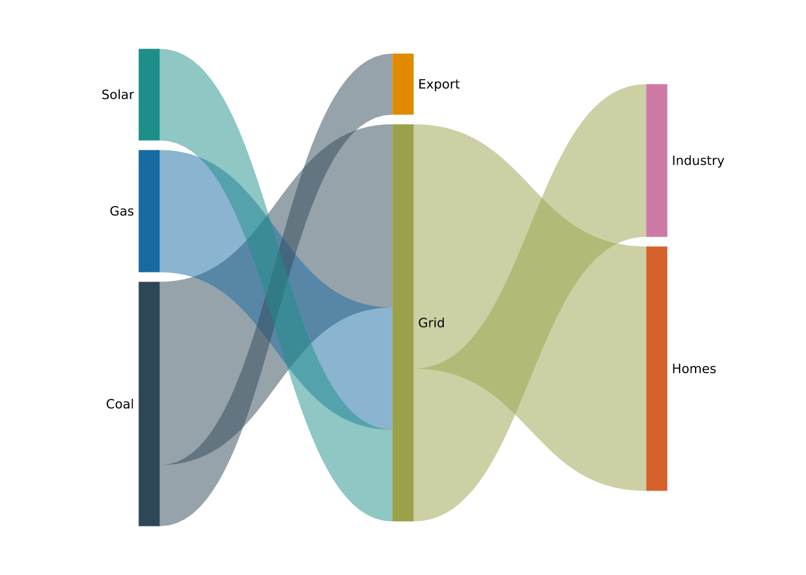
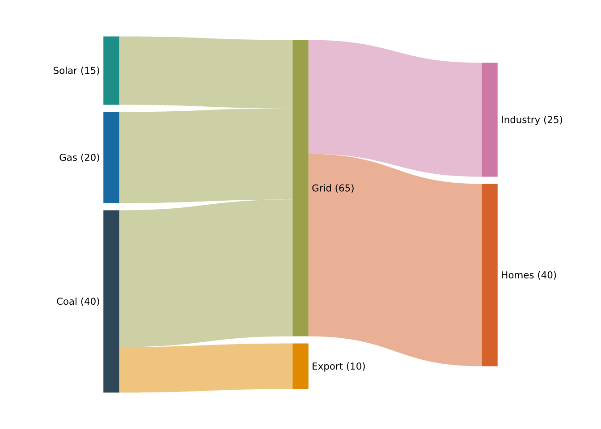
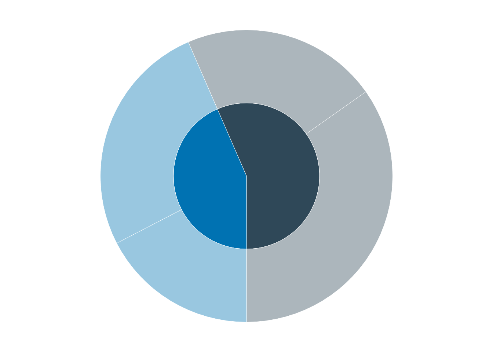

# Flows and hierarchies

Some plot types don’t map columns to `x` and `y` at all — their geometry
comes from a *layout* computed from the data’s structure.
[`vgraph()`](https://r-vellum.github.io/vellumplot/reference/vgraph.md)
(see [Spatial and
networks](https://r-vellum.github.io/vellumplot/articles/spatial-and-networks.md))
is one; this article covers **flow diagrams**. Like
[`vgraph()`](https://r-vellum.github.io/vellumplot/reference/vgraph.md),
these are whole plot types with their own constructor, an axis-free
panel, and a layout run in R before anything is drawn.

## Sankey diagrams

[`vsankey()`](https://r-vellum.github.io/vellumplot/reference/vsankey.md)
draws a layered flow diagram from a **flow list**: one row per flow,
with a `from` node, a `to` node, and a `value` that sets the ribbon’s
width.

``` r

flows <- data.frame(
  from  = c("Coal", "Gas", "Coal", "Solar", "Grid", "Grid"),
  to    = c("Grid", "Grid", "Export", "Grid", "Homes", "Industry"),
  value = c(30, 20, 10, 15, 40, 25)
)
vsankey(flows, from, to, value)
```



Nodes are the union of the `from` and `to` values; a node that appears
as both a target and a source (here, `Grid`) makes the diagram
multi-stage. Columns are placed by a longest-path layering of the flows,
each node’s height is proportional to the larger of its total in- and
out-flow, and ribbon widths are proportional to `value` — so the diagram
reads as a conserved flow left to right.

The flows must form a directed acyclic graph (a node cannot reach
itself), and `value`s must be positive. Turn node labels off with
`label = FALSE`:

``` r

vsankey(flows, from, to, value, label = FALSE)
```



[`vsankey()`](https://r-vellum.github.io/vellumplot/reference/vsankey.md)
returns an ordinary \[PlotSpec\], so it renders with
[`render_plot()`](https://r-vellum.github.io/vellumplot/reference/render_plot.md)
/ [`print()`](https://rdrr.io/r/base/print.html) like any other plot.
Under the hood it adds a single
[`mark_sankey()`](https://r-vellum.github.io/vellumplot/reference/vsankey.md)
layer to an axis-free, free-aspect panel;
[`mark_sankey()`](https://r-vellum.github.io/vellumplot/reference/vsankey.md)
is exported too, for building a flow layer on a plot you have set up
yourself.

## Sunburst diagrams

[`vsunburst()`](https://r-vellum.github.io/vellumplot/reference/vsunburst.md)
draws a hierarchy as concentric rings of sectors: depth maps to a ring,
and each node’s angular span is its share of its parent’s. Input is a
**parent list** — `id`, `parent` (`NA` for the root), and `value` (given
for leaves; an internal node’s value is the sum of its children).

``` r

h <- data.frame(
  id     = c("all", "tech", "food", "phones", "laptops", "fruit", "grain"),
  parent = c(NA, "all", "all", "tech", "tech", "food", "food"),
  value  = c(NA, NA, NA, 8, 5, 6, 4)
)
vsunburst(h, id, parent, value)
```



The root sits at the centre (it is not drawn as a wedge); the first
level forms the innermost ring. `inner_radius` opens a hole for a
ring/donut sunburst:

``` r

vsunburst(h, id, parent, value, inner_radius = 0.4)
```


Both
[`vsankey()`](https://r-vellum.github.io/vellumplot/reference/vsankey.md)
and
[`vsunburst()`](https://r-vellum.github.io/vellumplot/reference/vsunburst.md)
follow the
[`vgraph()`](https://r-vellum.github.io/vellumplot/reference/vgraph.md)
pattern: the layout is computed in R and drawn through vellum
primitives, so they are ordinary specs you can render, print, or (in
future) make interactive through the same machinery as every other plot.
