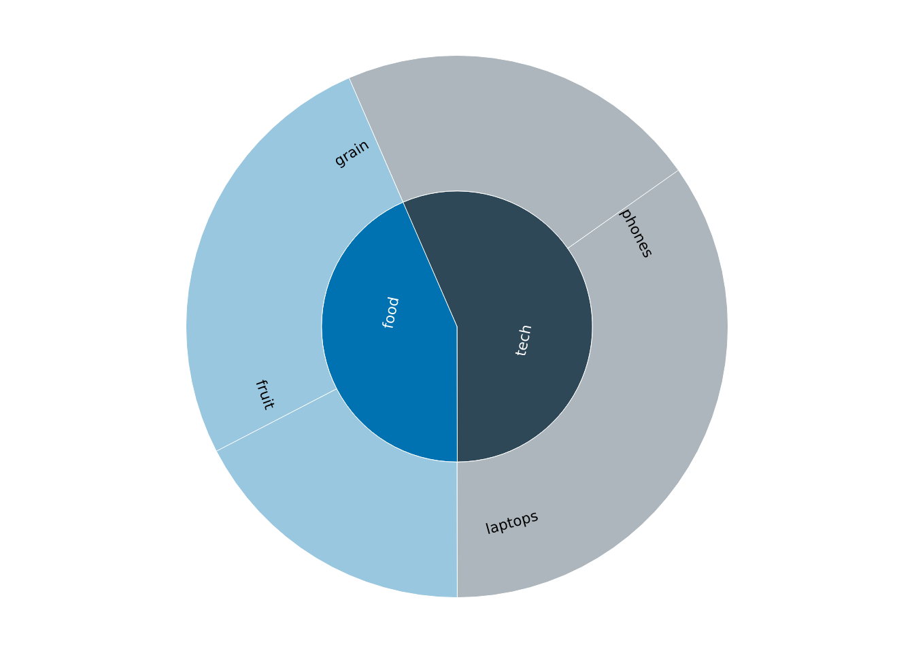
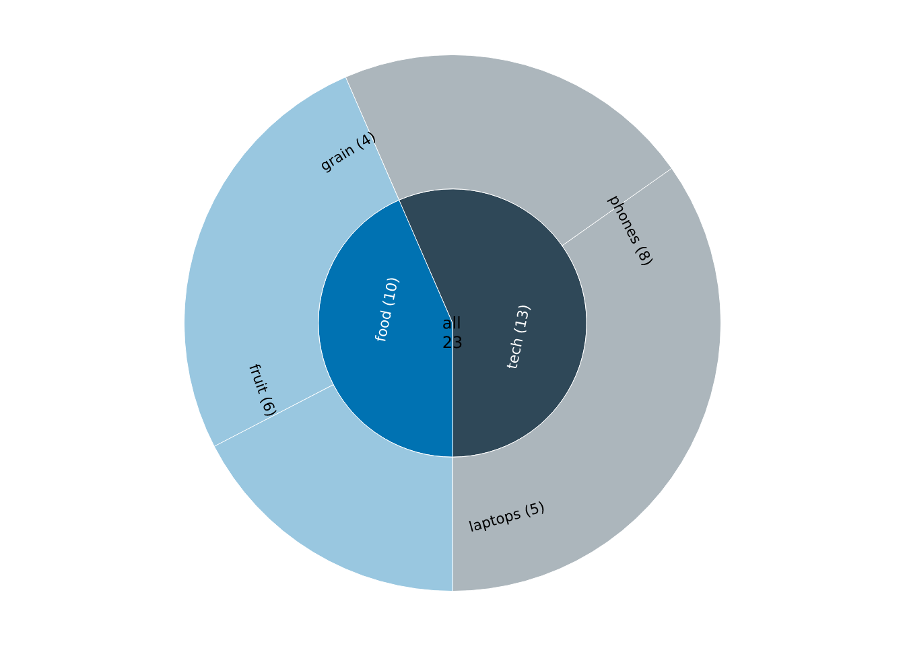
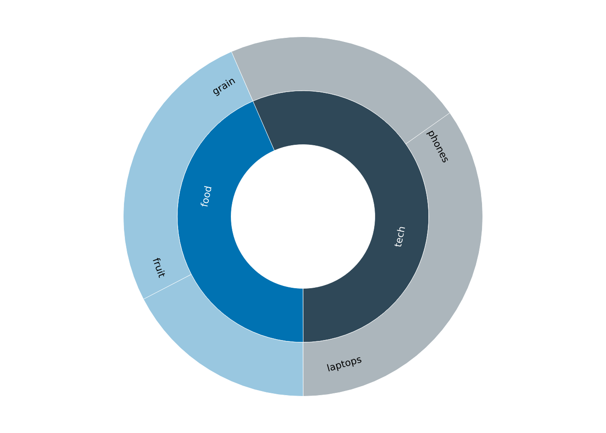

# Flows and hierarchies

Some plot types don’t map columns to `x` and `y` at all — their geometry
comes from a *layout* computed from the data’s structure.
[`vgraph()`](https://r-vellum.github.io/vellumplot/reference/vgraph.md)
(see [Spatial and
networks](https://r-vellum.github.io/vellumplot/articles/spatial-and-networks.md))
is one; this article covers **flow diagrams**. Like
[`vgraph()`](https://r-vellum.github.io/vellumplot/reference/vgraph.md),
these are whole plot types with their own constructor, an axis-free
panel, and a layout run in R before anything is drawn.

## Sankey diagrams

[`vsankey()`](https://r-vellum.github.io/vellumplot/reference/vsankey.md)
draws a layered flow diagram from a **flow list**: one row per flow,
with a `from` node, a `to` node, and a `value` that sets the ribbon’s
width.

``` r

flows <- data.frame(
  from  = c("Coal", "Gas", "Coal", "Solar", "Grid", "Grid"),
  to    = c("Grid", "Grid", "Export", "Grid", "Homes", "Industry"),
  value = c(30, 20, 10, 15, 40, 25)
)
vsankey(flows, from, to, value)
```


Nodes are the union of the `from` and `to` values; a node that appears
as both a target and a source (here, `Grid`) makes the diagram
multi-stage. Columns are placed by a longest-path layering of the flows,
and nodes within each column are ordered to minimise ribbon crossings (a
deterministic barycenter sweep). Each node’s height is proportional to
the larger of its total in- and out-flow, and ribbon widths are
proportional to `value` — so the diagram reads as a conserved flow left
to right.

Ribbons are coloured by their source node by default;
`flow_color = "target"` colours them by their target instead, and
`flow_color = "gradient"` fades each ribbon from its source colour to
its target colour. `show_values = TRUE` appends each node’s value to its
label, and `node_width` / `node_gap` tune the node rectangles.

``` r

vsankey(flows, from, to, value, show_values = TRUE, flow_color = "target")
```


``` r

vsankey(flows, from, to, value, flow_color = "gradient")
```


The flows must form a directed acyclic graph (a node cannot reach
itself), and `value`s must be positive. Turn node labels off with
`label = FALSE`:

``` r

vsankey(flows, from, to, value, label = FALSE)
```


[`vsankey()`](https://r-vellum.github.io/vellumplot/reference/vsankey.md)
returns an ordinary \[PlotSpec\], so it renders with
[`render_plot()`](https://r-vellum.github.io/vellumplot/reference/render_plot.md)
/ [`print()`](https://rdrr.io/r/base/print.html) like any other plot.
Under the hood it adds a single
[`mark_sankey()`](https://r-vellum.github.io/vellumplot/reference/vsankey.md)
layer to an axis-free, free-aspect panel;
[`mark_sankey()`](https://r-vellum.github.io/vellumplot/reference/vsankey.md)
is exported too, for building a flow layer on a plot you have set up
yourself.

## Sunburst diagrams

[`vsunburst()`](https://r-vellum.github.io/vellumplot/reference/vsunburst.md)
draws a hierarchy as concentric rings of sectors: depth maps to a ring,
and each node’s angular span is its share of its parent’s. Input is a
**parent list** — `id`, `parent` (`NA` for the root), and `value` (given
for leaves; an internal node’s value is the sum of its children).

``` r

h <- data.frame(
  id     = c("all", "tech", "food", "phones", "laptops", "fruit", "grain"),
  parent = c(NA, "all", "all", "tech", "tech", "food", "food"),
  value  = c(NA, NA, NA, 8, 5, 6, 4)
)
vsunburst(h, id, parent, value)
```



The root sits at the centre (it is not drawn as a wedge); the first
level forms the innermost ring, starting at twelve o’clock and winding
clockwise. Each top-level branch takes a distinct hue, and its
descendants inherit that hue lightened with depth, so branches stay
distinguishable and each ring reads as a shade of its parent.

Each segment is labelled with its `id` by default, oriented
(tangentially, radially, or horizontally) to fit its wedge and kept
upright; a label that fits in no orientation is dropped, so a busy
sunburst stays legible. `show_values` appends each node’s value, and
`root_label` writes the root — with its total when values are shown — in
the centre:

``` r

vsunburst(h, id, parent, value, show_values = TRUE, root_label = TRUE)
```



`inner_radius` opens a hole for a ring/donut sunburst:

``` r

vsunburst(h, id, parent, value, inner_radius = 0.4)
```



Both
[`vsankey()`](https://r-vellum.github.io/vellumplot/reference/vsankey.md)
and
[`vsunburst()`](https://r-vellum.github.io/vellumplot/reference/vsunburst.md)
follow the
[`vgraph()`](https://r-vellum.github.io/vellumplot/reference/vgraph.md)
pattern: the layout is computed in R and drawn through vellum
primitives, so they are ordinary specs you can render, print, or (in
future) make interactive through the same machinery as every other plot.
