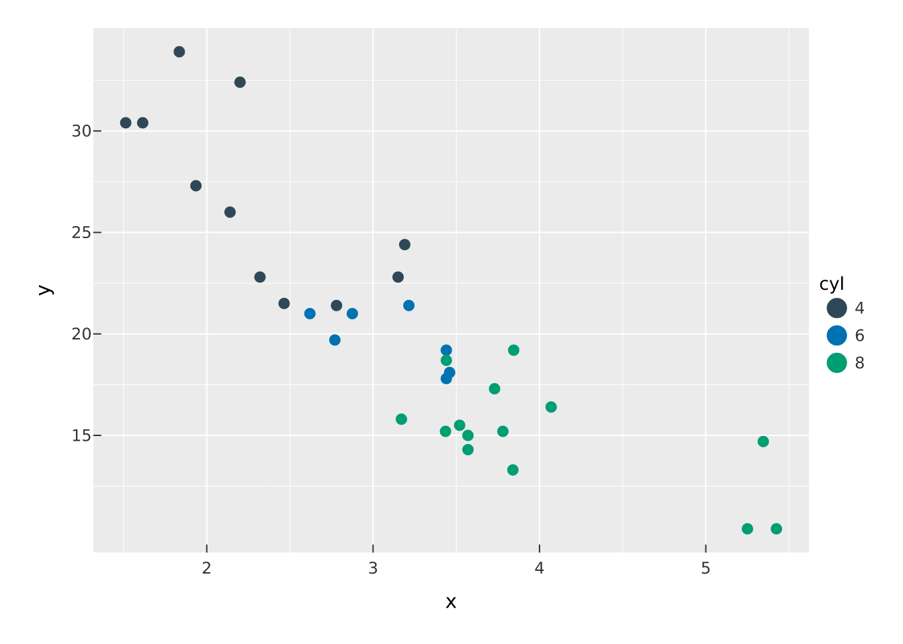
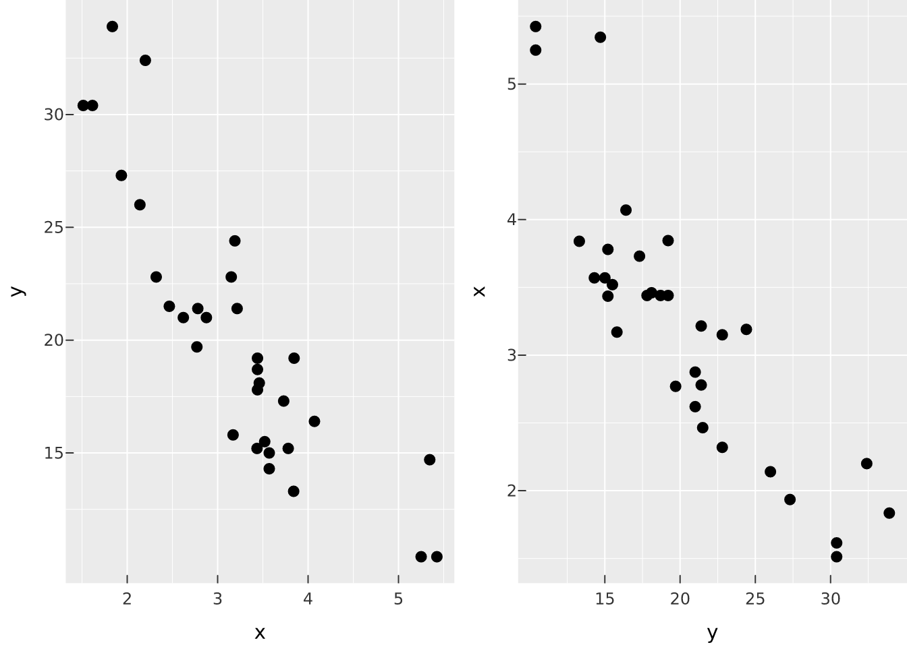

# Declarative interactivity

Most of vellumplot describes a *static* picture. But interaction can be
part of the plot too — declared in the spec, travelling with it, and
enacted by any capable host (today,
[vellumwidget](https://r-vellum.github.io/vellumwidget/)). This is
different from configuring a widget after the fact: the interaction is a
first-class, serialisable piece of the plot.

Everything on this page is **inert on a static render** — a plot with
interactions compiles and draws exactly like one without (the figures
below are the static renders). The interaction comes alive only when a
host such as `vellumwidget::as_widget()` enacts it.

## Selections

A **selection** is a named set of data elements defined by a user
gesture. On its own it does nothing; you refer to it elsewhere. Declare
one with
[`select_point()`](https://r-vellum.github.io/vellumplot/reference/select_point.md)
(a click or hover, or a legend value) or
[`select_interval()`](https://r-vellum.github.io/vellumplot/reference/select_point.md)
(a brush or lasso, optionally locked to an axis):

``` r

p |> select_point("hi", on = "hover") # hover a mark
p |> select_interval("brush", on = "x") # drag an x-range
```

`on` sets the gesture; `empty = TRUE` (the default) means an *empty*
selection contains everything — so an untouched plot shows its full self
and interacting *narrows* it.

## Conditional encoding: `condition()`

Use
[`condition()`](https://r-vellum.github.io/vellumplot/reference/condition.md)
as the value of an aesthetic to make it depend on selection membership:
members get the first value, non-members the second.

``` r

df <- data.frame(x = mtcars$wt, y = mtcars$mpg, cyl = factor(mtcars$cyl))
vplot(df) |>
  mark_point(x = x, y = y, color = condition("hi", cyl, "grey80")) |>
  select_point("hi", on = "hover")
```



[`condition()`](https://r-vellum.github.io/vellumplot/reference/condition.md)
is transparent to the grammar: the `if_true` branch trains the colour
scale and draws the legend exactly as `color = cyl` would, so the static
render is the full, meaningful plot. With `empty = TRUE`, nothing is
selected initially, so every point shows its `if_true` colour; once a
host activates the selection, non-members switch to `if_false` (here
`"grey80"`) — the spotlight.

Omit `if_false` to fall back to the theme’s dim appearance:

``` r

mark_point(x = x, y = y, color = condition("hi", cyl)) # non-members just dim
```

## Filtering: `filter_by()`

[`filter_by()`](https://r-vellum.github.io/vellumplot/reference/filter_by.md)
shows only the selection’s members, hiding the rest:

``` r

vplot(df) |>
  mark_point(x = x, y = y) |>
  select_interval("brush", on = "xy") |>
  filter_by("brush")
```

### Cross-filtering across views

The real power is pointing a *second* view at a selection defined on a
*first* — brush one panel, a linked panel narrows to those rows while
the source stays full. Define the selection once,
[`add_selection()`](https://r-vellum.github.io/vellumplot/reference/add_selection.md)
it on the source, and
[`filter_by()`](https://r-vellum.github.io/vellumplot/reference/filter_by.md)
it on the target:

``` r

sel <- select_interval("brush", on = "xy")
hconcat(
  vplot(df) |> mark_point(x = x, y = y) |> add_selection(sel),
  vplot(df) |> mark_point(x = y, y = x) |> filter_by(sel)
)
```



The two views share row identity, so a gesture in one maps to the
matching rows in the other. This cross-view coordination is exactly what
a widget *flag* cannot express — it lives in the plot.

## Overview + detail: `bind_scale()`

[`bind_scale()`](https://r-vellum.github.io/vellumplot/reference/bind_scale.md)
binds a panel’s view to an interval selection on another (an overview),
so brushing the overview pans/zooms the detail. It is declared in the
spec today; host enactment is in progress.

## Which marks are addressable

Give a mark an identity with `data_id=` (and, optionally, a `tooltip=`)
and it becomes hoverable, selectable and cross-filterable. This is no
longer limited to the batched marks (points, bars, tiles, segments): a
line or step **series** is one addressable object, a filled
[`mark_area()`](https://r-vellum.github.io/vellumplot/reference/mark_area.md)
/
[`mark_ribbon()`](https://r-vellum.github.io/vellumplot/reference/mark_area.md)
band is one polygon,
[`mark_text()`](https://r-vellum.github.io/vellumplot/reference/mark_text.md)
labels are addressable per datum,
[`mark_label()`](https://r-vellum.github.io/vellumplot/reference/mark_text.md)
keys by its rounded background box, and an sf polygon / choropleth keys
per feature.

``` r

# hover the whole trend line as one object
vplot(pressure) |>
  mark_line(x = temperature, y = pressure, data_id = "vapor-pressure") |>
  select_point("series", on = "hover")
```

A mark you leave without a key is simply not addressable — and, for
lines, polygons and text, it contributes no row to the interaction model
at all. That is deliberate: a plot’s gridlines and axis labels are
unkeyed text and lines, and they must not drown the marks that carry
meaning. So *absence of a key is a choice you are making*, not a
limitation.

## What a host does with it

`vellumplot` compiles once and carries the interaction declarations plus
the per-element metadata a host needs
([`interaction_model()`](https://r-vellum.github.io/vellumplot/reference/interaction_model.md)
returns the declaration block). The host reads them and wires the
gestures it already performs on the frozen scene — highlight, hide,
pan/zoom — with no recompilation. Turn any of the plots above into a
live widget with:

``` r

library(vellumwidget)
vplot(df) |>
  mark_point(x = x, y = y, color = condition("hi", cyl, "grey80")) |>
  select_point("hi", on = "hover") |>
  as_widget()
```

The interaction is display-tier by design: it reacts on the frozen scene
(highlight, filter-by-hiding, pan/zoom) and never recomputes the
grammar. See
[`select_point()`](https://r-vellum.github.io/vellumplot/reference/select_point.md),
[`select_interval()`](https://r-vellum.github.io/vellumplot/reference/select_point.md),
[`condition()`](https://r-vellum.github.io/vellumplot/reference/condition.md),
[`filter_by()`](https://r-vellum.github.io/vellumplot/reference/filter_by.md),
[`add_selection()`](https://r-vellum.github.io/vellumplot/reference/add_selection.md),
and
[`bind_scale()`](https://r-vellum.github.io/vellumplot/reference/bind_scale.md)
in the reference.
