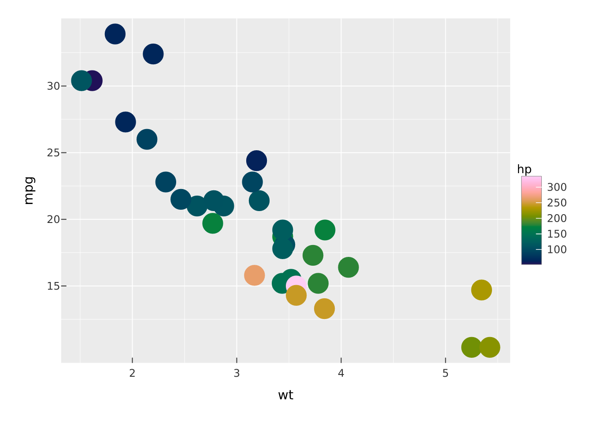
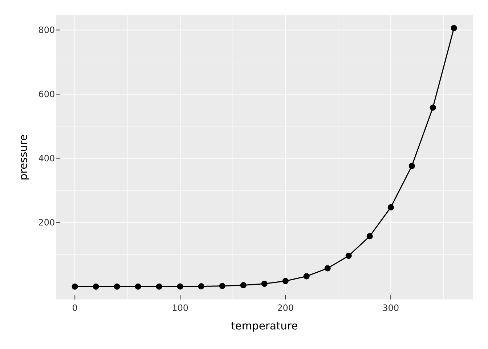
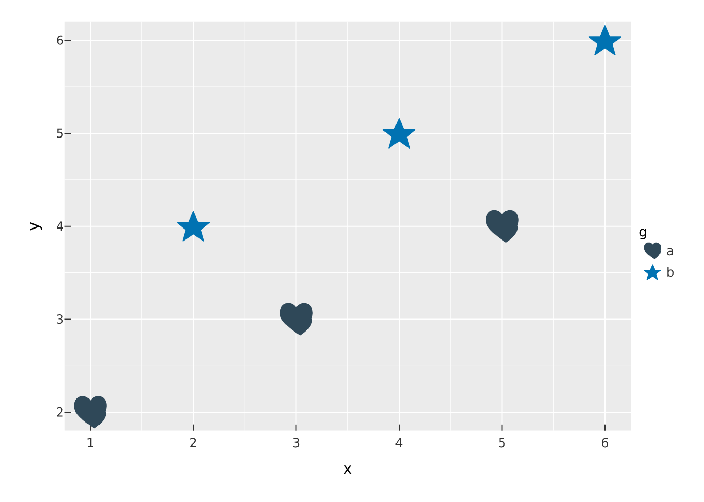
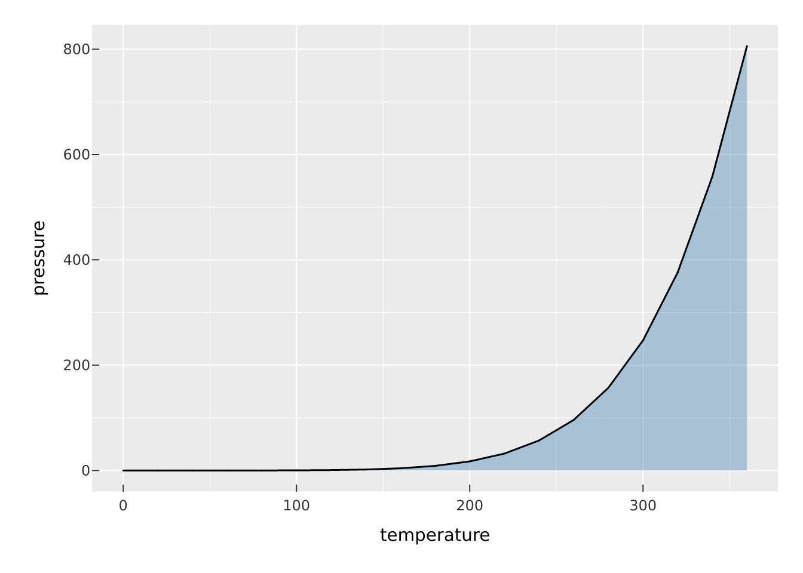
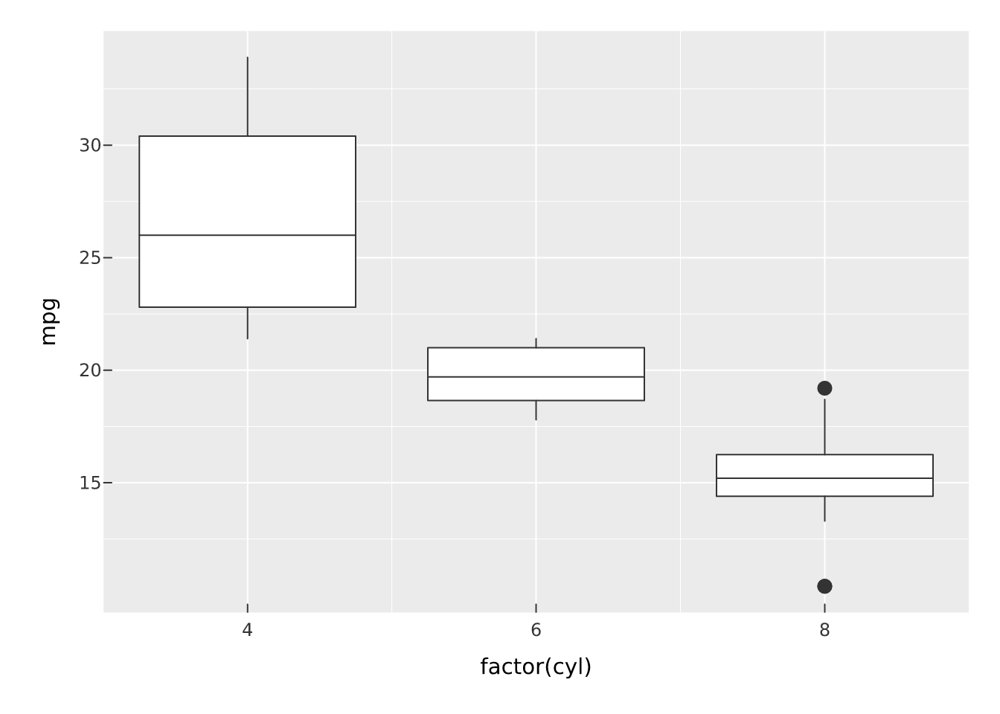
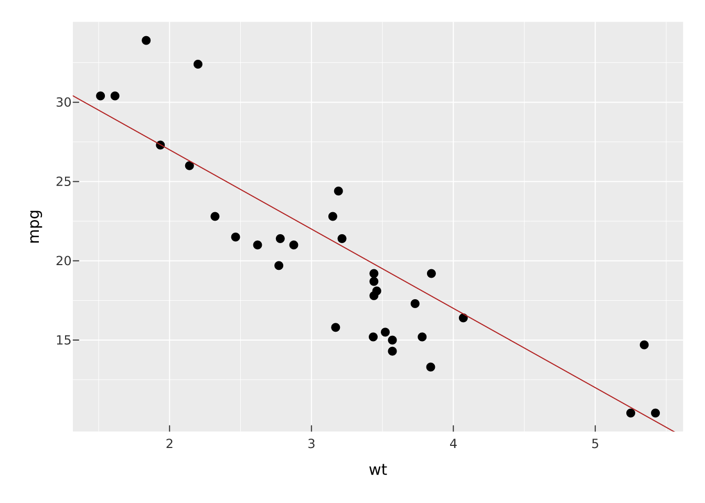
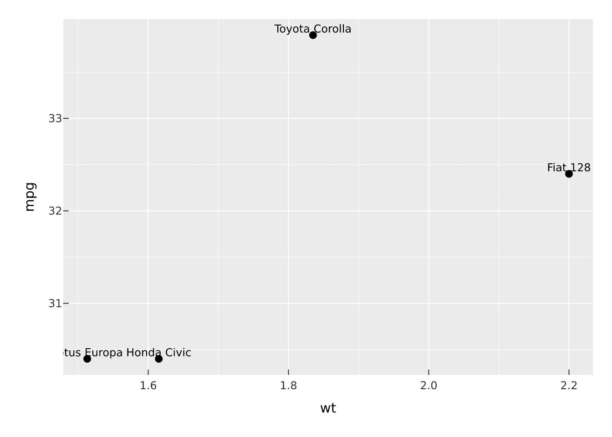
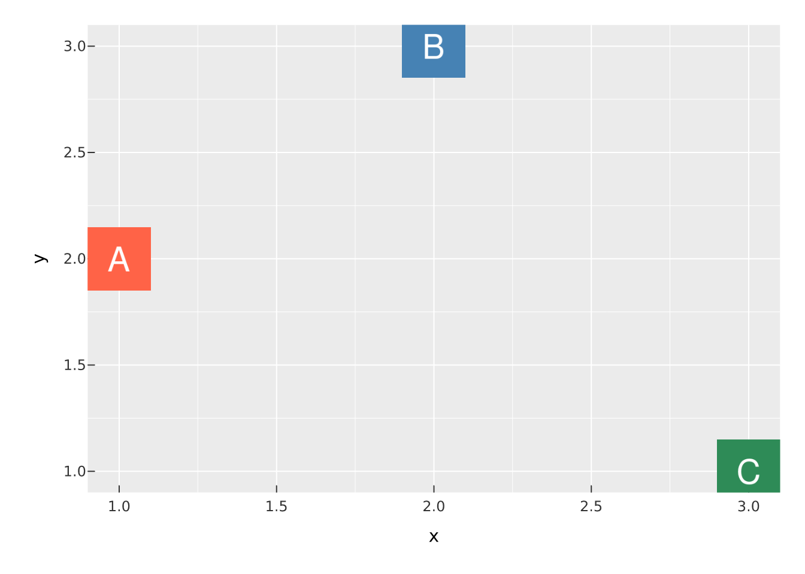
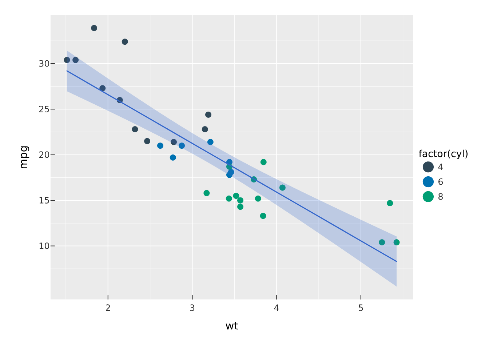

# Marks, layer by layer

A vellumplot plot is a stack of *marks*. Each `mark_*()` appends one
drawing layer to the spec, and every mark reads the same grammar: bare
column names (or expressions) captured with tidy evaluation become
*encodings*, while scalar values become constant aesthetics.
`color = hp` maps the `hp` column through a scale; `color = "red"`
paints every element red.

``` r

vplot(mtcars) |>
  mark_point(x = wt, y = mpg, color = hp, size = 3)
```



You can stack as many marks as you like on a panel, and scales train
across all of them at once.

## Points, lines, and bars

[`mark_point()`](https://r-vellum.github.io/vellumplot/reference/mark_point.md)
draws markers;
[`mark_line()`](https://r-vellum.github.io/vellumplot/reference/mark_point.md)
and
[`mark_step()`](https://r-vellum.github.io/vellumplot/reference/mark_area.md)
connect points in `x` order;
[`mark_rule()`](https://r-vellum.github.io/vellumplot/reference/mark_point.md)
draws reference lines.
[`mark_point()`](https://r-vellum.github.io/vellumplot/reference/mark_point.md)
also takes `shape` (one of `"circle"`, `"square"`, `"triangle"`,
`"diamond"`, `"plus"`, `"cross"`) and a `position = "jitter"`
adjustment.

``` r

vplot(pressure) |>
  mark_line(x = temperature, y = pressure) |>
  mark_point(x = temperature, y = pressure)
```



[`mark_bar()`](https://r-vellum.github.io/vellumplot/reference/mark_point.md)
draws bars from a zero baseline. Give it an explicit `y` for heights, or
omit `y` and it counts rows per category (the count stat). When `fill`
is mapped, groups stack by default; switch to side-by-side with
`position = "dodge"` or normalise to 1 with `position = "fill"`.

``` r

vplot(mtcars) |>
  mark_bar(x = factor(cyl), fill = factor(gear), position = "dodge")
```



For finer control, the `position` argument also takes a parameterised
`position_*()` object.
[`position_dodge2()`](https://r-vellum.github.io/vellumplot/reference/position.md)
fills each category’s band by the groups actually *present* (so a ragged
grouping stays centred);
[`position_nudge()`](https://r-vellum.github.io/vellumplot/reference/position.md)
offsets by a constant; `position_jitter(width=, seed=)` and
[`position_jitterdodge()`](https://r-vellum.github.io/vellumplot/reference/position.md)
control scatter for overplotted categorical points.

``` r

vplot(mtcars) |>
  mark_bar(x = factor(cyl), fill = factor(gear), position = position_dodge2(padding = 0.15))
```



## Areas and intervals

[`mark_area()`](https://r-vellum.github.io/vellumplot/reference/mark_area.md)
fills between a `y` line and zero,
[`mark_ribbon()`](https://r-vellum.github.io/vellumplot/reference/mark_area.md)
fills between `ymin` and `ymax`, and the interval marks draw ranges:
[`mark_errorbar()`](https://r-vellum.github.io/vellumplot/reference/mark_boxplot.md)
(with caps),
[`mark_linerange()`](https://r-vellum.github.io/vellumplot/reference/mark_boxplot.md)
(without), and
[`mark_segment()`](https://r-vellum.github.io/vellumplot/reference/mark_segment.md)
from `(x, y)` to `(xend, yend)`.

``` r

vplot(pressure) |>
  mark_area(x = temperature, y = pressure, fill = "steelblue", alpha = 0.4) |>
  mark_line(x = temperature, y = pressure)
```


[`mark_boxplot()`](https://r-vellum.github.io/vellumplot/reference/mark_boxplot.md)
summarises the raw `y` values per `x` category into a box-and-whisker
(box from Q1 to Q3, median line, whiskers at 1.5 times the IQR, outliers
as points).

``` r

vplot(mtcars) |>
  mark_boxplot(x = factor(cyl), y = mpg)
```



Like points and bars, these summary marks are *addressable*: an error
bar or line range keyed with `data_id`/`tooltip` carries that identity
on every segment it draws, and a boxplot keys each box by its category —
so they hover, tooltip, and select as units once rendered as an
interactive widget.

## Tiles and bins

[`mark_tile()`](https://r-vellum.github.io/vellumplot/reference/mark_tile.md)
draws a rectangle at each `(x, y)` coloured by `fill`;
[`mark_raster()`](https://r-vellum.github.io/vellumplot/reference/mark_tile.md)
is the same thing drawn as a single raster image (a fast path that needs
a complete regular grid). For continuous data,
[`mark_bin2d()`](https://r-vellum.github.io/vellumplot/reference/mark_tile.md)
and
[`mark_hex()`](https://r-vellum.github.io/vellumplot/reference/mark_tile.md)
bin `x` and `y` into a grid and colour each cell by count.

``` r

grid <- expand.grid(x = 1:8, y = 1:8)
grid$z <- with(grid, sin(x / 2) + cos(y / 2))
vplot(grid) |>
  mark_tile(x = x, y = y, fill = z) |>
  scale_fill_continuous(palette = "Batlow")
```


[`mark_contour()`](https://r-vellum.github.io/vellumplot/reference/mark_contour.md)
draws iso-density contour lines of a 2-D point cloud (and
[`mark_contour_filled()`](https://r-vellum.github.io/vellumplot/reference/mark_contour.md)
fills the bands), coloured by level. See the [statistical
marks](https://r-vellum.github.io/vellumplot/articles/statistical-marks.md)
article for the details.

``` r

vplot(faithful) |>
  mark_point(x = eruptions, y = waiting, color = "grey70") |>
  mark_contour(x = eruptions, y = waiting)
```



## Text

[`mark_text()`](https://r-vellum.github.io/vellumplot/reference/mark_text.md)
draws the `label` aesthetic as text at each `(x, y)`;
[`mark_label()`](https://r-vellum.github.io/vellumplot/reference/mark_text.md)
adds a filled background behind each label so it stays legible over busy
marks. `size` is in points, and `angle` can be mapped or constant.

``` r

top <- mtcars[mtcars$mpg > 30, ]
vplot(top) |>
  mark_point(x = wt, y = mpg) |>
  mark_text(x = wt, y = mpg, label = rownames(top), vjust = "bottom", size = 9)
```



On a crowded scatter, labels collide. `repel = TRUE` moves them apart
with a force-directed layout and draws a thin leader back to each point.
The layout is resolved against the true rendered panel size (so it
doesn’t drift with the data scale) and is reproducible via `seed`.

``` r

vplot(mtcars) |>
  mark_point(x = wt, y = mpg) |>
  mark_text(
    x = wt, y = mpg, label = rownames(mtcars),
    repel = TRUE, size = 7, seed = 1
  )
```


## Images

[`mark_image()`](https://r-vellum.github.io/vellumplot/reference/mark_image.md)
puts a bitmap at each `(x, y)` in place of a marker: a flag or a company
logo. `src` is a column of file paths (one image per datum) or a single
path reused at every point. `size` sets the height in millimetres, and
the width follows each image’s own aspect ratio, so nothing stretches.

``` r

badge <- function(text, fill) {
  path <- tempfile(fileext = ".png")
  magick::image_blank(120, 120, color = fill) |>
    magick::image_annotate(text, size = 64, gravity = "center", color = "white") |>
    magick::image_write(path)
  path
}
d <- data.frame(
  x = 1:3,
  y = c(2, 3, 1),
  logo = c(badge("A", "tomato"), badge("B", "steelblue"), badge("C", "seagreen"))
)
vplot(d) |>
  mark_image(x = x, y = y, src = logo, size = 14)
```



Reading images needs the magick package (a suggested dependency), which
decodes PNG, JPEG, SVG, and more. Because `size` is in millimetres
rather than data units, images keep their physical size as the panel
resizes.

## Pie and donut

[`mark_pie()`](https://r-vellum.github.io/vellumplot/reference/mark_pie.md)
and
[`mark_donut()`](https://r-vellum.github.io/vellumplot/reference/mark_pie.md)
are the part-of-whole shortcuts. Each `value` becomes a wedge; `fill`
colours the slices. Under the hood they are a stacked bar projected
through
[`coord_polar()`](https://r-vellum.github.io/vellumplot/reference/coord_polar.md),
which they set for you.

``` r

parts <- data.frame(part = c("a", "b", "c", "d"), n = c(3, 5, 2, 4))
vplot(parts) |>
  mark_donut(value = n, fill = part, inner_radius = 0.6)
```


For polar plots generally,
[`coord_radial()`](https://r-vellum.github.io/vellumplot/reference/coord_polar.md)
extends
[`coord_polar()`](https://r-vellum.github.io/vellumplot/reference/coord_polar.md)
with a central hole (`inner_radius`) and a partial `start`–`end` arc —
e.g. a semicircular coxcomb:

``` r

vplot(mtcars) |>
  mark_bar(x = factor(cyl), fill = factor(cyl)) |>
  coord_radial(theta = "x", start = -pi / 2, end = pi / 2, inner_radius = 0.2)
```


## Layering is the point

Because scales train across every layer, mixing marks on one panel
works. Here a point cloud and a fitted line share the same trained `x`
and `y` axes.

``` r

vplot(mtcars) |>
  mark_point(x = wt, y = mpg, color = factor(cyl)) |>
  mark_smooth(x = wt, y = mpg, method = "lm")
```



From here:

- **[Scales and
  guides](https://r-vellum.github.io/vellumplot/articles/scales-and-guides.md)**
  for the mapping from data to colour, size, and axes.
- **[Statistical
  marks](https://r-vellum.github.io/vellumplot/articles/statistical-marks.md)**
  for histograms, densities, and smooths in depth.
- **[Spatial and
  networks](https://r-vellum.github.io/vellumplot/articles/spatial-and-networks.md)**
  for
  [`mark_sf()`](https://r-vellum.github.io/vellumplot/reference/mark_sf.md)
  maps and
  [`vgraph()`](https://r-vellum.github.io/vellumplot/reference/vgraph.md)
  node-link diagrams.
