# Scales and guides

A *scale* is the function that turns a data value into something you can
see: a colour, a marker size, a shape, or a position along an axis. In
vellumplot every mapped encoding gets a scale automatically, trained
from the data, so most plots need no explicit scale at all. You reach
for a `scale_*()` call only when you want to override the default:
change the palette, set a transform, fix the limits, or rename the
guide.

The key idea is *training*. When you map `color = hp`, vellumplot scans
the `hp` values across every layer, works out the domain, and builds a
continuous colour scale with a legend. Add a `scale_*()` and you are
declaring an override on top of that trained default, not replacing the
whole machine.

## Colour, continuous and discrete

Continuous data get a smooth colour ramp; discrete data get a
categorical palette. The `palette` argument takes a vector of colours or
a single palette name passed to
[`grDevices::hcl.colors()`](https://rdrr.io/r/grDevices/palettes.html)
(for example `"Batlow"`, `"Blues"`, `"Set 2"`).

``` r

vplot(mtcars) |>
  mark_point(x = wt, y = mpg, color = hp, size = 3) |>
  scale_color_continuous(palette = "Viridis", name = "Horsepower")
```

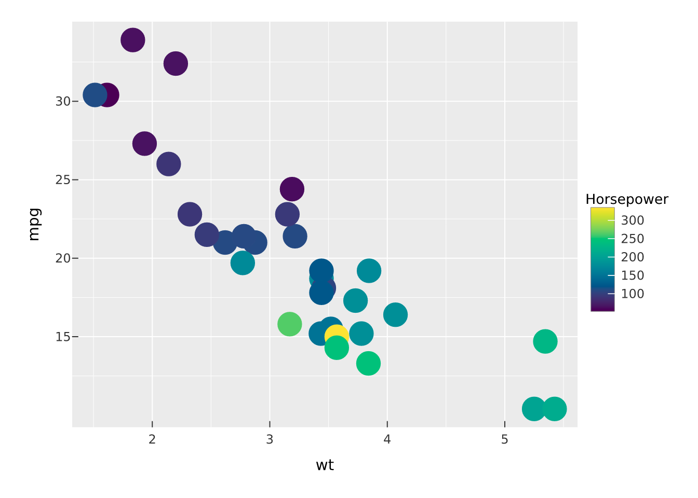

For a two-colour ramp,
[`scale_color_gradient()`](https://r-vellum.github.io/vellumplot/reference/scale_color_continuous.md)
takes the endpoints directly. For categories,
[`scale_color_manual()`](https://r-vellum.github.io/vellumplot/reference/scale_color_continuous.md)
maps levels to colours; naming the values pins each level to a specific
colour.

``` r

vplot(mtcars) |>
  mark_point(x = wt, y = mpg, color = factor(cyl), size = 3) |>
  scale_color_manual(values = c("4" = "#1b9e77", "6" = "#d95f02", "8" = "#7570b3"))
```

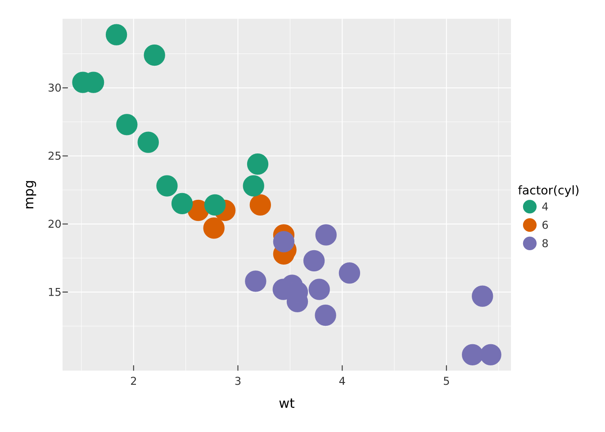

Ramps built from a plain colour vector — a
`scale_color_gradient(low, high)`, or a `palette` given as colours — are
interpolated in the perceptually-uniform **Oklab** space, not sRGB, so
the ramp and its colourbar read evenly instead of dipping through a
muddy, over-dark middle (a blue→yellow ramp no longer passes through
grey). Designed perceptual palettes such as the default `Batlow` or any
[`hcl.colors()`](https://rdrr.io/r/grDevices/palettes.html) name are
already uniform and unchanged. To blend in sRGB (or CIE Lab) instead,
set `options(vellumplot.color.interpolation = "srgb")` (or `"lab"`). A
gradient *fill* opts in per gradient with
`linear_gradient(..., interpolation = "oklab")`.

## Binned colour

[`scale_fill_binned()`](https://r-vellum.github.io/vellumplot/reference/scale_fill_binned.md)
and
[`scale_color_binned()`](https://r-vellum.github.io/vellumplot/reference/scale_fill_binned.md)
cut a continuous aesthetic into classes and give it a discrete legend,
which is what you want for a choropleth or a heatmap you read by band
rather than by exact value. Choose the classification `style`
(`"quantile"`, `"equal"`, `"pretty"`, or any
[`classInt::classIntervals()`](https://r-spatial.github.io/classInt/reference/classIntervals.html)
style) and the number of classes `n`.

``` r

grid <- expand.grid(x = 1:10, y = 1:10)
grid$z <- with(grid, x * y)
vplot(grid) |>
  mark_tile(x = x, y = y, fill = z) |>
  scale_fill_binned(style = "quantile", n = 5, palette = "Mako")
```

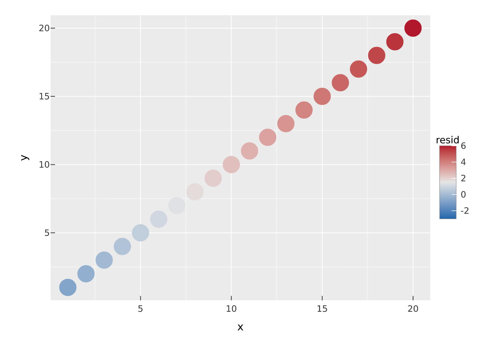

## Size, shape, and edge width

Non-colour aesthetics have scales too.
[`scale_size()`](https://r-vellum.github.io/vellumplot/reference/scale_size.md)
maps values linearly to a marker-size `range` (in mm);
[`scale_shape()`](https://r-vellum.github.io/vellumplot/reference/scale_shape.md)
cycles a set of shapes over the levels of a discrete aesthetic;
[`scale_edge_width()`](https://r-vellum.github.io/vellumplot/reference/scale_edge_width.md)
does for network edges what
[`scale_size()`](https://r-vellum.github.io/vellumplot/reference/scale_size.md)
does for points.

The shape palette is `"circle"`, `"square"`, `"triangle"`, `"diamond"`,
`"plus"`, `"cross"`, `"triangle_down"`, and `"star"` — eight in all, so
a mapped `shape` covers up to eight levels automatically. Pass a subset
(or a reordering) with `scale_shape(values = ...)`. Filled shapes take
the mark’s `fill`/`color`, so an open marker is `fill = NA` with a
`color`.

``` r

vplot(mtcars) |>
  mark_point(x = wt, y = mpg, size = hp, color = factor(cyl)) |>
  scale_size(range = c(2, 9), name = "hp")
```

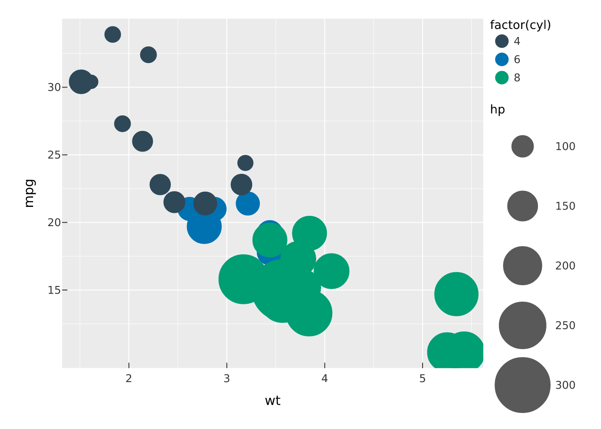

## Opacity and line type

`alpha` and `linetype` are mapped aesthetics too.
[`scale_alpha()`](https://r-vellum.github.io/vellumplot/reference/scale_alpha.md)
maps a continuous variable to opacity (its `range` defaults to
`c(0.1, 1)`), a good way to let density show through an overplotted
cloud.

``` r

vplot(mtcars) |>
  mark_point(x = wt, y = mpg, alpha = hp, size = 3) |>
  scale_alpha(range = c(0.2, 1))
```

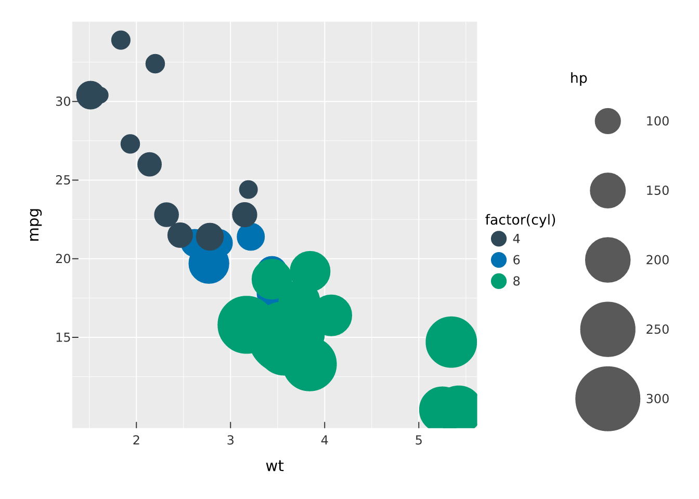

[`scale_linetype()`](https://r-vellum.github.io/vellumplot/reference/scale_linetype.md)
maps a discrete variable to line types, cycling `"solid"`, `"dashed"`,
`"dotted"`, and so on. It applies to line-like marks
([`mark_line()`](https://r-vellum.github.io/vellumplot/reference/mark_point.md),
[`mark_step()`](https://r-vellum.github.io/vellumplot/reference/mark_area.md)).

``` r

series <- data.frame(
  x = rep(1:20, 3),
  y = c(cumsum(rnorm(20)), cumsum(rnorm(20)), cumsum(rnorm(20))),
  series = rep(c("a", "b", "c"), each = 20)
)
vplot(series) |>
  mark_line(x = x, y = y, linetype = series)
```

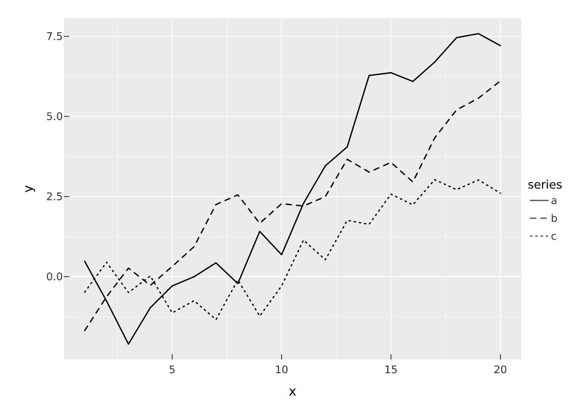

## Identity scales

Sometimes a column *already* holds the exact aesthetic values you want:
actual colour names, sizes in millimetres, shape names. An identity
scale uses them verbatim and draws no legend. There is a variant for
each aesthetic:
[`scale_color_identity()`](https://r-vellum.github.io/vellumplot/reference/scale_color_identity.md),
[`scale_fill_identity()`](https://r-vellum.github.io/vellumplot/reference/scale_color_identity.md),
[`scale_size_identity()`](https://r-vellum.github.io/vellumplot/reference/scale_color_identity.md),
[`scale_shape_identity()`](https://r-vellum.github.io/vellumplot/reference/scale_color_identity.md),
[`scale_alpha_identity()`](https://r-vellum.github.io/vellumplot/reference/scale_color_identity.md),
[`scale_linetype_identity()`](https://r-vellum.github.io/vellumplot/reference/scale_color_identity.md).

``` r

df <- data.frame(
  x = 1:5, y = 1:5,
  col = c("firebrick", "goldenrod", "forestgreen", "steelblue", "purple")
)
vplot(df) |>
  mark_point(x = x, y = y, color = col, size = 6) |>
  scale_color_identity()
```

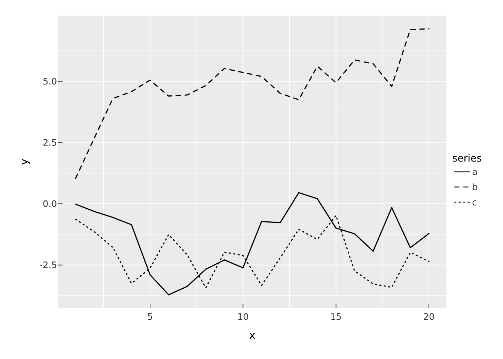

## Position scales

[`scale_x_continuous()`](https://r-vellum.github.io/vellumplot/reference/scale_x_continuous.md)
and
[`scale_y_continuous()`](https://r-vellum.github.io/vellumplot/reference/scale_x_continuous.md)
control the axes. By default they train from the data with a small
expansion; override them to set `limits`, apply a `trans` (`"log10"`,
`"sqrt"`, `"reverse"`), or supply explicit `breaks` and `labels`.
Categorical axes use
[`scale_x_discrete()`](https://r-vellum.github.io/vellumplot/reference/scale_x_continuous.md)
and
[`scale_y_discrete()`](https://r-vellum.github.io/vellumplot/reference/scale_x_continuous.md),
whose `limits` set the order or subset of levels.

``` r

vplot(mtcars) |>
  mark_point(x = wt, y = mpg) |>
  scale_y_continuous(limits = c(10, 35), breaks = seq(10, 35, 5)) |>
  scale_x_continuous(trans = "log10", name = "Weight (log scale)")
```

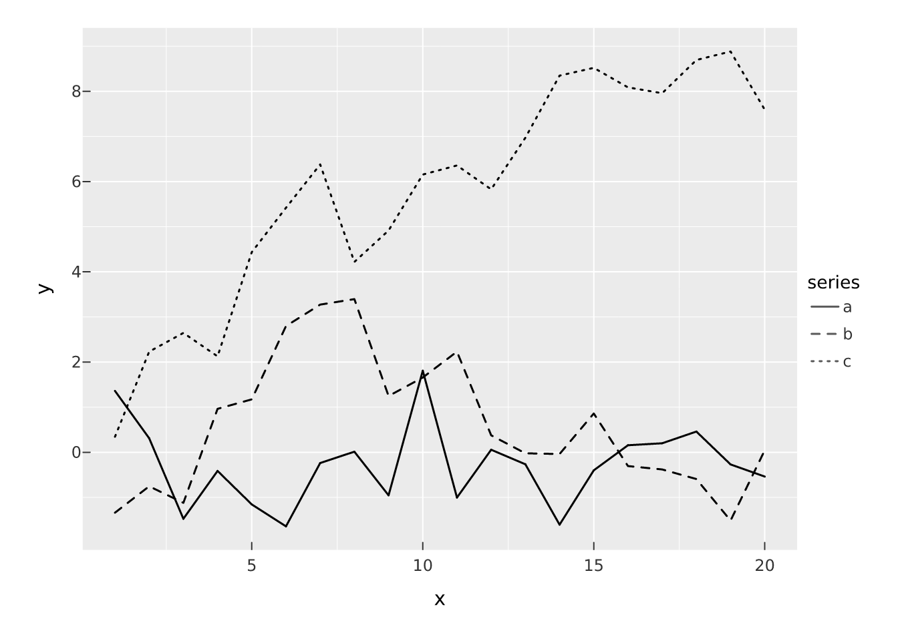

To set limits without spelling out a whole scale, use the shortcuts
[`xlim()`](https://r-vellum.github.io/vellumplot/reference/lims.md),
[`ylim()`](https://r-vellum.github.io/vellumplot/reference/lims.md), and
[`lims()`](https://r-vellum.github.io/vellumplot/reference/lims.md) (the
last takes one named argument per aesthetic):

``` r

vplot(mtcars) |>
  mark_point(x = wt, y = mpg) |>
  lims(x = c(0, 6), y = c(0, 40))
```

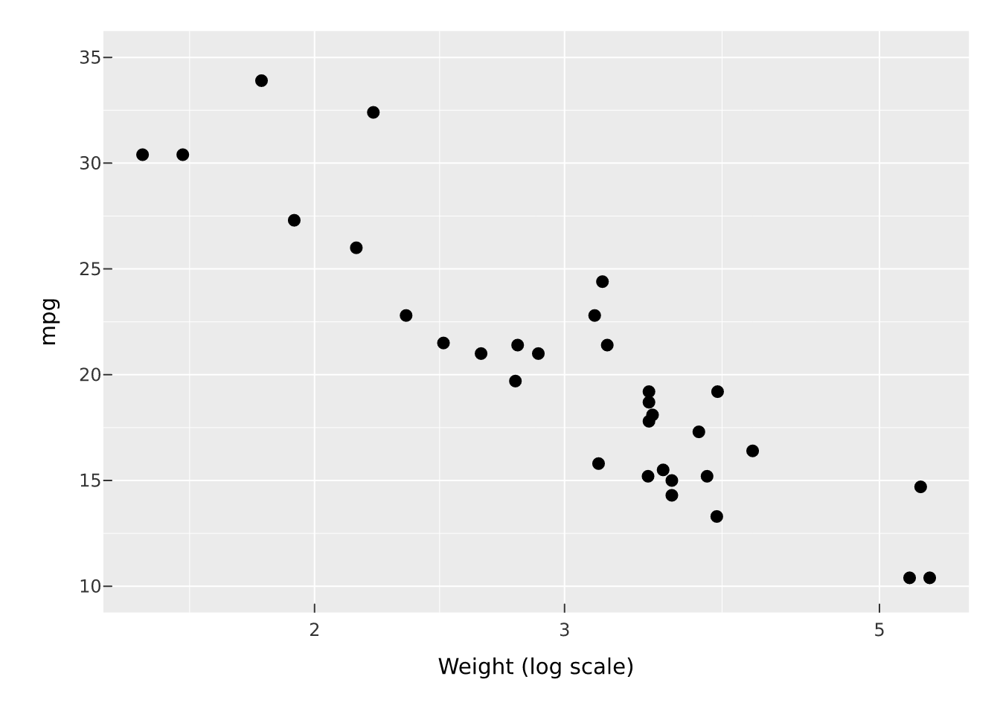

### Scale transform vs display transform

A `scale_*(trans=)` (above) transforms the *data*: it picks its breaks
in the transformed space, so a `"log10"` axis is labelled `1, 10, 100`.
[`coord_trans()`](https://r-vellum.github.io/vellumplot/reference/coord_trans.md)
instead warps only the *display*, after the scale has trained — the
breaks stay at their original data values, so the axis keeps those
labels but they sit at warped positions (gridlines bunch up, and
straight lines curve). Use it to show data on a log display without
relabelling the axis in powers of ten:

``` r

vplot(mtcars) |>
  mark_point(x = wt, y = mpg) |>
  mark_line(x = wt, y = mpg) |>
  coord_trans(y = "log10")
```

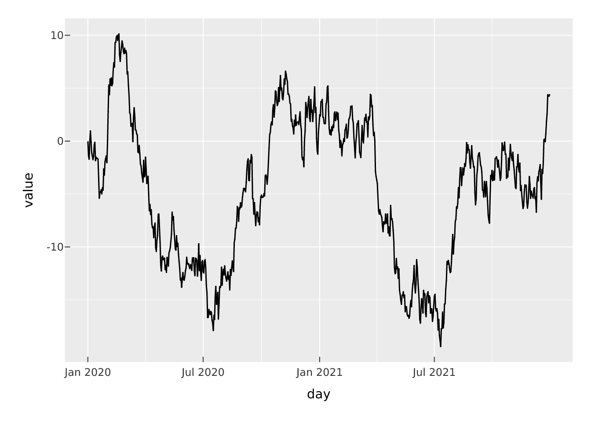

Each of `x` / `y` takes a transform name (`"log10"`, `"sqrt"`,
`"identity"`) or a `scales::transform_*()` object. It applies to the
common marks (points, lines, areas, bars, tiles, smooths, text);
interval/segment, boxplot, and raster marks are not warped yet.

## Date and time axes

A `Date` or `POSIXct` column gets a date axis automatically. To control
the break interval or the label format, declare
[`scale_x_date()`](https://r-vellum.github.io/vellumplot/reference/scale_x_date.md)
(or
[`scale_x_datetime()`](https://r-vellum.github.io/vellumplot/reference/scale_x_date.md)
/
[`scale_x_time()`](https://r-vellum.github.io/vellumplot/reference/scale_x_date.md)):
`date_breaks` takes an interval string like `"6 months"`, and
`date_labels` a [`strftime()`](https://rdrr.io/r/base/strptime.html)
format.

``` r

econ <- data.frame(
  day = as.Date("2020-01-01") + 0:729,
  value = cumsum(rnorm(730))
)
vplot(econ) |>
  mark_line(x = day, y = value) |>
  scale_x_date(date_breaks = "6 months", date_labels = "%b %Y")
```

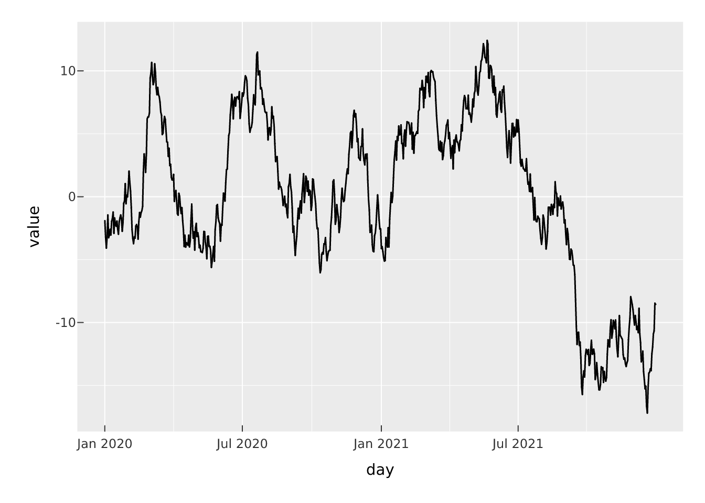

## Guides come for free

Every scale that needs a legend produces one, and vellumplot stacks
multiple legends automatically. Map two aesthetics and you get two
guides without asking.

``` r

vplot(mtcars) |>
  mark_point(x = wt, y = mpg, color = hp, size = disp) |>
  scale_color_continuous(palette = "Batlow", name = "Horsepower") |>
  scale_size(range = c(1, 8), name = "Displacement")
```

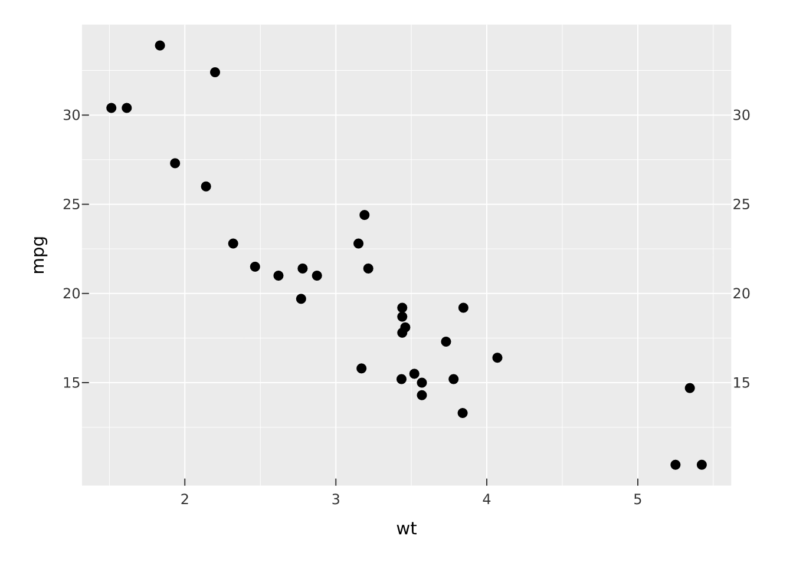

## Controlling a legend

[`guides()`](https://r-vellum.github.io/vellumplot/reference/guides.md)
overrides a single legend without respelling its scale. Pass `"none"` to
hide it, or
[`guide_legend()`](https://r-vellum.github.io/vellumplot/reference/guides.md)
to reverse the key order or override the title.

``` r

vplot(mtcars) |>
  mark_point(x = wt, y = mpg, color = factor(cyl)) |>
  guides(color = guide_legend(title = "Cylinders", reverse = TRUE))
```

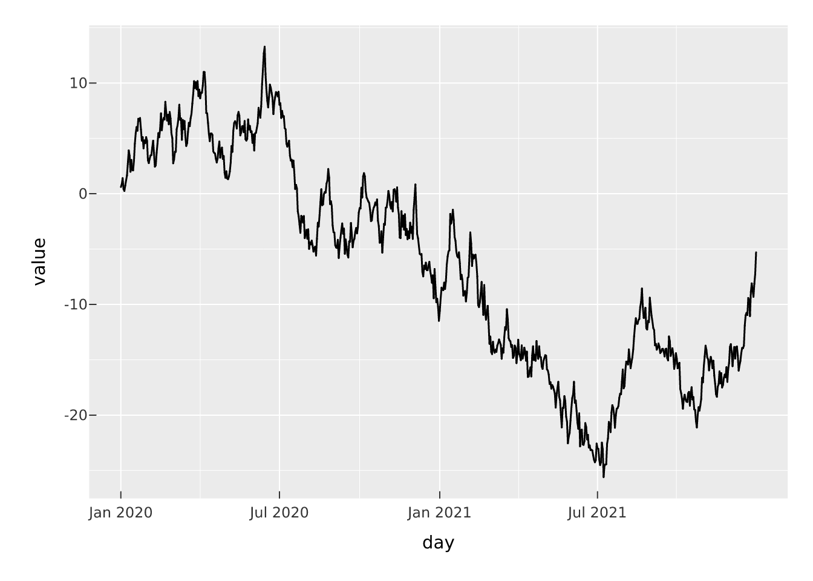

Hiding a legend keeps the mapping; the marks stay coloured, only the
guide disappears:

``` r

vplot(mtcars) |>
  mark_point(x = wt, y = mpg, color = factor(cyl)) |>
  guides(color = "none")
```

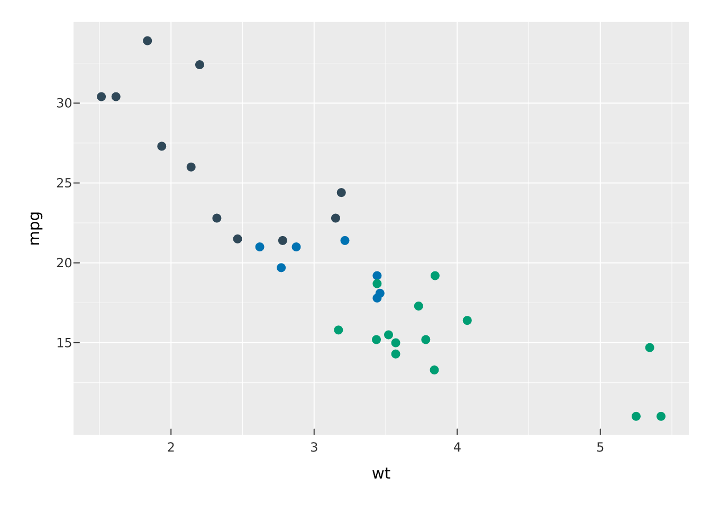

## Rich titles

Any scale `name` (and any
[`labs()`](https://r-vellum.github.io/vellumplot/reference/labs.md)
title) accepts
[`md()`](https://r-vellum.github.io/vellumplot/reference/md.md), a small
markdown subset for bold, italic, superscript, subscript, and coloured
spans. Handy for units and formulae.

``` r

vplot(mtcars) |>
  mark_point(x = wt, y = mpg, color = hp) |>
  scale_color_continuous(name = md("Power (hp m^2^)"))
```

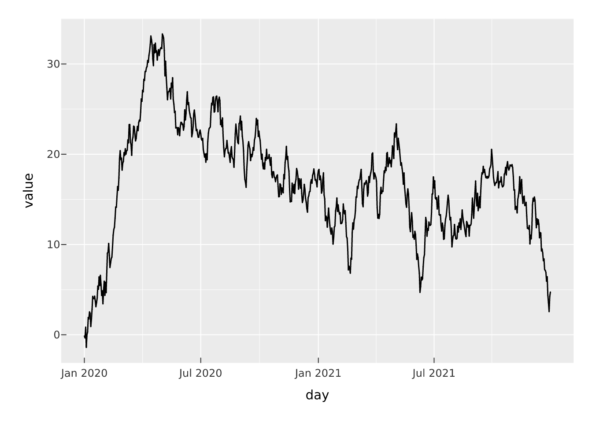

Faceted plots add one more question: should panels share a scale or
train their own? That is the
[`resolve_scale()`](https://r-vellum.github.io/vellumplot/reference/resolve_scale.md)
lattice, covered in **[Facets and
composition](https://r-vellum.github.io/vellumplot/articles/facets-and-composition.md)**.
For stat-derived aesthetics like `after_stat(count)`, see **[Statistical
marks](https://r-vellum.github.io/vellumplot/articles/statistical-marks.md)**.
