# Spatial and networks

Most of vellumplot maps columns of a data frame to `x` and `y`. Two
important data shapes do not fit that mould: spatial geometries, where
the coordinates live in a geometry column and the aspect ratio matters,
and graphs, where the positions have to be computed by a layout
algorithm first. vellumplot handles both with the same grammar, through
entry points suited to each data type.

## Maps from sf

[`mark_sf()`](https://r-vellum.github.io/vellumplot/reference/mark_sf.md)
draws the geometry column of an `sf` object. Points, lines, and polygons
each render appropriately, and there are no `x`/`y` encodings: the
coordinates come from the geometry. Other aesthetics map feature
attributes as usual, so `fill = AREA` gives you a choropleth. Pair it
with
[`coord_sf()`](https://r-vellum.github.io/vellumplot/reference/coord_sf.md),
which reprojects every layer to a common CRS before training and locks
the map aspect ratio so nothing is stretched.

``` r

nc <- sf::st_read(system.file("shape/nc.shp", package = "sf"), quiet = TRUE)
vplot(nc) |>
  mark_sf(fill = BIR74) |>
  scale_fill_binned(style = "quantile", n = 6, palette = "Batlow") |>
  coord_sf()
```

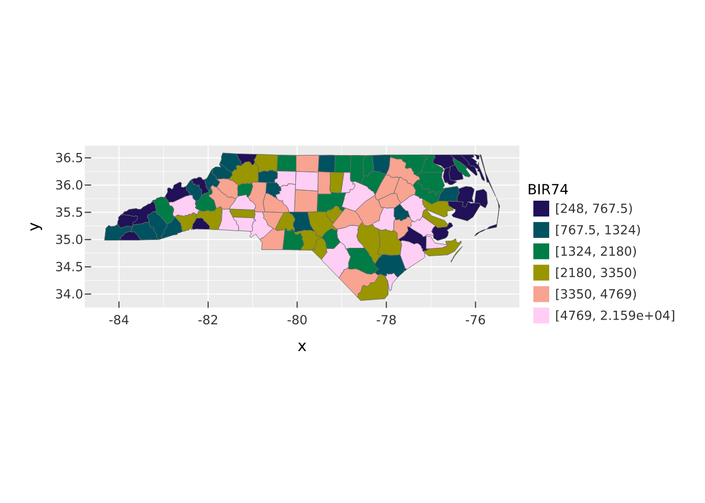

Because
[`mark_sf()`](https://r-vellum.github.io/vellumplot/reference/mark_sf.md)
is an ordinary layer, you can stack it: draw a base layer of boundaries,
then a second
[`mark_sf()`](https://r-vellum.github.io/vellumplot/reference/mark_sf.md)
for highlighted features or point locations on top, and every layer
reprojects together.

## Networks from igraph

[`vgraph()`](https://r-vellum.github.io/vellumplot/reference/vgraph.md)
starts a node-link diagram from an `igraph` graph. It runs a layout
(stress majorization by default, via `graphlayouts`) and produces a spec
whose node and edge tables already carry the `x`, `y`, `xend`, `yend`,
and `name` columns the graph marks need. Then
[`mark_edges()`](https://r-vellum.github.io/vellumplot/reference/mark_graph.md)
and
[`mark_nodes()`](https://r-vellum.github.io/vellumplot/reference/mark_graph.md)
draw it. Draw order is fixed no matter how you pipe them: edges below
nodes below labels.

``` r

g <- igraph::make_graph("Zachary")
g <- igraph::set_vertex_attr(
  g, "grp",
  value = as.factor(igraph::cluster_louvain(g)$membership)
)
g <- igraph::set_vertex_attr(g, "deg", value = igraph::degree(g))

vgraph(g, layout = "stress") |>
  mark_edges(alpha = 0.4) |>
  mark_nodes(size = deg, fill = grp) |>
  scale_size(range = c(0.5, 3))
```

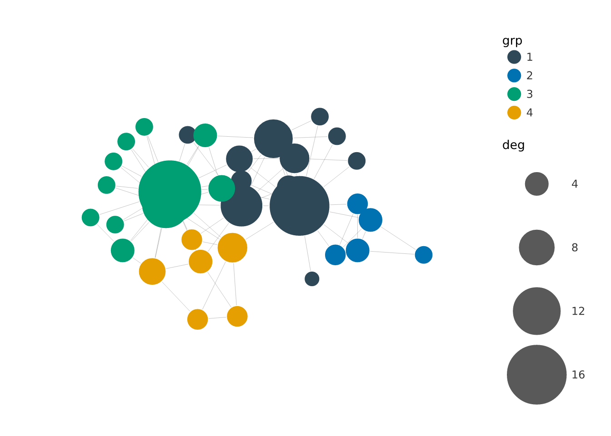

The node and edge aesthetics are the same ones you already know.
[`mark_nodes()`](https://r-vellum.github.io/vellumplot/reference/mark_graph.md)
takes `size`, `shape`, `fill`, and `color`;
[`mark_edges()`](https://r-vellum.github.io/vellumplot/reference/mark_graph.md)
takes `color`, `linewidth`, `linetype`, and `alpha`.
[`mark_node_text()`](https://r-vellum.github.io/vellumplot/reference/mark_graph.md)
adds vertex labels.

``` r

vgraph(g, layout = "stress") |>
  mark_edges(color = "grey70") |>
  mark_nodes(fill = grp, size = 2) |>
  mark_node_text(label = name, size = 8)
```

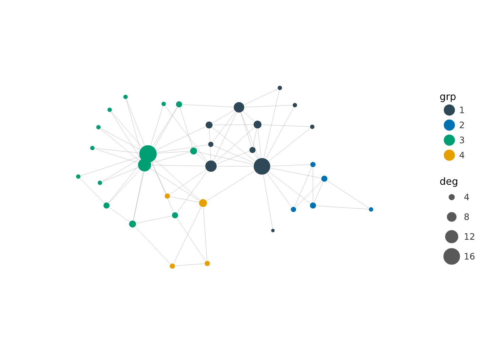

### Independent edge scales

Edge colour, opacity, line type, and width train on their **own** scales
–
[`scale_edge_color()`](https://r-vellum.github.io/vellumplot/reference/scale_edge.md),
[`scale_edge_alpha()`](https://r-vellum.github.io/vellumplot/reference/scale_edge.md),
[`scale_edge_linetype()`](https://r-vellum.github.io/vellumplot/reference/scale_edge.md),
and
[`scale_edge_width()`](https://r-vellum.github.io/vellumplot/reference/scale_edge_width.md)
– separate from the node colour/alpha/linetype scales. So a figure can
map node fill to a discrete community *and* edge colour to a continuous
edge weight, and each gets its own legend instead of the two collapsing
into one. Map an edge attribute to `color` and it is trained as an edge
scale automatically; call
[`scale_edge_color()`](https://r-vellum.github.io/vellumplot/reference/scale_edge.md)
to choose the palette.

``` r

g <- igraph::set_edge_attr(g, "w", value = runif(igraph::ecount(g)))

vgraph(g, layout = "stress") |>
  mark_edges(color = w, linewidth = w) |>
  mark_nodes(fill = grp, size = deg) |>
  scale_edge_color(palette = "Grays") |>
  scale_edge_width(range = c(0.3, 2.5)) |>
  scale_size(range = c(0.5, 3))
```

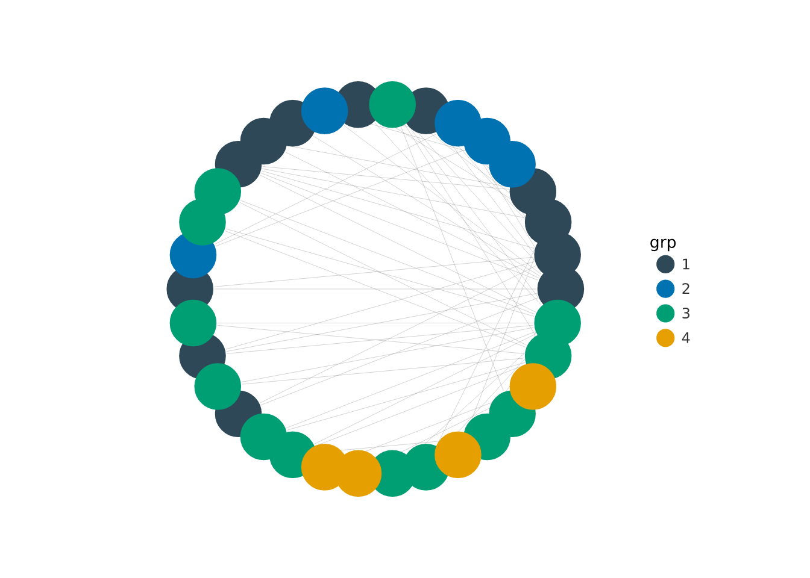

### Directed edges, arrows, and edge labels

For directed graphs, `arrow = TRUE` draws a closed arrowhead at each
edge’s target end; edges are capped at the node boundary so the head is
never buried under the marker. Pass a
[`vellum::vl_arrow()`](https://r-vellum.github.io/vellum/reference/vl_arrow.html)
for full control over the head (`ends`, `type`, `length`, `angle`).
[`mark_edge_text()`](https://r-vellum.github.io/vellumplot/reference/mark_graph.md)
labels the edges at their midpoints, and `angle = "along"` rotates each
label to follow its edge.

``` r

el <- matrix(c(1, 2, 2, 3, 3, 1, 1, 4, 4, 2), ncol = 2, byrow = TRUE)
d <- igraph::graph_from_edgelist(el, directed = TRUE)
d <- igraph::set_edge_attr(d, "flow", value = c(3, 1, 4, 1, 5))

vgraph(d, layout = "stress") |>
  mark_edges(linewidth = flow, arrow = TRUE) |>
  mark_nodes(size = 2, fill = "steelblue") |>
  mark_edge_text(label = flow, size = 7) |>
  mark_node_text(label = name, size = 8, color = "white") |>
  scale_edge_width(range = c(0.4, 2.5))
```

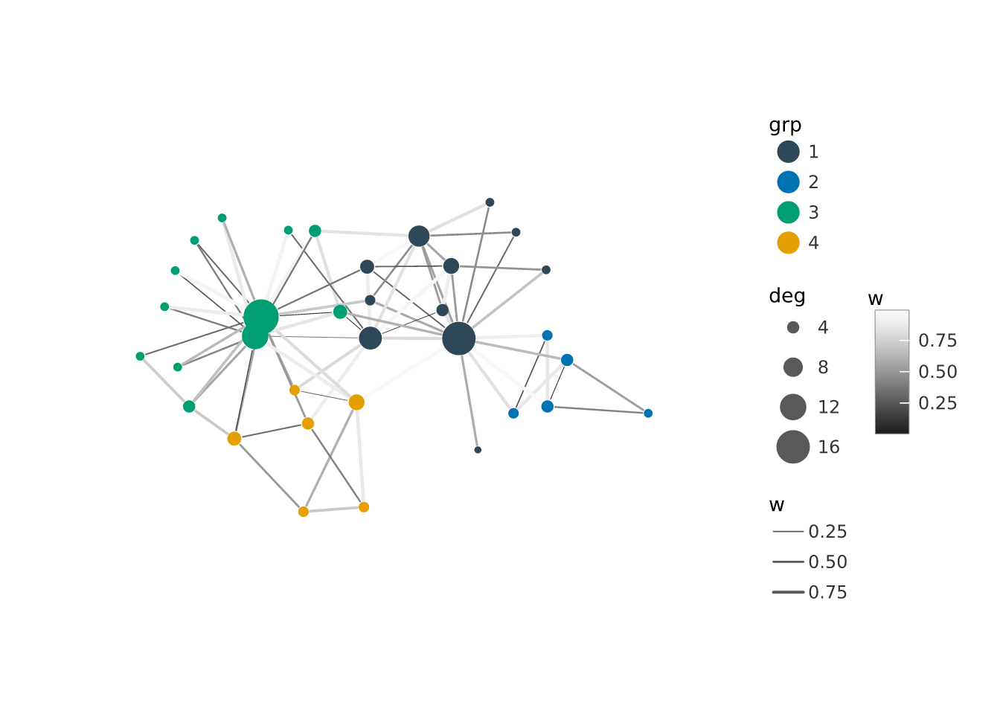

### Readable labels

Labelling every vertex of a real network is unreadable, and labels that
sit on the markers or vanish into the edges are worse.
[`mark_node_text()`](https://r-vellum.github.io/vellumplot/reference/mark_graph.md)
has four tools for this:

- `top_n` / `by` label only the most important vertices (e.g. the
  highest-degree hubs) – the common “label a handful, not all 34” move
  as a one-liner.
- `dist` pushes each label radially outward from the layout centre, so
  it clears its node marker.
- `repel = TRUE` nudges any labels that still overlap apart,
  ggrepel-style, with a thin leader line back to each vertex.
- `effects = list(shadow())` drops a shadow behind each label so it
  stays legible where it crosses an edge.
  [`mark_edge_text()`](https://r-vellum.github.io/vellumplot/reference/mark_graph.md)
  takes the same `effects`.

``` r

vgraph(g, layout = "stress") |>
  mark_edges(alpha = 0.3) |>
  mark_nodes(size = deg, fill = grp) |>
  mark_node_text(
    label = name,
    top_n = 8,
    by = deg,
    dist = 3,
    color = "white",
    effects = list(shadow(x = 0.4, y = -0.4))
  ) |>
  scale_size(range = c(0.5, 3))
```

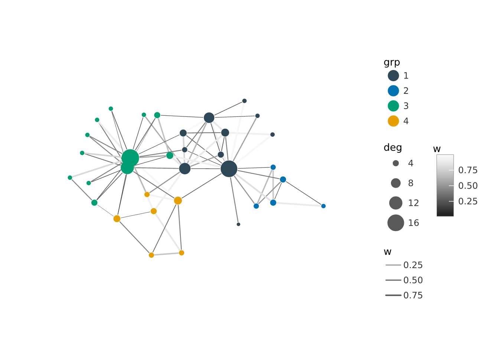

### Edge routing

Edges are straight by default. `routing = "elbow"` draws orthogonal
right-angle steps instead – still straight segments (curved edges are a
deliberate non-goal), stepping along whichever axis the endpoints are
farther apart on, so a top-down tree bends downward. It is the natural
routing for `"tree"`, `"sugiyama"`, and dendrogram layouts, and keeps
node-boundary caps and arrowheads.

``` r

tr <- igraph::make_tree(15, children = 2, mode = "out")
vgraph(tr, layout = "tree") |>
  mark_edges(routing = "elbow", arrow = TRUE) |>
  mark_nodes(size = 2, fill = "steelblue")
```

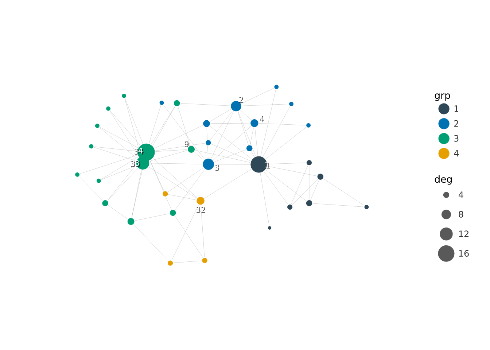

For directed graphs, `gradient = TRUE` fades each edge from faint at its
source to opaque at its target – a direction cue that reads without
arrowheads (and without the clutter they add on a dense graph).

``` r

dg <- igraph::sample_gnp(15, 0.2, directed = TRUE)
vgraph(dg) |>
  mark_edges(gradient = TRUE) |>
  mark_nodes(size = 2, fill = "grey30")
```

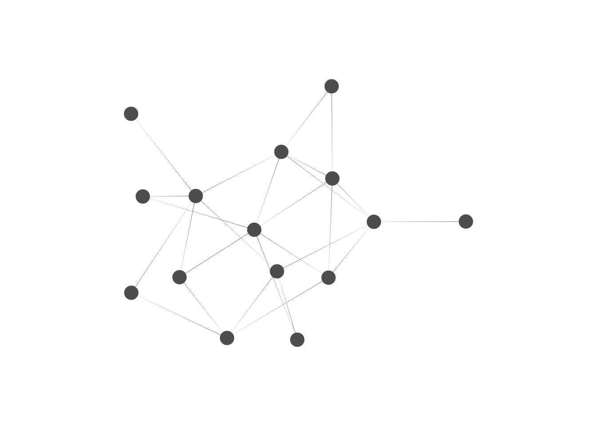

### Edge bundling

On a dense graph, straight edges pile into an unreadable hairball.
[`mark_edge_bundle()`](https://r-vellum.github.io/vellumplot/reference/mark_graph.md)
routes them as bundled curves instead, so edges that run roughly
together merge into a few trunks and the backbone of the graph shows
through. It is a drop-in swap for
[`mark_edges()`](https://r-vellum.github.io/vellumplot/reference/mark_graph.md)
– the same edge aesthetics apply – and delegates the geometry to the
[edgebundle](https://github.com/schochastics/edgebundle) package. `type`
picks the algorithm; bundled edges are faint by default so overlapping
trunks read as density.

``` r

gb <- igraph::sample_gnp(60, 0.08)
vgraph(gb, layout = "stress") |>
  mark_edge_bundle(type = "hammer", color = "firebrick") |>
  mark_nodes(size = 1.5, fill = "grey20")
```

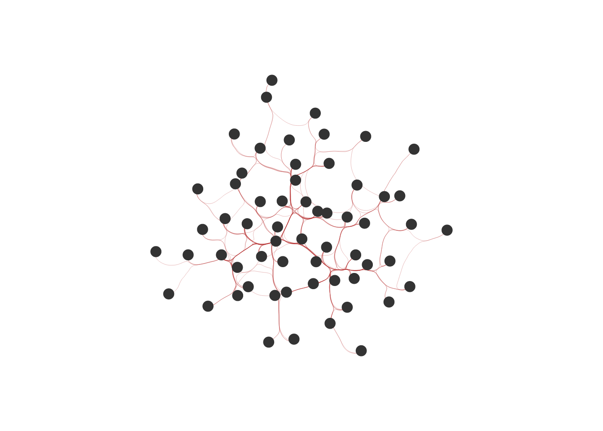

The other algorithms trade off speed against how aggressively they
merge: `"force"` (the default, force-directed) and `"path"` bend edges
gently, `"stub"` only tufts each endpoint, and `"mingle"` merges
hierarchically. For a directed graph, `type = "divided"` splits each
trunk by direction. Pass algorithm-specific tuning through `params`,
e.g. `params = list(compatibility_threshold = 0.5)`.

### Flow maps

A *flow map* shows one source fanning out to many destinations, the
branches merging into trunks whose width grows with the combined flow –
the shape Minard used for Napoleon’s march and cartographers use for
migration. Give
[`mark_flow_map()`](https://r-vellum.github.io/vellumplot/reference/mark_graph.md)
a one-to-many (star) graph laid out at fixed coordinates, name the
`root`, and map the per-edge flow to `weight`.

``` r

set.seed(1)
dest <- 10
fg <- igraph::make_star(dest + 1, mode = "undirected")
igraph::V(fg)$name <- c("hub", paste0("d", seq_len(dest)))
igraph::E(fg)$weight <- sample(1:20, dest, replace = TRUE)
coords <- rbind(
  c(0, 0),
  cbind(runif(dest, 1, 6), runif(dest, -3, 3))
)

vgraph(fg, layout = coords) |>
  mark_flow_map(root = "hub", weight = weight) |>
  mark_nodes(size = 1.5, fill = "grey30")
```

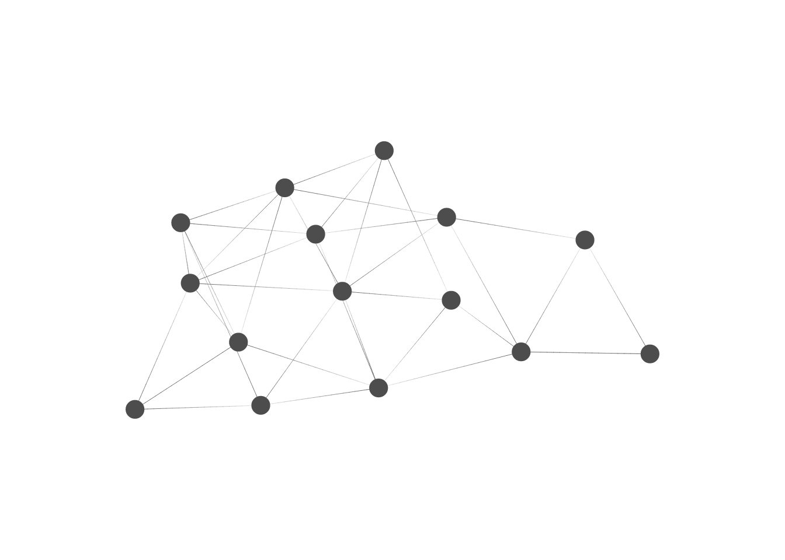

`type = "spiral"` (the default) is the recommended layout: a planar,
angle-restricted spiral tree that needs only the edgebundle package.
`type = "steiner"` builds an approximate Steiner tree instead (it
additionally needs the package). The computed flow is mapped onto
`width_range`, so the widest trunk near the root stays legible however
lopsided the weights are.

### Dendrograms

[`vgraph()`](https://r-vellum.github.io/vellumplot/reference/vgraph.md)
also accepts a base `hclust`/`dendrogram`, coercing it to a tree that
carries each merge’s height. The `"dendrogram"` layout places leaves on
a line and every merge at its height, and `elbow_at = "start"` turns the
elbow into the classic *bracket* (siblings share a bar at the parent’s
level):

``` r

hc <- hclust(dist(USArrests))
vgraph(hc, layout = "dendrogram") |>
  mark_edges(routing = "elbow", elbow_at = "start", elbow_axis = "v")
```

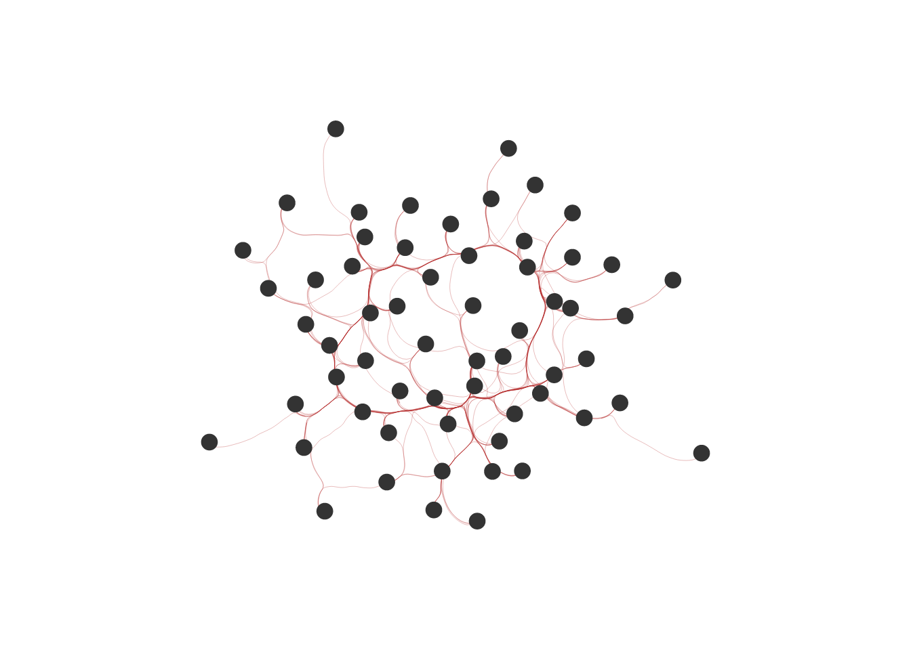

Add labels with
[`mark_text()`](https://r-vellum.github.io/vellumplot/reference/mark_text.md),
which controls `angle` and justification – for a top-down tree the leaf
labels read vertically, hanging below their leaves (merge nodes carry a
blank label, so only the leaves show):

``` r

vgraph(hc, layout = "dendrogram") |>
  mark_edges(routing = "elbow", elbow_at = "start", elbow_axis = "v") |>
  mark_text(
    x = x, y = y, label = label, size = 1.6,
    angle = 90, hjust = "right", nudge_y = -1.5
  )
```

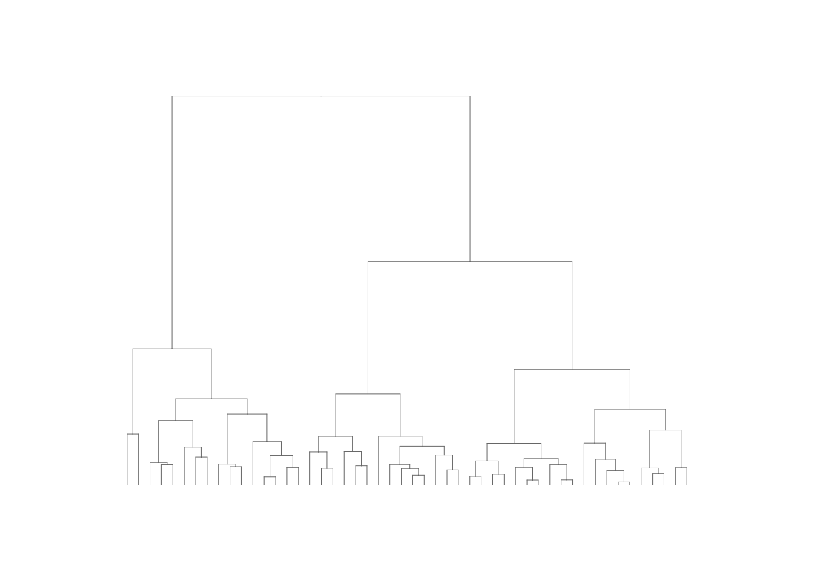

[`vdendrogram()`](https://r-vellum.github.io/vellumplot/reference/vdendrogram.md)
is the one-line preset for all of that – bracket edges and placed leaf
labels, `direction` to orient it, and `k` to cut the tree and colour the
clusters (branches above the cut stay neutral):

``` r

vdendrogram(hc, k = 3)
```


For unrooted trees (phylogeny-style), `layout = "unrooted"` uses
graphlayouts’ `layout_as_tree_unrooted()` – `mode` picks `"equalangle"`,
`"equaldaylight"`, or `"stress"`:

``` r

vgraph(igraph::make_tree(31, 3, "undirected"), layout = "unrooted", mode = "equaldaylight") |>
  mark_edges(alpha = 0.6) |>
  mark_nodes(size = 1.5, fill = "grey30")
```

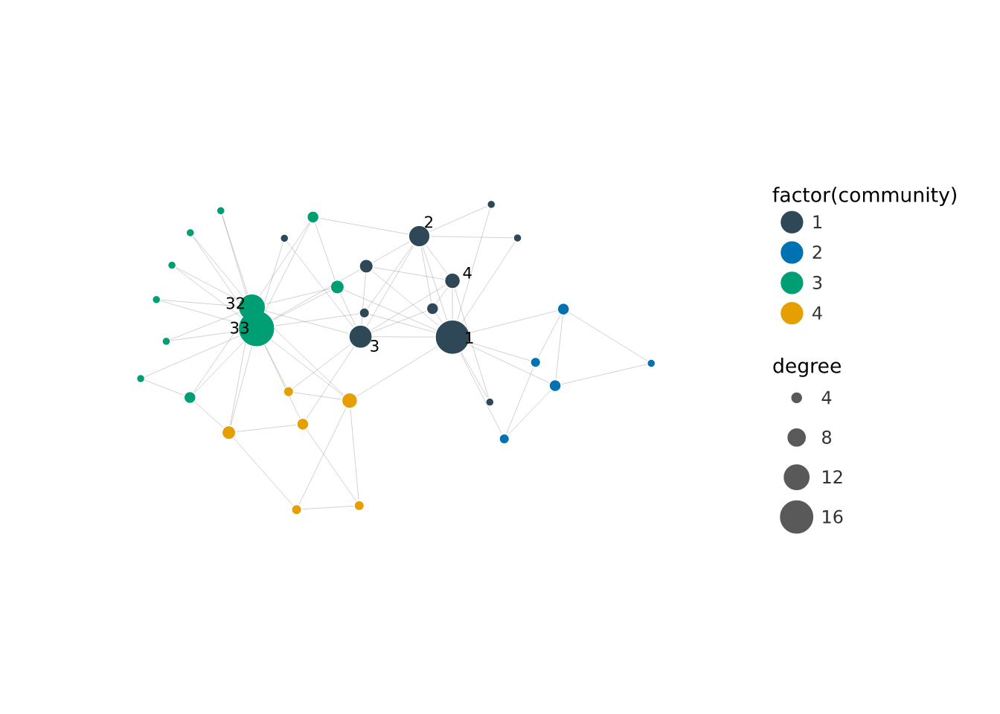

### Augmenting and filtering

Vertex metrics are the analyst’s choice, not something
[`vgraph()`](https://r-vellum.github.io/vellumplot/reference/vgraph.md)
computes behind your back – but `augment` attaches a set on request, so
you can map or filter by them without a manual igraph round-trip.
`augment = TRUE` adds `degree` and `components`; a character vector
picks from `degree`, `betweenness`, `closeness`, `eigen`, `coreness`,
`components`, `community`, and the in/out-degree variants.

`filter_nodes` / `filter_edges` take data-masked predicates over the
vertex / edge attributes, and `k_core` keeps the k-core. Filtering
happens **before** the layout, so you see a clean layout of the subgraph
rather than a full layout with holes – the honest way to tame a dense
graph (the node-link idiom breaks down past a link density of ~3).

``` r

# attach degree + community, then plot just the 2-core, sized and coloured by them
vgraph(g, augment = c("degree", "community"), k_core = 2) |>
  mark_edges(alpha = 0.3) |>
  mark_nodes(size = degree, fill = factor(community)) |>
  mark_node_text(label = name, top_n = 6, by = degree, dist = 3) |>
  scale_size(range = c(0.5, 3))
```

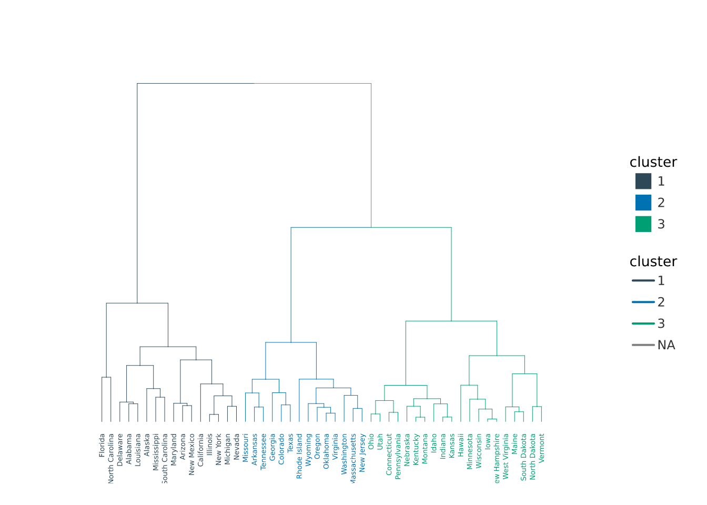

### Community hulls and node glyphs

[`mark_node_hull()`](https://r-vellum.github.io/vellumplot/reference/mark_graph.md)
shades groups of nodes with a convex hull drawn *behind* the graph – the
standard way to show community structure. Group by a mapped `fill`;
`expand` grows each hull so it wraps the markers rather than clipping
them.

``` r

g <- igraph::set_vertex_attr(
  g, "comm",
  value = factor(igraph::membership(igraph::cluster_louvain(g)))
)
vgraph(g, layout = "stress") |>
  mark_node_hull(fill = comm, expand = 0.12) |>
  mark_edges(alpha = 0.3) |>
  mark_nodes(size = deg, fill = comm) |>
  scale_size(range = c(0.5, 3))
```

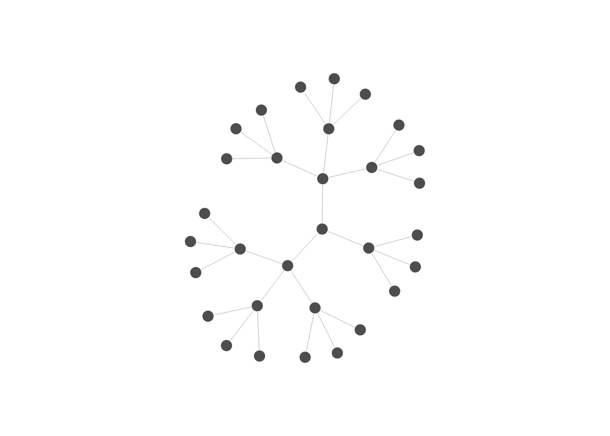

[`mark_node_pie()`](https://r-vellum.github.io/vellumplot/reference/mark_graph.md)
replaces the node markers with pie (or donut, via `inner`) glyphs whose
wedges come from a set of compositional columns – one wedge per column,
sized by that column’s value at each vertex.

``` r

set.seed(1)
for (nm in c("x1", "x2", "x3")) {
  g <- igraph::set_vertex_attr(g, nm, value = runif(igraph::vcount(g)))
}
vgraph(g, layout = "stress") |>
  mark_edges(alpha = 0.3) |>
  mark_node_pie(cols = c("x1", "x2", "x3"), size = 5)
```


### Interactive neighbour highlighting

[`select_neighbours()`](https://r-vellum.github.io/vellumplot/reference/select_neighbours.md)
is a network-aware selection preset: in an interactive host
(`vellumwidget::as_widget()`), pointing at a node spotlights **its
neighbourhood** — the node, its incident edges, and its adjacent nodes —
and dims the rest; pointing at an edge highlights its two endpoints.
`degree = 2` reaches neighbours-of-neighbours. Like every selection it
is inert on a static render, so the code below draws the same picture on
the page but comes alive under `as_widget()`.

``` r

vgraph(g, layout = "stress") |>
  mark_edges(alpha = 0.3) |>
  mark_nodes(size = deg, fill = grp) |>
  mark_node_text(label = name, top_n = 8, by = deg) |>
  select_neighbours(on = "hover") |>
  scale_size(range = c(0.5, 3))
```

Declaring the selection also keys every node (by its vertex name) and
edge, so node/edge tooltips, click-select, and pan/zoom work in the
widget too.

### Choosing a layout

`layout` accepts a name (`"stress"`, `"sparse_stress"`, `"backbone"`,
`"fr"`, `"kk"`, `"circle"`, `"tree"`, `"sugiyama"`, `"dendrogram"`,
`"unrooted"`, and more), a supplied N-by-2 coordinate matrix, or a
function that returns one. Stochastic layouts take a `seed` so the
figure is reproducible.

``` r

vgraph(g, layout = "circle") |>
  mark_edges(alpha = 0.3) |>
  mark_nodes(fill = grp, size = 2)
```

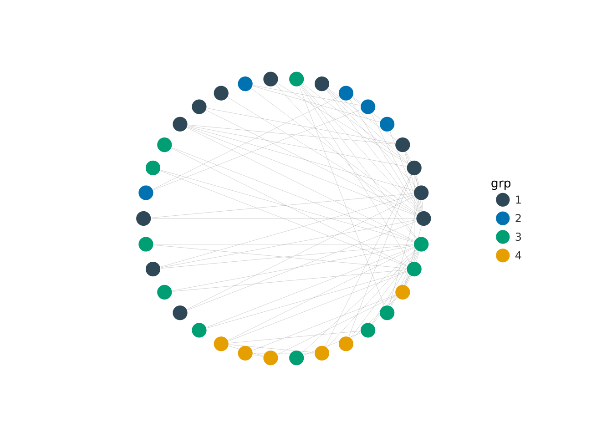

Both of these are still ordinary specs. They face the same scales,
themes, and composition tools as any other plot, and they render to a
file with
[`render_plot()`](https://r-vellum.github.io/vellumplot/reference/render_plot.md).
For per-feature interactivity (tooltips and data keys on map features or
nodes), see the interactivity notes on
[`mark_sf()`](https://r-vellum.github.io/vellumplot/reference/mark_sf.md)
and the mark reference pages.
