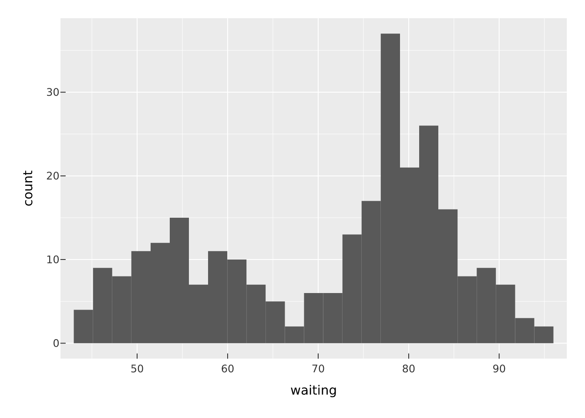
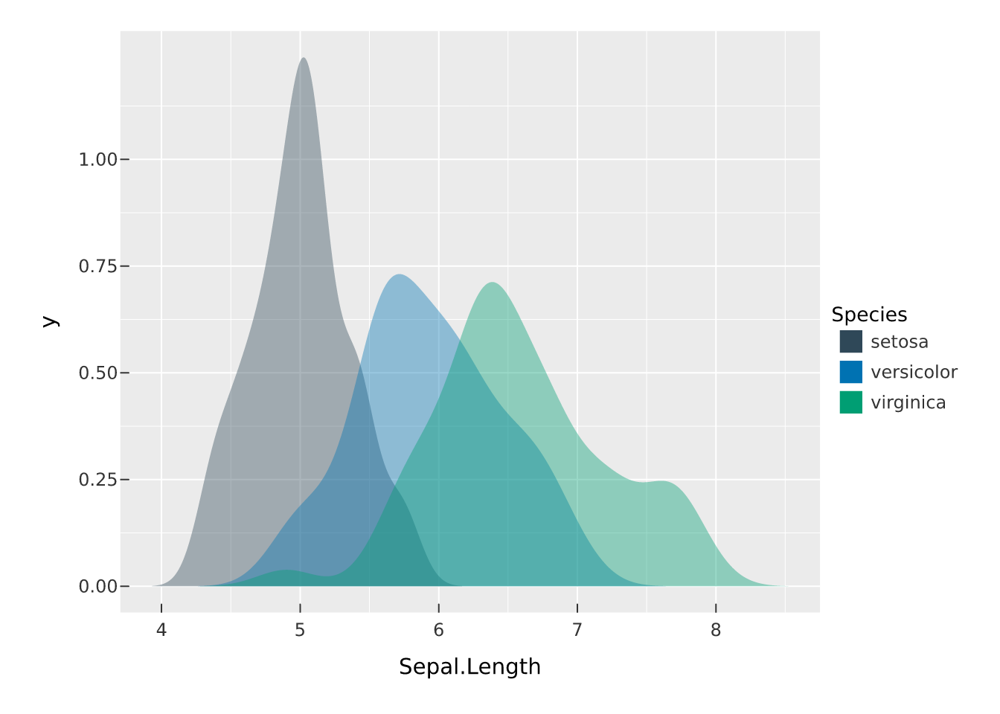
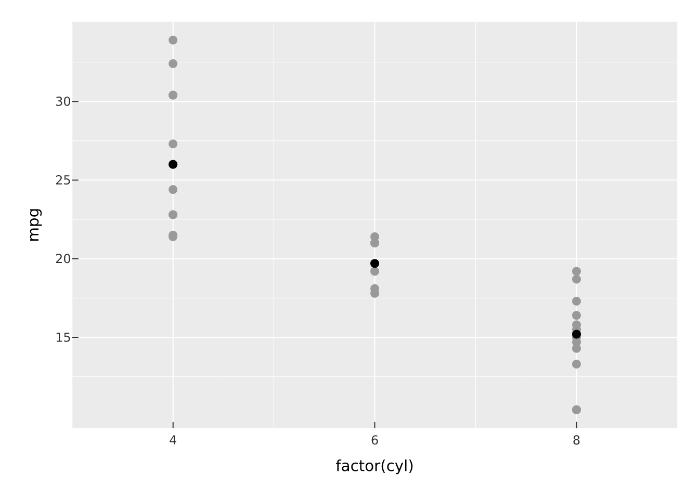
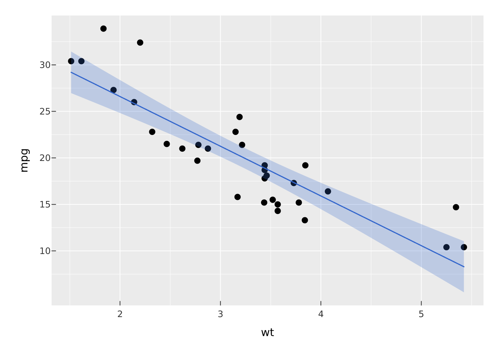
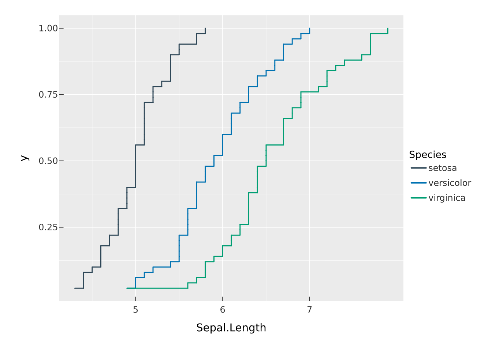
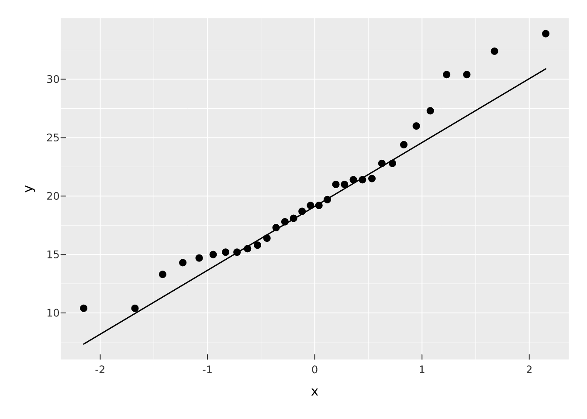
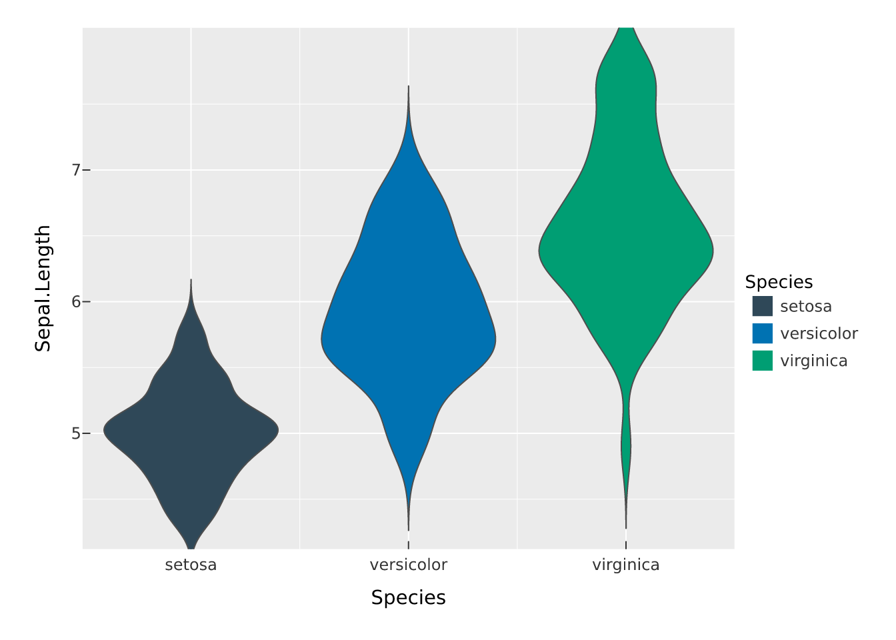
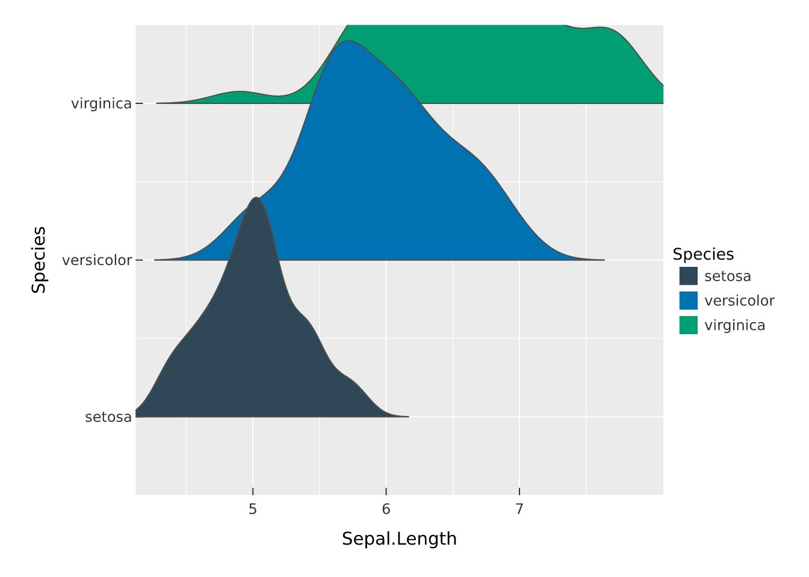
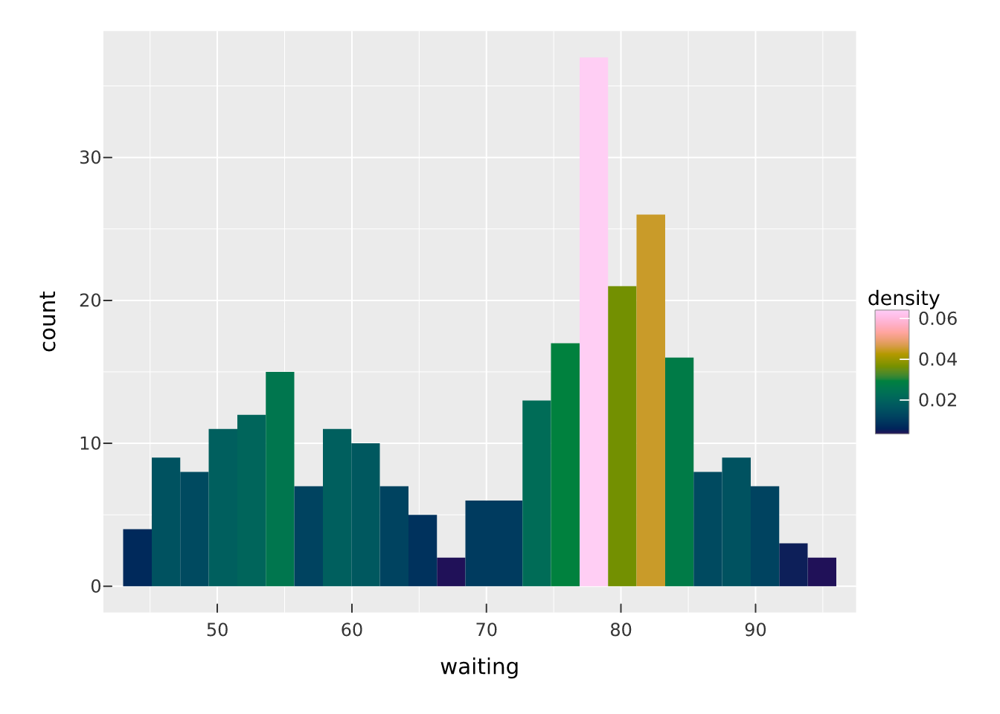
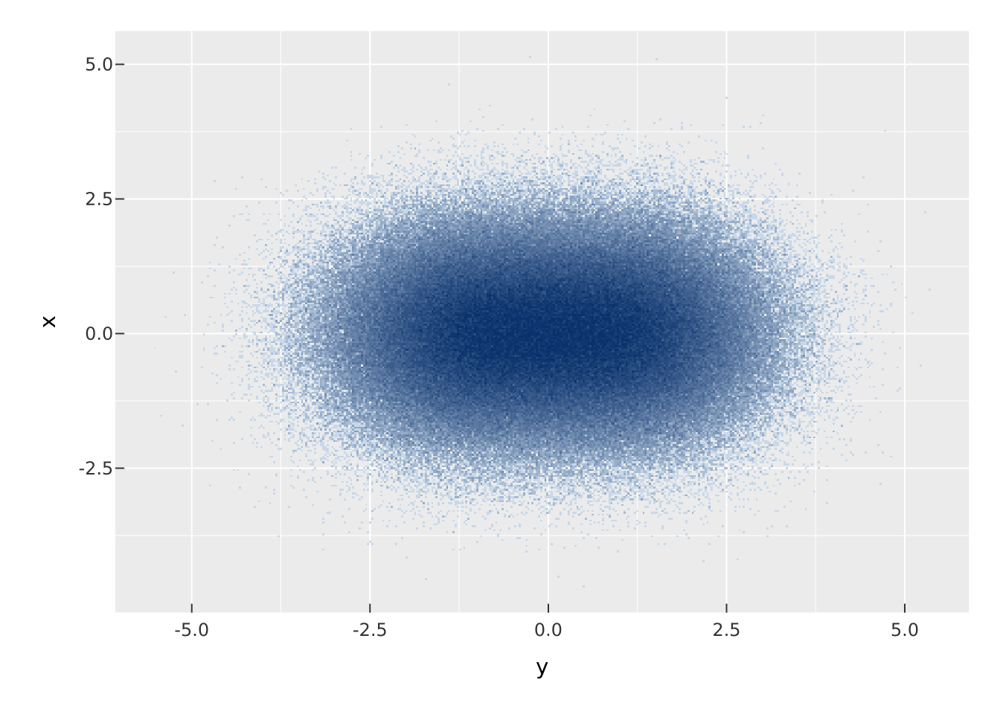

# Statistical marks

Most marks draw the data as given. A statistical mark computes something
from the data first, then draws the result. vellumplot runs that
transform as a stage of the compiler (see **[The
compiler](https://r-vellum.github.io/vellumplot/articles/the-compiler.md)**),
so a histogram is a mark that bins the data as part of being drawn,
rather than something you bin by hand.

## Histograms and densities

[`mark_histogram()`](https://r-vellum.github.io/vellumplot/reference/mark_histogram.md)
bins a continuous `x` and draws the per-bin counts as bars. Control the
resolution with `bins`.

``` r

vplot(faithful) |>
  mark_histogram(x = waiting, bins = 25)
```



[`mark_density()`](https://r-vellum.github.io/vellumplot/reference/mark_tile.md)
draws a smooth kernel-density estimate of `x` as a filled curve;
`adjust` scales the bandwidth. Densities are on a comparable vertical
scale, so mapping `fill` to a group and overlaying works well.

``` r

vplot(iris) |>
  mark_density(x = Sepal.Length, fill = Species, alpha = 0.4)
```



## Per-group summaries

[`mark_summary()`](https://r-vellum.github.io/vellumplot/reference/mark_boxplot.md)
aggregates `y` within each `x` category using `fun` (the mean by
default) and draws the result. It is the quick way to add group means
over raw data.

``` r

vplot(mtcars) |>
  mark_point(x = factor(cyl), y = mpg, color = "grey60") |>
  mark_summary(x = factor(cyl), y = mpg, fun = median)
```



## Smooths

[`mark_smooth()`](https://r-vellum.github.io/vellumplot/reference/mark_histogram.md)
fits a model of `y` on `x` (`method = "lm"`) and draws the fitted line
with a confidence ribbon when `se = TRUE`. It layers naturally over the
raw points.

``` r

vplot(mtcars) |>
  mark_point(x = wt, y = mpg) |>
  mark_smooth(x = wt, y = mpg, se = TRUE, level = 0.95)
```



## Distributions

Several marks summarise how a single variable is distributed.
[`mark_ecdf()`](https://r-vellum.github.io/vellumplot/reference/mark_ecdf.md)
draws the empirical cumulative distribution of `x` as a step, which is a
scale-free way to compare groups without choosing a bandwidth.

``` r

vplot(iris) |>
  mark_ecdf(x = Sepal.Length, color = Species)
```



[`mark_qq()`](https://r-vellum.github.io/vellumplot/reference/mark_ecdf.md)
plots the sorted `sample` against the quantiles of a reference
distribution (normal by default);
[`mark_qq_line()`](https://r-vellum.github.io/vellumplot/reference/mark_ecdf.md)
adds the reference line through the quartiles. Points on the line mean
the sample matches the reference.

``` r

vplot(mtcars) |>
  mark_qq(sample = mpg) |>
  mark_qq_line(sample = mpg)
```



[`mark_rug()`](https://r-vellum.github.io/vellumplot/reference/mark_ecdf.md)
adds marginal ticks at each observation, a compact companion to a
scatter or density. `sides` picks the edges (`"b"`, `"l"`, `"t"`,
`"r"`).

``` r

vplot(faithful) |>
  mark_point(x = waiting, y = eruptions) |>
  mark_rug()
```


## Density shapes

[`mark_violin()`](https://r-vellum.github.io/vellumplot/reference/mark_violin.md)
draws a mirrored kernel density of `y` for each categorical `x`, a
boxplot’s silhouette that shows the full shape of each group.

``` r

vplot(iris) |>
  mark_violin(x = Species, y = Sepal.Length, fill = Species)
```



[`mark_ridgeline()`](https://r-vellum.github.io/vellumplot/reference/mark_violin.md)
turns that on its side: a density of `x` per categorical `y`, with the
ridges overlapping so many groups fit in little vertical space. Use the
`scale` argument to tune how much they overlap.

``` r

vplot(iris) |>
  mark_ridgeline(x = Sepal.Length, y = Species, fill = Species)
```



[`mark_dotplot()`](https://r-vellum.github.io/vellumplot/reference/mark_violin.md)
bins `x` and stacks one dot per observation, so the height of each stack
is a count you can read dot by dot.

``` r

vplot(faithful) |>
  mark_dotplot(x = waiting)
```


## 2-D density contours

[`mark_contour()`](https://r-vellum.github.io/vellumplot/reference/mark_contour.md)
estimates the 2-D density of a point cloud and draws its iso-density
contour lines;
[`mark_contour_filled()`](https://r-vellum.github.io/vellumplot/reference/mark_contour.md)
fills the bands between them. Both are coloured by level automatically.
They read best over the points they summarise:

``` r

vplot(faithful) |>
  mark_point(x = eruptions, y = waiting, color = "grey70") |>
  mark_contour(x = eruptions, y = waiting)
```


``` r

vplot(faithful) |>
  mark_contour_filled(x = eruptions, y = waiting)
```


The density estimate uses
[`MASS::kde2d()`](https://rdrr.io/pkg/MASS/man/kde2d.html); tune the
levels with `bins`, `binwidth`, or explicit `breaks`. To contour a
*surface* you already have (a `z` value on a regular `x`/`y` grid)
rather than a point density, map `z`:

``` r

grid <- expand.grid(x = seq(-3, 3, 0.1), y = seq(-3, 3, 0.1))
grid$z <- with(grid, dnorm(x) * dnorm(y))
vplot(grid) |> mark_contour(x = x, y = y, z = z)
```


Contour tracing needs the `isoband` package (and `MASS` for the density
estimate).

## Reaching computed variables with after_stat

A statistical mark produces new variables that were not in your data: a
histogram computes a `count` and a `density`, for example.
[`after_stat()`](https://r-vellum.github.io/vellumplot/reference/after_stat.md)
lets an encoding refer to one of those computed variables instead of a
data column. The classic use is a density-scaled histogram.

``` r

vplot(faithful) |>
  mark_histogram(x = waiting, bins = 25, fill = after_stat(density))
```



Because the aesthetic is now driven by a computed value, its scale
trains on that value like any other, and you get the matching legend.

## Millions of points with mark_datashade

When there are too many points to draw one marker each (overplotted, up
to millions), individual markers become uninformative and slow to draw.
[`mark_datashade()`](https://r-vellum.github.io/vellumplot/reference/mark_datashade.md)
bins the points into a canvas-sized grid in a single pass and colours
each cell by density, drawing one raster. Its cost is decoupled from the
number of points.

``` r

n <- 5e5
big <- data.frame(
  x = rnorm(n),
  y = rnorm(n) + rep(c(-1, 1), each = n / 2)
)
vplot(big) |>
  mark_datashade(x = y, y = x, how = "eq_hist")
```



Here `how = "eq_hist"` uses histogram equalisation so both dense and
sparse regions stay visible; the grid resolution is set by `width` and
`height`. Per-point aesthetics do not apply, because cell colour encodes
density rather than any single point.

[`mark_point()`](https://r-vellum.github.io/vellumplot/reference/mark_point.md)
also has an `auto = TRUE` switch that falls back to a datashaded raster
automatically when a layer has very many rows, so you can keep writing
[`mark_point()`](https://r-vellum.github.io/vellumplot/reference/mark_point.md)
and let vellumplot choose the representation.
