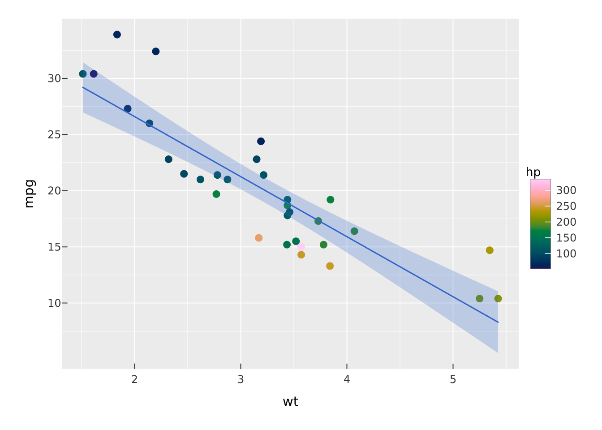

# The compiler: spec to scene

Most plotting libraries draw as you call them: each function pushes
graphics onto a device. vellumplot does not. When you build a plot,
nothing is drawn. You are assembling a *spec*, a plain S7 object that
records the data, the layers, the scales, the facet, the coord, and the
theme. Drawing happens later, in one pass, when a compiler turns that
spec into a `vellum` scene. This article is about that separation and
why it is worth having.

## The spec is just data

Building a plot returns a value you can hold, inspect, and modify before
anything is rendered.

``` r

p <- vplot(mtcars) |>
  mark_point(x = wt, y = mpg, color = hp) |>
  mark_smooth(x = wt, y = mpg)
```

`p` is a spec, not a picture.
[`summary()`](https://rdrr.io/r/base/summary.html) shows its structure
without drawing it:

``` r

summary(p)
#> <PlotSpec> 32x11 (11 columns), page 6x4 in
#> 
#> ── layers
#> • mark_point(x = wt, y = mpg, color = hp)
#> • mark_smooth(x = wt, y = mpg)
```

Because the spec is an ordinary object, a plot is a value like any
other. You can build it in one function and return it, keep a list of
specs and render them in a loop, add a layer to a plot someone else
handed you, or save the spec and rebuild the exact figure later. The
plot is decoupled from the act of drawing it.

## What the compiler does

Printing the spec (or calling
[`render_plot()`](https://r-vellum.github.io/vellumplot/reference/render_plot.md))
runs the compiler. It is a pipeline of distinct stages, each consuming
the output of the last:

1.  **Resolve encodings.** Evaluate the tidy-eval expressions (`x = wt`,
    `color = hp`) against the data for every layer, producing concrete
    columns.
2.  **Apply stats and positions.** Marks with a statistical transform
    (histogram, density, smooth) compute their derived data here, and
    position adjustments (stack, dodge, jitter) are applied.
3.  **Train scales.** Scan the resolved values across *all* layers to
    work out each scale’s domain, then build the mapping from data to
    colour, size, shape, and position. This is why layered marks share
    axes without you aligning anything.
4.  **Measure layout.** Lay out the panel (or the grid of facet panels),
    reserving room for axes, strips, legends, and titles, and measure
    where everything goes.
5.  **Compile guides.** Emit the axes, gridlines, and legends the
    trained scales imply.
6.  **Compile marks.** Turn each layer into `vellum` grobs positioned in
    the panel.

The result is a `vellum` scene: a resolution-independent description of
the drawing that the backend can render to PNG, SVG, or PDF. vellumplot
never touches a graphics device itself; it produces a scene and hands it
to `vellum`.

## Why this design pays off

**Scales that span layers.** Training happens after every layer’s data
is resolved, so a point cloud and a fitted line automatically land on
the same axes. There is no drawing order to get wrong.

**Faceting is a layout question, not a redraw.** Because layout is its
own stage over an already-trained spec, splitting into panels reuses the
same resolved data and scales. Panels can share scales or, via the
[`resolve_scale()`](https://r-vellum.github.io/vellumplot/reference/resolve_scale.md)
lattice, train independently, and either way it is one compile.

**Inspectability.** You can look at a plot before committing to it.
[`summary()`](https://rdrr.io/r/base/summary.html) reports the layers
and page size; the spec itself carries the answer to “what will this
draw?” without drawing it. That makes plots testable: you can assert on
the spec. (`ggplot2` also has a
[`summary()`](https://rdrr.io/r/base/summary.html) method, so this is a
difference of degree — the degree being that the compile runs without a
device, so the answer extends to *where things land*, not just what is
mapped.)

**Marks keep their identity, and their geometry, after the compile.**
Because the target is a `vellum` scene rather than a device, each drawn
element arrives with its data key and its resolved device-pixel box
([`vellum::scene_model()`](https://r-vellum.github.io/vellum//reference/scene_model.html)).
That table is what `vellumwidget` reads to add tooltips, selection, and
brushing, what the accessibility layer turns into a described image, and
what a positional test can assert against. It is the one thing in this
stack with no counterpart in the grid/ggplot2 pipeline, where resolved
geometry lives inside a draw and is gone when the draw ends.

**One scene, many outputs.** The same compiled scene is walked for
raster, for vector, and for the widget, instead of each output
re-solving layout with its own device’s text metrics. Write the plot
once, choose the output later, and the versions cannot disagree about
geometry.

## Rendering

Two ways to draw. Print the spec to see it in the plots pane or embed it
in a knitr or Quarto document, exactly like ggplot2:

``` r

p
```



Or write it to a file with
[`render_plot()`](https://r-vellum.github.io/vellumplot/reference/render_plot.md).
The format follows the file extension, and because the scene is
resolution-independent, `.svg` and `.pdf` are exact at any size while
`.png` honours the plot’s dpi.

``` r

render_plot(p, "cars.png")
render_plot(p, "cars.svg")
render_plot(p, "cars.pdf")
```

To go deeper into the backend the compiler targets, see the
[vellum](https://r-vellum.github.io/vellum/) documentation. To turn a
compiled scene into an interactive widget, see
[vellumwidget](https://r-vellum.github.io/vellumwidget/).
