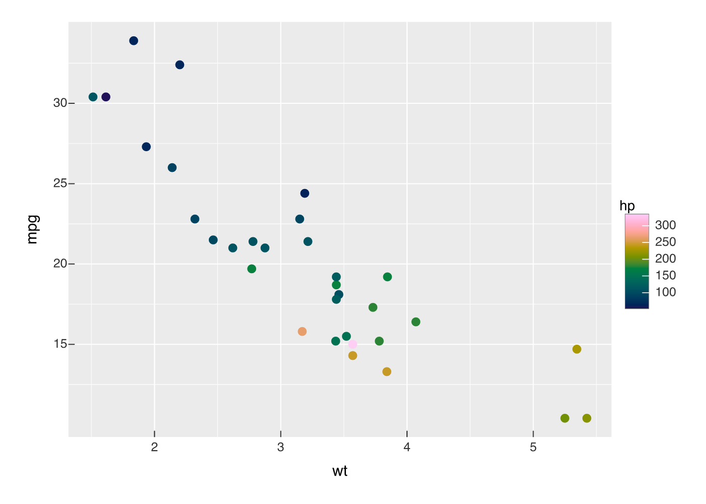
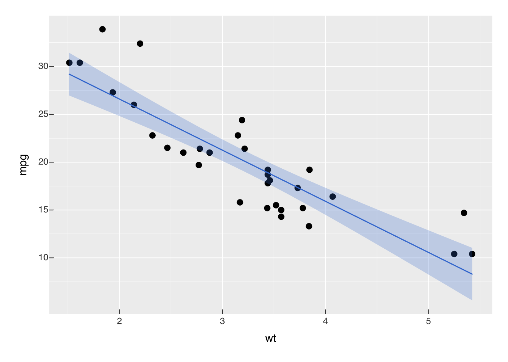
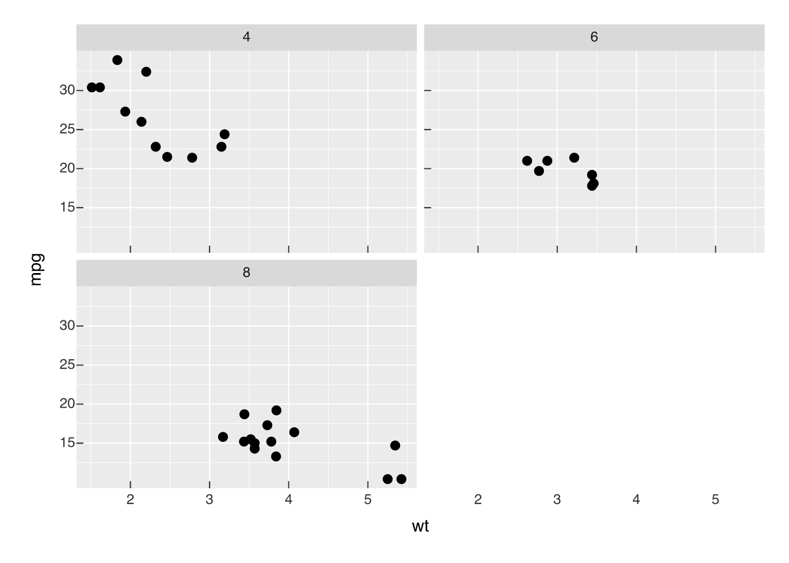
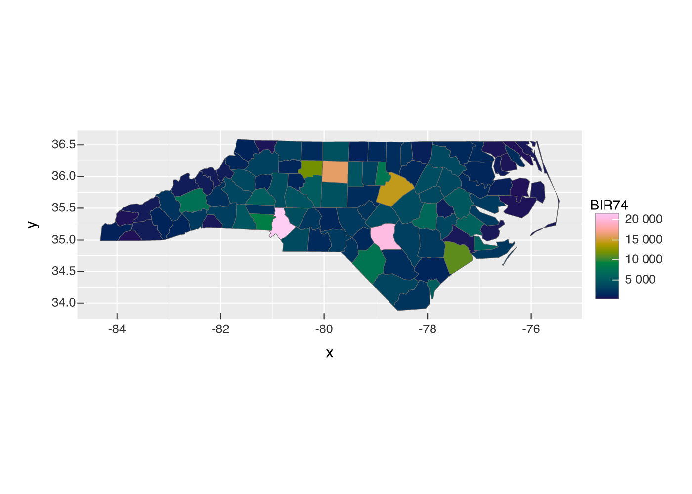
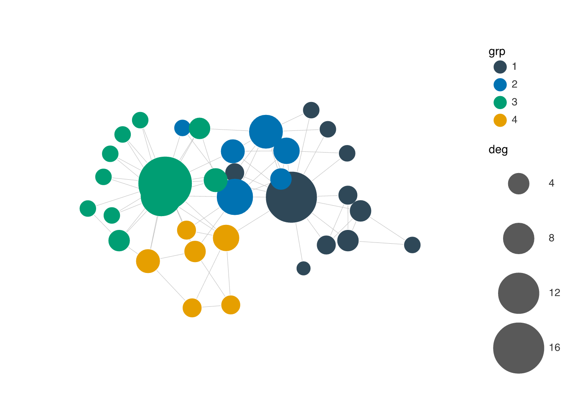

# vellumplot

vellumplot is a declarative, pipe-first grammar of graphics built on the
[vellum](https://github.com/r-vellum/vellum) graphics backend. You
describe a plot as an inspectable, serializable *spec*; nothing is drawn
until the spec is compiled into a vellum scene and rendered.

The compile is a real pipeline (spec → resolve encodings → train scales
→ measure layout → compile guides → compile marks → vellum scene) and it
runs without a graphics device, because vellum measures text itself. Two
consequences are the reason to pick this stack:

- **Every mark keeps its identity through to the output.** A compiled
  plot *is* a vellum scene, so each drawn element carries its data key
  and its resolved device-pixel box
  ([`vellum::scene_model()`](https://r-vellum.github.io/vellum//reference/scene_model.html)).
  That is what [vellumwidget](https://github.com/r-vellum/vellumwidget)
  reads to add tooltips, brushing, and linked selection: the same marks
  you already declared, not `*_interactive()` twins of them, and no
  second engine re-drawing your plot.
- **One spec, one solved layout, several destinations.**
  [`render_plot()`](https://r-vellum.github.io/vellumplot/reference/render_plot.md)
  writes PNG, SVG, or PDF from the *same* compiled scene instead of
  re-solving layout per device, and `as_widget()` hands that scene to
  the browser. The static figure and the interactive one cannot drift,
  because they are one scene.

## Installation

``` r

# install.packages("pak")
pak::pak("r-vellum/vellumplot")
```

vellumplot needs the [vellum](https://github.com/r-vellum/vellum)
backend, which compiles a Rust crate, so you also need a Rust toolchain
(`cargo`/`rustc`); pak pulls vellum in automatically.

## Usage

Building a plot returns a spec; printing it draws into the Plots pane
(and embeds in a knitr/Quarto chunk), like ggplot2. Use
[`render_plot()`](https://r-vellum.github.io/vellumplot/reference/render_plot.md)
to write a file.

``` r

library(vellumplot)

# a scatter with a continuous colour legend
vplot(mtcars) |>
  mark_point(x = wt, y = mpg, color = hp) |>
  scale_color_continuous()
```



Layer marks on a single panel; scales train across every layer:

``` r

vplot(mtcars) |>
  mark_point(x = wt, y = mpg) |>
  mark_smooth(x = wt, y = mpg)
```



Facet into a grid of panels
([`facet_wrap()`](https://r-vellum.github.io/vellumplot/reference/facet_wrap.md)
/
[`facet_grid()`](https://r-vellum.github.io/vellumplot/reference/facet_wrap.md)),
with shared or free scales:

``` r

vplot(mtcars) |>
  mark_point(x = wt, y = mpg) |>
  facet_wrap(~cyl)
```



Draw spatial data:
[`mark_sf()`](https://r-vellum.github.io/vellumplot/reference/mark_sf.md)
renders an `sf` geometry column and
[`coord_sf()`](https://r-vellum.github.io/vellumplot/reference/coord_sf.md)
reprojects and locks the map aspect ratio:

``` r

nc <- sf::st_read(system.file("shape/nc.shp", package = "sf"), quiet = TRUE)
vplot(nc) |>
  mark_sf(fill = BIR74) |>
  coord_sf()
```



Draw a network:
[`vgraph()`](https://r-vellum.github.io/vellumplot/reference/vgraph.md)
lays out an `igraph` graph (stress majorization by default), then
[`mark_edges()`](https://r-vellum.github.io/vellumplot/reference/mark_graph.md)
/
[`mark_nodes()`](https://r-vellum.github.io/vellumplot/reference/mark_graph.md)
draw it — aspect-locked, no axes, edges under nodes:

``` r

g <- igraph::make_graph("Zachary")
g <- igraph::set_vertex_attr(
  g,
  "grp",
  value = as.factor(igraph::cluster_louvain(g)$membership)
)
g <- igraph::set_vertex_attr(g, "deg", value = igraph::degree(g))
vgraph(g, layout = "stress") |>
  mark_edges(alpha = 0.4) |>
  mark_nodes(size = deg, fill = grp) |>
  scale_size(range = c(2, 8))
```



The spec is just data —
[`summary()`](https://rdrr.io/r/base/summary.html) shows its structure
without drawing:

``` r

summary(vplot(mtcars) |> mark_point(x = wt, y = mpg, color = hp))
#> <PlotSpec> 32x11 (11 columns), page 6x4 in
#> 
#> ── layers
#> • mark_point(x = wt, y = mpg, color = hp)
```

Write to a file with
[`render_plot()`](https://r-vellum.github.io/vellumplot/reference/render_plot.md)
(the format follows the extension):

``` r

p <- vplot(mtcars) |> mark_point(x = wt, y = mpg)
render_plot(p, "cars.png")
```

## What’s included

- Marks:
  [`mark_point()`](https://r-vellum.github.io/vellumplot/reference/mark_point.md),
  [`mark_line()`](https://r-vellum.github.io/vellumplot/reference/mark_point.md),
  [`mark_step()`](https://r-vellum.github.io/vellumplot/reference/mark_area.md),
  [`mark_rule()`](https://r-vellum.github.io/vellumplot/reference/mark_point.md),
  [`mark_bar()`](https://r-vellum.github.io/vellumplot/reference/mark_point.md)
  (explicit heights, or row counts per category),
  [`mark_area()`](https://r-vellum.github.io/vellumplot/reference/mark_area.md)
  /
  [`mark_ribbon()`](https://r-vellum.github.io/vellumplot/reference/mark_area.md),
  intervals
  ([`mark_errorbar()`](https://r-vellum.github.io/vellumplot/reference/mark_boxplot.md),
  [`mark_linerange()`](https://r-vellum.github.io/vellumplot/reference/mark_boxplot.md),
  [`mark_segment()`](https://r-vellum.github.io/vellumplot/reference/mark_segment.md)),
  [`mark_boxplot()`](https://r-vellum.github.io/vellumplot/reference/mark_boxplot.md),
  tiles/heatmaps
  ([`mark_tile()`](https://r-vellum.github.io/vellumplot/reference/mark_tile.md),
  [`mark_raster()`](https://r-vellum.github.io/vellumplot/reference/mark_tile.md)),
  2-D binning
  ([`mark_bin2d()`](https://r-vellum.github.io/vellumplot/reference/mark_tile.md),
  [`mark_hex()`](https://r-vellum.github.io/vellumplot/reference/mark_tile.md)),
  2-D density contours
  ([`mark_contour()`](https://r-vellum.github.io/vellumplot/reference/mark_contour.md),
  [`mark_contour_filled()`](https://r-vellum.github.io/vellumplot/reference/mark_contour.md)),
  text
  ([`mark_text()`](https://r-vellum.github.io/vellumplot/reference/mark_text.md),
  [`mark_label()`](https://r-vellum.github.io/vellumplot/reference/mark_text.md)),
  and pie/donut shortcuts
  ([`mark_pie()`](https://r-vellum.github.io/vellumplot/reference/mark_pie.md),
  [`mark_donut()`](https://r-vellum.github.io/vellumplot/reference/mark_pie.md)).
- Spatial:
  [`mark_sf()`](https://r-vellum.github.io/vellumplot/reference/mark_sf.md)
  draws an `sf` geometry column as a map layer, with
  [`coord_sf()`](https://r-vellum.github.io/vellumplot/reference/coord_sf.md)
  to reproject and lock the aspect ratio.
- Network:
  [`vgraph()`](https://r-vellum.github.io/vellumplot/reference/vgraph.md)
  starts a node-link diagram from an `igraph` graph (stress layout by
  default, via `graphlayouts`), with
  [`mark_edges()`](https://r-vellum.github.io/vellumplot/reference/mark_graph.md),
  [`mark_nodes()`](https://r-vellum.github.io/vellumplot/reference/mark_graph.md),
  [`mark_node_text()`](https://r-vellum.github.io/vellumplot/reference/mark_graph.md),
  and
  [`scale_edge_width()`](https://r-vellum.github.io/vellumplot/reference/scale_edge_width.md).
- Encodings (tidy-eval): `x`, `y`, `color`/`fill`, `size`, `shape`,
  `alpha`.
- Position scales
  ([`scale_x_continuous()`](https://r-vellum.github.io/vellumplot/reference/scale_x_continuous.md),
  [`scale_y_continuous()`](https://r-vellum.github.io/vellumplot/reference/scale_x_continuous.md);
  linear and `log10`) with auto-trained, expanded domains; discrete band
  scales
  ([`scale_x_discrete()`](https://r-vellum.github.io/vellumplot/reference/scale_x_continuous.md),
  [`scale_y_discrete()`](https://r-vellum.github.io/vellumplot/reference/scale_x_continuous.md))
  for categorical axes.
- Colour scales
  ([`scale_color_continuous()`](https://r-vellum.github.io/vellumplot/reference/scale_color_continuous.md)
  /
  [`scale_fill_continuous()`](https://r-vellum.github.io/vellumplot/reference/scale_color_continuous.md),
  [`scale_color_discrete()`](https://r-vellum.github.io/vellumplot/reference/scale_color_continuous.md)
  /
  [`scale_fill_discrete()`](https://r-vellum.github.io/vellumplot/reference/scale_color_continuous.md),
  `_gradient()`, `_binned()`, `_manual()`),
  [`scale_shape()`](https://r-vellum.github.io/vellumplot/reference/scale_shape.md),
  and a trained
  [`scale_size()`](https://r-vellum.github.io/vellumplot/reference/scale_size.md),
  with stacked legends.
- Trained axes, a panel with gridlines, and layering on one panel.
- Faceting
  ([`facet_wrap()`](https://r-vellum.github.io/vellumplot/reference/facet_wrap.md),
  [`facet_grid()`](https://r-vellum.github.io/vellumplot/reference/facet_wrap.md))
  with shared or free scales, via the
  [`resolve_scale()`](https://r-vellum.github.io/vellumplot/reference/resolve_scale.md)
  lattice.
- Statistical marks:
  [`mark_histogram()`](https://r-vellum.github.io/vellumplot/reference/mark_histogram.md),
  [`mark_density()`](https://r-vellum.github.io/vellumplot/reference/mark_tile.md),
  [`mark_summary()`](https://r-vellum.github.io/vellumplot/reference/mark_boxplot.md),
  [`mark_smooth()`](https://r-vellum.github.io/vellumplot/reference/mark_histogram.md)
  (with
  [`after_stat()`](https://r-vellum.github.io/vellumplot/reference/after_stat.md)).
- Coordinate systems:
  [`coord_cartesian()`](https://r-vellum.github.io/vellumplot/reference/coord_cartesian.md),
  [`coord_flip()`](https://r-vellum.github.io/vellumplot/reference/coord_cartesian.md),
  [`coord_fixed()`](https://r-vellum.github.io/vellumplot/reference/coord_cartesian.md)
  /
  [`coord_equal()`](https://r-vellum.github.io/vellumplot/reference/coord_cartesian.md),
  [`coord_trans()`](https://r-vellum.github.io/vellumplot/reference/coord_trans.md)
  (nonlinear display remap),
  [`coord_polar()`](https://r-vellum.github.io/vellumplot/reference/coord_polar.md)
  (pie / coxcomb / radar), and
  [`coord_sf()`](https://r-vellum.github.io/vellumplot/reference/coord_sf.md).
- Position adjustments: stack / dodge / fill bars, jittered points.
- Per-mark `blend =` modes (CSS `mix-blend-mode`: `"multiply"`,
  `"screen"`, …).
- [`mark_datashade()`](https://r-vellum.github.io/vellumplot/reference/mark_datashade.md)
  for million-point density rasters.
- Annotations:
  [`annotate()`](https://r-vellum.github.io/vellumplot/reference/annotate.md),
  [`labs()`](https://r-vellum.github.io/vellumplot/reference/labs.md),
  and [`md()`](https://r-vellum.github.io/vellumplot/reference/md.md)
  markdown titles.
- Themes
  ([`theme_gray()`](https://r-vellum.github.io/vellumplot/reference/theme_gray.md)
  default,
  [`theme_minimal()`](https://r-vellum.github.io/vellumplot/reference/theme_gray.md),
  [`theme_bw()`](https://r-vellum.github.io/vellumplot/reference/theme_gray.md),
  [`theme_classic()`](https://r-vellum.github.io/vellumplot/reference/theme_gray.md),
  [`theme_void()`](https://r-vellum.github.io/vellumplot/reference/theme_gray.md),
  [`theme_cyberpunk()`](https://r-vellum.github.io/vellumplot/reference/theme_gray.md),
  [`theme()`](https://r-vellum.github.io/vellumplot/reference/theme_gray.md)
  /
  [`set_theme()`](https://r-vellum.github.io/vellumplot/reference/theme_gray.md))
  and multi-plot composition
  ([`hconcat()`](https://r-vellum.github.io/vellumplot/reference/concat.md),
  [`vconcat()`](https://r-vellum.github.io/vellumplot/reference/concat.md),
  [`concat()`](https://r-vellum.github.io/vellumplot/reference/concat.md),
  [`wrap_plots()`](https://r-vellum.github.io/vellumplot/reference/concat.md),
  [`inset()`](https://r-vellum.github.io/vellumplot/reference/inset.md),
  [`repeat_()`](https://r-vellum.github.io/vellumplot/reference/repeat_.md)).
- Layer effects
  ([`glow()`](https://r-vellum.github.io/vellumplot/reference/glow.md),
  [`outline()`](https://r-vellum.github.io/vellumplot/reference/outline.md),
  [`shadow()`](https://r-vellum.github.io/vellumplot/reference/shadow.md))
  and gradient fills
  ([`linear_gradient()`](https://r-vellum.github.io/vellumplot/reference/gradients.md),
  [`radial_gradient()`](https://r-vellum.github.io/vellumplot/reference/gradients.md)).
- Hand-drawn rendering:
  [`sketch()`](https://r-vellum.github.io/vellumplot/reference/sketch.md)
  gives any geometry mark a wobbly, hachure- filled
  [Rough.js](https://roughjs.com) look (a `sketch =` argument on marks,
  an
  [`element_line()`](https://r-vellum.github.io/vellumplot/reference/element.md)
  /
  [`element_rect()`](https://r-vellum.github.io/vellumplot/reference/element.md)
  `sketch =` slot, or the plot-wide
  [`theme_sketch()`](https://r-vellum.github.io/vellumplot/reference/theme_sketch.md)
  one-liner). Generated natively in the engine, so it is exact and works
  across PNG / SVG / PDF.

## The vellum ecosystem

vellumplot is the grammar layer of a small ecosystem of packages that
share the vellum scene model:

- **[vellum](https://github.com/r-vellum/vellum)** — the parchment: the
  low-level graphics backend (Rust scene graph, PNG/SVG/PDF renderer).
- **[vellumplot](https://github.com/r-vellum/vellumplot)** — the pen:
  this package.
- **[vellumwidget](https://github.com/r-vellum/vellumwidget)** — the
  annotation: turns a vellumplot plot (or a raw vellum scene) into a
  client-side interactive HTML widget via `as_widget()`.
- **[vellumverse](https://github.com/r-vellum/vellumverse)** — installs
  and loads the whole ecosystem in one step.
